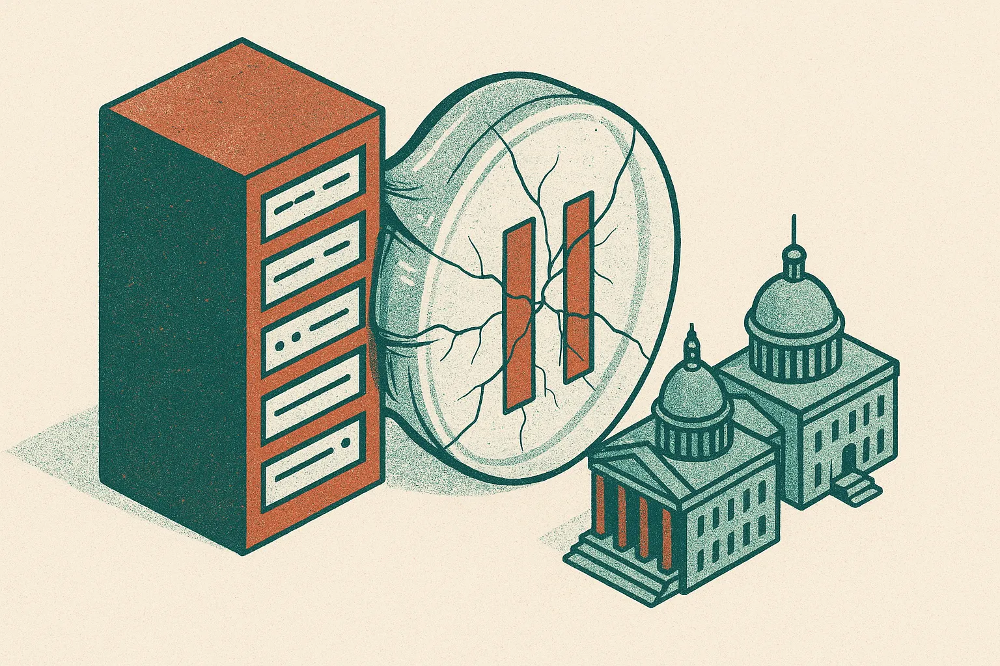

TL;DR: Voluntary AI slowdowns are unlikely to hold unless safety rules become enforceable, because market pressure and U.S.-China distrust both reward moving first.

## What would actually make an AI slowdown credible?

My primary source here is Decrypt’s “Why an AI Slowdown Could Collapse Under Commercial and US-China Pressure,” which reports that Atlantic Council experts see two weak points in the current slowdown idea: corporate pledges without enforceable safety standards, and the low odds of a real international deal when the U.S. and China do not trust each other.

That is the useful frame. The problem is not that every lab is reckless, or that every safety promise is fake. The problem is that a promise to slow down is expensive if rivals do not make the same promise, or if they make it and quietly route around it.

This is a classic coordination problem dressed up in frontier model language.

A lab can say it will pause training above a certain risk threshold. But then the hard questions arrive. Who defines the threshold? Who audits the run? Who sees the evals? What happens if the model is dangerous in one domain but commercially valuable in ten others? What counts as deployment, an API, an internal tool, a military contract, a fine-tune?

Without answers, a slowdown becomes a press release with vibes attached.

Enforceable standards are different. They create friction that does not depend on a CEO’s mood, investor pressure, or a competitor’s launch calendar. That could mean mandatory reporting, independent model evaluations, compute governance, liability rules, deployment gates, or some mix of those. Decrypt’s Atlantic Council framing does not settle which path works. But it does get the hierarchy right: norms help, pledges help less, enforcement is where the real test starts.

## Why does U.S.-China distrust matter so much?

Because even a well-designed slowdown has to survive the fear that the other side is racing.

If Washington believes Beijing will keep building frontier systems regardless of public commitments, U.S. policy will tilt toward speed. If Beijing believes U.S. export controls and AI policy are really containment tools, Chinese policy will also tilt toward speed. Each side can describe acceleration as defensive. Both can be sincere. The result is still acceleration.

That is why international AI governance is harder than publishing a shared statement about risk. A credible agreement would need monitoring, verification, and some reason to believe violations will be detected. AI does not make that easy. Model capability is not as visible as a missile silo. Training runs can be distributed. Talent moves. Open models complicate control. Corporate labs, cloud providers, universities, and state-backed actors all sit in the same messy supply chain.

Commercial pressure adds a second ratchet. Public markets reward growth. Enterprise buyers want better agents, cheaper inference, longer context, stronger coding, and fewer hallucinations. Governments want strategic advantage. Consumers want products that work. None of those groups naturally asks for slower release schedules unless failure becomes visible and costly.

That is the gap safety policy has to close.

## What should builders take from this?

The mistake is treating AI slowdown politics as background noise. It is not. If you build on frontier models, your stack depends on policy choices that could change access, disclosure duties, procurement rules, model availability, or liability.

I would not plan around a grand global pause. Decrypt’s account of the Atlantic Council view makes that look thin. I would plan around uneven rules instead: more audits in some sectors, more documentation requests from enterprise customers, more scrutiny for agents that take actions, and more pressure to show model behavior before and after deployment.

That means the practical work is boring and valuable. Keep eval logs. Track model versions. Record where AI touches user data. Separate demo agents from production agents. Know which workflows can fail safely and which need human approval. Do not wait for a treaty to tell you that an autonomous refund bot, medical assistant, legal intake tool, or code deployment agent needs guardrails.

A builder can try this now: pick one AI workflow, write down the failure modes, add a small eval set, log outputs for review, and define the action boundary the model cannot cross without a person. The catch most readers miss is that “AI safety” is not only frontier lab policy. It becomes your product reliability problem the moment your model can affect money, access, health, identity, or trust.
