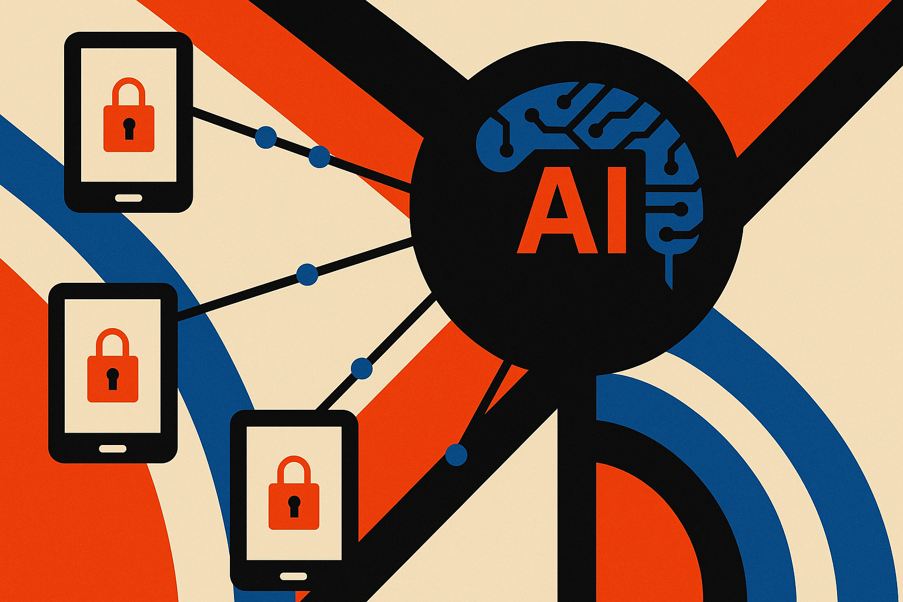

TL;DR: Federated learning looks more usable when privacy controls and asynchronous training are designed as one system, not bolted on separately.

## What problem is this paper actually trying to solve?

The primary source here is the arXiv cs.AI and cs.LG paper titled “Privacy-enhanced federated learning via asynchronous aggregation and local differential perturbation.”

The setup is familiar: many organizations want to train models across distributed data without pooling raw data in one place. Hospitals, banks, mobile devices, enterprise tenants, retail systems. The pitch for federated learning has always been attractive. Keep data local. Send updates. Aggregate them centrally.

The catch is that “data stays local” is not the same as “privacy is solved.” Gradients and model updates can still leak information. Devices do not all train at the same speed. Some clients are offline. Some send stale updates. Some have uneven data. Real deployments are not the clean synchronized loop that basic FedAvg assumes.

This paper tries to handle both sides at once. It combines Dynamic Differential Privacy, lightweight Homomorphic Encryption, and Local Differential Privacy, then adds asynchronous aggregation with version control. That matters because privacy and timing interact. If a system protects updates but stalls whenever slower clients lag, it may be safe but unusable. If it trains quickly but exposes too much through updates, it may be efficient but risky.

The reported numbers are the useful part, with caveats. On CIFAR-10 and Purchase-100, the arXiv paper reports classification accuracy up to 82.6% under a stringent privacy setting of ε = 0.1, plus a 21.3% communication overhead reduction compared with FedAvg. Those are not production guarantees. They are still benchmark results. But they point in the right direction: privacy does not have to mean a model becomes useless, and asynchronous training can cut some of the coordination tax.

## Why does asynchronous aggregation matter?

Synchronous federated learning is tidy on a whiteboard. Every client trains, everyone sends updates, the server waits, then aggregates. In practice, that waiting is expensive.

Phones lose connectivity. Edge boxes vary by hardware. Enterprise systems have maintenance windows. Medical networks may have different local policies. If the central training loop waits for the slowest or least available participant, the whole system inherits the worst client’s schedule.

The arXiv paper’s asynchronous strategy uses version control to manage updates arriving at different times. That is the practical part. Versioning gives the server a way to reason about stale updates instead of pretending every update belongs to the same training moment.

This is not just an engineering convenience. It changes who can participate. Smaller organizations, weaker devices, and less stable endpoints become less of a drag on the system. If the approach holds up beyond CIFAR-10 and Purchase-100, that makes federated learning more realistic for messy networks.

Still, asynchronous aggregation can create new failure modes. Stale updates can pull a model backward. Fast clients can dominate. Privacy noise can compound with data skew. A benchmark comparison against FedAvg is useful, but it is not enough to decide whether this system is safe for a regulated deployment.

## What should builders check before trusting it?

The first check is the threat model. Dynamic Differential Privacy, Homomorphic Encryption, and Local Differential Privacy each protect against different risks. Combining them sounds strong, but security depends on implementation details, attacker assumptions, key handling, client honesty, and how privacy budgets are tracked over time.

The second check is whether ε = 0.1 maps cleanly to your use case. Differential privacy numbers are easy to quote and hard to compare across systems. A small epsilon sounds strict, but privacy accounting depends on the mechanism, composition, sampling, and training schedule.

The third check is workload realism. CIFAR-10 is useful for image classification experiments. Purchase-100 is useful for transaction-style classification. Neither proves performance on clinical notes, financial fraud streams, industrial sensor data, or personalized models on devices with battery constraints.

I would treat this as a design pattern worth testing, not a ready-made answer. If you are building distributed training across sensitive data, start by reproducing the paper’s setup, then run one internal benchmark with your real client distribution: slow nodes, missing nodes, skewed data, and a defined privacy budget. The catch most readers miss is that federated learning is not made private by geography. Local data storage helps, but the update path is where the hard privacy work lives.
