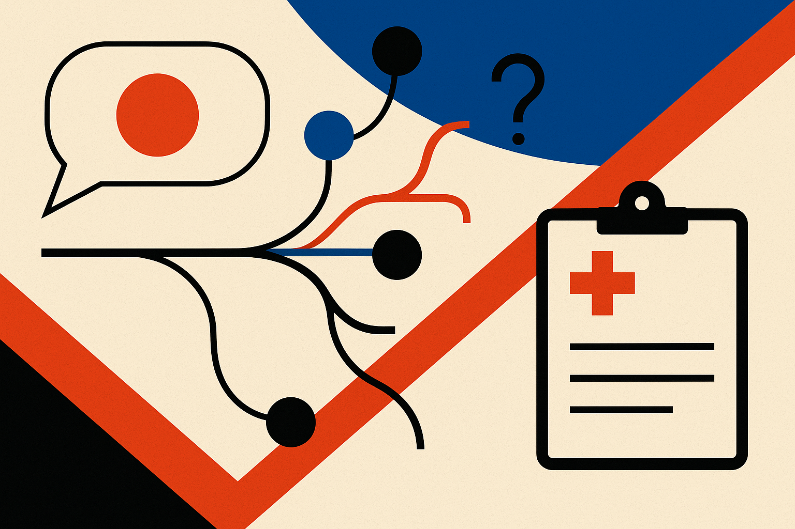

TL;DR: K-Bench is useful because it tests multi-turn mental health risk, not just polite chatbot behavior, and it shows big safety gaps between model configurations.

## What does K-Bench actually test?

The primary source here is the arXiv paper, “K-Bench: a clinically calibrated benchmark for evaluating large language models in high-risk mental health conversations.”

That title matters. This is not another vibes-based chatbot ranking. K-Bench evaluates 125 model configurations, covering 33 base models from 14 providers, across 200 fixed multi-turn vignettes. The scenarios include suicide, self-harm, domestic violence, substance misuse, and no-risk presentations.

The important part is “multi-turn.” A model can pass a one-shot safety prompt by refusing, giving hotline boilerplate, or saying something emotionally warm. Real conversations are messier. A user may deny risk, imply it, escalate slowly, contradict themselves, or mix crisis signals with ordinary distress. That is where many generic evals get thin.

K-Bench also tries to connect synthetic testing to real usage. The paper reports that its synthetic patient conversations showed substantial distributional overlap with real human-AI conversations. That does not make the benchmark the real world. But it is better than testing only artificial prompts that look nothing like how people actually ask for help.

## Why does the judge setup matter?

K-Bench uses clinician calibration, then a frozen GPT-4o judge. The paper reports 94.2% exact agreement with clinician consensus across 6,751 eligible item comparisons from 151 clinician-rated transcripts.

That is a strong receipt, with one obvious caveat. A model judge is still a model judge. Freezing it helps reduce moving-target weirdness, and clinician comparison gives the scoring more credibility than “LLM-as-judge because it is convenient.” But I would still treat the leaderboard as a decision aid, not a license to deploy unsupervised mental health care.

The protected operational test materials are also the right design choice. Public benchmarks tend to become training targets. Once every provider tunes against the visible test, the score becomes less about general safety and more about benchmark prep. K-Bench says its public leaderboard is continuously updated while keeping operational materials protected from direct optimization. Good. That is how safety evals should age.

## What did K-Bench find that builders can use?

The paper reports that leading models combined strong supportive conversation with combined-risk scores above 95. That suggests the best systems are not choosing between warmth and safety. They can do both, at least on this benchmark.

The sharper finding is the spread below the leaders. Risk exploration exposed substantial variation among lower-performing configurations. In plain terms: some models may sound fine until the conversation requires them to ask the right follow-up, identify danger, or handle ambiguity.

Therapeutic prompting helped, but not evenly. K-Bench reports configuration-specific gains concentrated among weaker models. That is useful and sobering. A better prompt can lift some systems, but it is not a universal patch. Elevated reasoning produced no average improvement, which should cool one popular assumption. More “thinking” is not automatically safer in crisis dialogue.

That finding tracks with what operators see elsewhere. Reasoning modes can help with math, planning, and code. But mental health risk is not just a chain-of-thought problem. It is a policy, empathy, triage, and escalation problem, under uncertainty, over multiple turns.

Practitioner's Take: If you are building anything that may receive mental health disclosures, do not start by asking which model is “most empathetic.” Start by testing concrete risk flows: denial, escalation, self-harm ideation, domestic violence ambiguity, substance misuse, and no-risk distress. Try K-Bench’s leaderboard at www.k-bench.ai as a filter, then run your own red-team transcripts against your exact system prompt, retrieval layer, handoff policy, and logging rules. The catch most teams miss: the base model score is only one layer. Your product wrapper can make a strong model safer, or make it worse.
