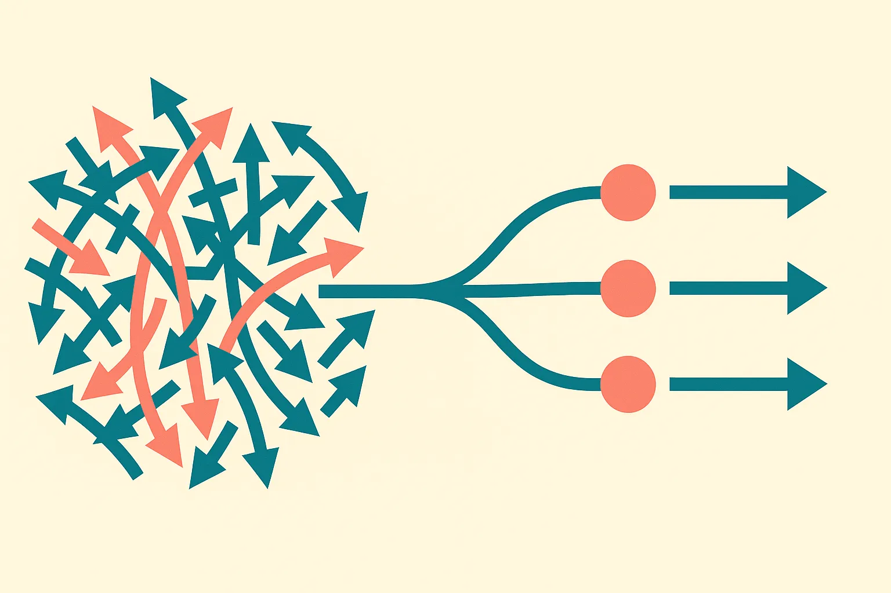

TL;DR: OptiFlow’s useful idea is to train a fast one-step policy by matching it to high-value, in-dataset action samples, instead of directly optimizing against a critic that may be wrong off-distribution.

## What problem is OptiFlow trying to solve?

The primary source here is the arXiv paper “Learning Multimodal One-step Flow Policy via Value-weighted Optimal Transport,” from Yonsei-DILLab, with code published at https://github.com/Yonsei-DILLab/OptiFlow.

The problem is a very real one in offline reinforcement learning. You have a fixed dataset. No fresh environment interaction. No chance to try weird actions and see what happens. The policy has to learn from what is already there.

That gets messy when the dataset contains multiple good behaviors for the same state. Think of a robot arm that can approach an object from the left or right, or a driving policy that can safely merge early or late. A standard policy can average those behaviors into something dumb. A flow policy can represent multiple modes more naturally, but a full flow model can be too slow if you need quick action selection.

So the target is attractive: keep the multimodal behavior, but compress it into a one-step policy.

The catch is value guidance. If you tell the model to chase actions with high critic-estimated value, it may collapse onto one mode. Worse, it may find actions that the critic overvalues only because they sit outside the training distribution. That is a familiar offline RL failure: the model looks clever on its own scoring function, then falls apart because the score was not grounded in real data.

OptiFlow is built around avoiding that trap.

## Why does optimal transport fit this job?

OptiFlow frames one-step policy learning as a structured sample-allocation problem. That phrase matters. The model is not just picking the highest-value action sample and copying it. It jointly trains a value-aware reference flow policy and a faster one-step policy, then couples their action samples state by state using entropic optimal transport.

In plain English: for each state, the system has candidate actions from a richer reference policy and candidate actions from the efficient one-step policy. The critic estimates which reference actions look valuable. The transport objective decides how to match the one-step samples to the reference samples, while also caring about action-space distance.

That second part is the guardrail. Value says, “prefer these targets.” Distance says, “do not pair things that are geometrically incompatible.” The result is meant to push the one-step policy toward high-value behaviors that are still supported by the dataset, not toward fantasy actions created by critic error.

This is a nice mental model for a lot of model compression work, not just offline RL. Distillation goes wrong when the student is asked to imitate only the sharpest-looking outputs without preserving the structure of the teacher’s distribution. OptiFlow’s transport layer tries to preserve that structure while still biasing toward better actions.

The paper reports strong performance across diverse offline RL benchmarks and says OptiFlow captures optimal multimodal behaviors effectively. I would treat that as promising, not settled. The source material does not give benchmark names, score tables, ablations, or runtime tradeoffs in the excerpt here, so the practical read is about the mechanism more than a leaderboard claim.

## What should builders take from this?

The useful pattern is not “optimal transport fixes RL.” It is narrower and better: when compressing a rich multimodal decision process into a fast policy, do not optimize only against a scalar score. Add a matching constraint that keeps the student close to plausible teacher samples.

That applies to robotics, game agents, UI agents, recommendation systems, and any workflow where historical data contains several valid next actions. If your model has to pick quickly, a one-step policy is appealing. If your training data has multiple modes, naive compression can erase important alternatives. If your critic or reward model is imperfect, direct maximization can reward nonsense.

I would try OptiFlow-style thinking when I have three ingredients: a fixed dataset, a slower policy or sampler that captures diverse candidate actions, and a value model that is useful but not trusted outside the data. Use the value model to rank candidates, not to free-climb into unknown action space. Use geometry or similarity to keep assignments sane. The catch most readers miss: the win is not just faster inference. It is disciplined distillation, where the student gets better without being allowed to hallucinate its way out of the dataset.
