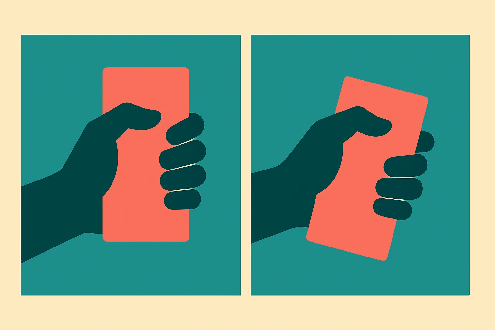
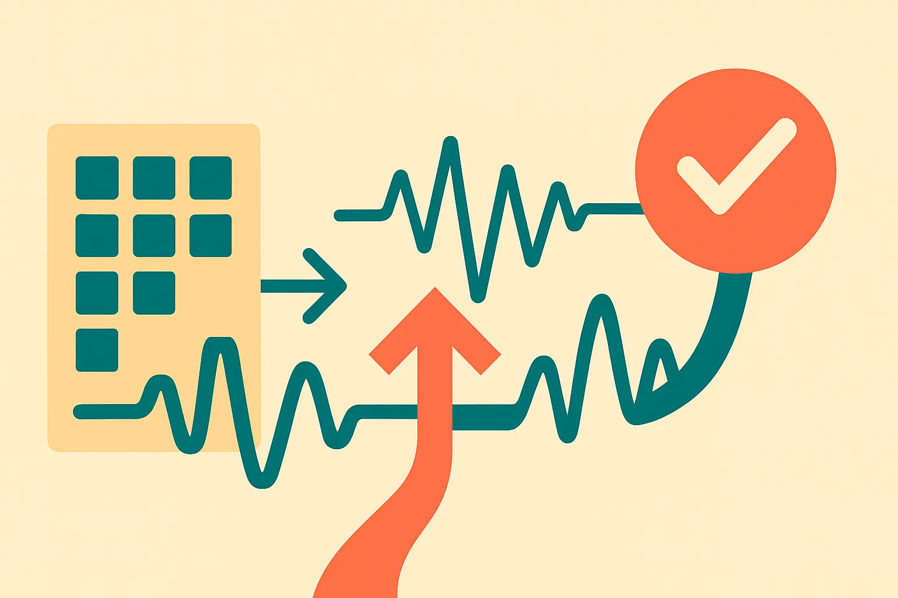
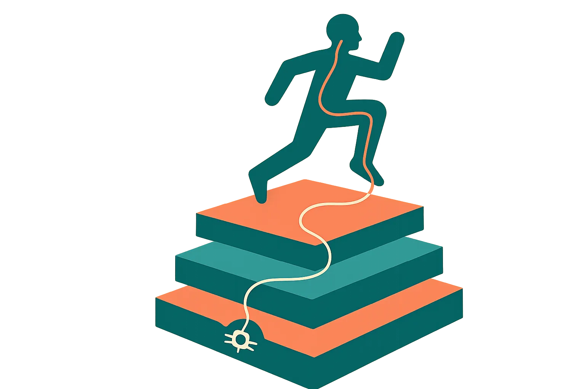

TL;DR: The hardest part of a robot hand holding an object is not deciding how to grab it, it is noticing fast enough when the object starts to move, and SlipSense shows that problem is now solvable at 23 milliseconds with a sensor stack that transfers zero-shot across robots.

Robot hands have gotten good at grasping. Watch any modern manipulation demo and you will see fingers close cleanly around a cup, a screwdriver, a strawberry. What you rarely see, because the demos are cut carefully, is what happens two seconds later when the object shifts, tilts, and starts to slide out of the grip. That moment, the fraction of a second between "holding" and "dropped," is where most dexterous manipulation quietly falls apart. It is also the part the field has under-invested in, because it is unglamorous plumbing compared to a shiny grasp policy.

That is why I want to spend a whole pillar on slip detection. Not because one paper changed everything, but because a cluster of recent work has made the case that reactive, low-latency touch is the actual bottleneck for reliable hands, and one paper in particular now puts hard numbers on how fast and how general it can be.

## What is slip detection and why does it matter more than grasping?

Grasping is the setup. Slip detection is the save.

When a human holds a coffee cup and it starts to slip, you do not re-plan the grasp from scratch. You feel the micro-slip, the tiny shear and vibration as the surface begins to move against your skin, and you tighten before conscious thought catches up. That reflex loop runs on the order of tens of milliseconds. It is the thing that lets you hold a wine glass without either dropping it or crushing it.

Robot hands have historically lacked that loop. They plan a grasp, apply a force, and hope. If the object is heavier than expected, or the surface is more slippery, or the arm accelerates, the object slides and there is no fast corrective signal to catch it. You can throw more grasp planning at this and it will not help, because the failure happens after the grasp, in the world, under forces the planner never modeled.

This is the same class of problem I keep coming back to in robot manipulation: the gap is not intelligence, it is the reaction budget. I wrote about this from a different angle when [πR² made robot policies react inside the action chunk](/blog/2026-07-29-r-makes-robot-policies-react-inside-the-action-chunk/), which is the same fight at the policy level. Slip detection is that fight at the sensor level. If your control loop cannot see the slip until 100 milliseconds after it starts, the object is already gone. The whole game is closing that window.

## What did SlipSense actually build?

The primary source here is "SlipSense: Multimodal Tactile Learning for Low-Latency and Generalized Slip Detection," posted to arXiv under cs.AI. I am going to lean on it hard because it is the first piece of work I have seen that treats detection latency as a first-class, measured quantity rather than an afterthought.

SlipSense is built on a sensor the authors call TacV5. It combines two very different sensing modalities in one compact package. The first is a 32 by 32 piezoresistive array running at 240 Hz, which captures the spatial pressure distribution across the contact patch, essentially a low-resolution pressure image of where and how hard the object is pressing. The second is a 3-axis MEMS accelerometer running at 8 kHz, which captures the friction-induced vibrations that happen when a surface begins to slide.

That pairing is the key idea. Pressure tells you the shape and distribution of contact. Vibration tells you the onset of motion. A slip event shows up in both, but the accelerometer catches the high-frequency signature of incipient slip much faster than a pressure image can resolve it. The two modalities are complementary, and the paper's own experiments are designed to show exactly that complementarity rather than assert it.

The model does modality-specific encoding first, then intra-sensor fusion, then cross-modal attention with causal temporal prediction at 240 Hz. "Causal" matters here: the network is only allowed to use past and present frames, not future ones, because in a real control loop you do not get to peek ahead. This is not a system that looks good offline and dies in deployment. It is architected for the online case from the start.

## How fast and how accurate is it, really?

Here is where I want the numbers stated plainly and attributed, because latency claims in robotics are usually vibes.

According to the SlipSense paper, the system was trained and evaluated on a dataset of 1.4 million frames spanning 37 objects. On that data it reports 96.7% Macro F1 with a false-positive rate below 1.6%. And the headline latency figure: it detects 76% of slip events within 23.1 milliseconds.

Let me unpack why each of those three numbers matters, because they are doing different jobs.

The 96.7% Macro F1 tells you the detector is accurate across classes, not just on the easy majority case. Macro F1 weights each class equally, so it does not get to hide a weak slip-detection rate behind a strong "no slip" rate. That is the honest metric to report for an imbalanced problem, and I respect that they chose it.

The sub-1.6% false-positive rate is the one operators should stare at. A slip detector that cries wolf is worse than useless, because every false positive triggers a corrective squeeze, and a hand that constantly over-tightens will crush soft objects and waste force budget. Low false positives are what make the signal safe to act on in a closed loop.

The 23.1 millisecond figure, covering 76% of slip events, is the whole reason to care. Twenty-three milliseconds is inside the reaction window where a controller can still save the grasp. It is not "we detected the slip after the object hit the floor." It is fast enough to be reflexive. The honest caveat, which the paper itself frames by saying 76% rather than 100%, is that the remaining quarter of slip events are either slower to detect or missed within that window. That is a real limitation, not a rounding error, and I would want to see the latency distribution for the slower tail before calling this solved.

## Does it transfer across robots, or only in the lab?

This is the part that moves SlipSense from "nice result" to "possibly load-bearing."

The paper reports that when SlipSense was trained solely on UMI data, it generalized zero-shot to a Tesollo dexterous hand, transferring across unseen objects, distinct sensor units, and robotic platforms without retraining. UMI, the Universal Manipulation Interface, is a data-collection rig; the Tesollo is a commercial dexterous hand. Training on one and deploying on the other with no fine-tuning is exactly the kind of cross-platform generalization that almost never survives contact with reality in tactile sensing, because touch data is notoriously sensor-specific.

Why does it transfer when so much tactile work does not? My read is that the vibration channel is the carrier. Friction-induced vibration at slip onset has a physical signature that is more about the mechanics of two surfaces sliding than about the quirks of a particular sensor's pressure calibration. If the model is leaning on that physics, it makes sense that it would generalize where a pure pressure-image model, trained to the idiosyncrasies of one sensor, would not.

I want to be careful here. "Zero-shot generalization" is a phrase that gets abused. What the paper claims is transfer across unseen objects, sensor units, and platforms, evaluated on the Tesollo hand. It does not claim generalization to every hand, every material, or every grasp geometry in the world. It is a strong single-transfer result, and it is more than most tactile papers show, but it is one transfer pair, not a universal law. Treat it as a promising signal, not a guarantee.

This connects to a theme The Lab has hit repeatedly: the data bottleneck in robotics is not raw quantity, it is the right kind of grounded, transferable signal. I made that argument around [InSight and the robot data bottleneck that actually matters](/blog/2026-06-24-insight-and-the-robot-data-bottleneck-that-actually-matters/), and slip detection is a clean example. If your slip signal transfers across hands, you do not need to re-collect a million frames per hand. That changes the economics of deploying dexterous manipulation at scale.

## Where does slip detection fit in the rest of the dexterous-hand stack?

Slip detection does not live alone. It is one layer in a stack that a lot of recent work has been quietly assembling, and the interesting thing is how the pieces fit.

At the hardware layer, the cost and learnability of the hand itself matters. [Aero Hand Open made the cheap part of a robot hand the learnable part](/blog/2026-08-31-aero-hand-open-makes-the-cheap-part-of-a-robot-hand-the-learnable-part/), which is the kind of move that lets tactile sensing spread beyond expensive research rigs. SlipSense's TacV5 sensor is compact and combines a modest 32 by 32 array with a commodity MEMS accelerometer, which is the right instinct: keep the sensor cheap enough to put on many fingers.

At the skill-composition layer, you have work like [DexCompose's finger-level ownership](/blog/2026-06-29-finger-level-ownership-how-dexcompose-stacks-robot-hand-skills-without-breaking/), which is about stacking hand skills without them stepping on each other, and [REGRIND's one-demo recipe for robot hands](/blog/2026-07-14-regrinds-one-demo-recipe-for-robot-hands/), which is about learning a grasp from minimal demonstration. Both of those assume the hand can actually hold the thing it grasps. Slip detection is the safety net underneath them. You can compose all the skills you want, but if the object slides out mid-task, the composition is moot.

And at the whole-body layer, reactive touch feeds into smoother motion. I wrote about [CoorDex and the end of stop-and-go humanoids](/blog/2026-06-23-coordex-and-the-end-of-stop-and-go-humanoids/), and one reason humanoids move in jerky, tentative steps is that they cannot trust their grip under dynamic motion. A fast slip reflex is part of what lets a robot move confidently while carrying something, because it knows it can catch a slip before it becomes a drop.

The multimodal framing also connects to a broader point I have made about fusion systems generally: [multimodal AI needs a plan for missing inputs](/blog/2026-07-28-multimodal-ai-needs-a-plan-for-missing-inputs/). SlipSense fuses pressure and vibration, but a deployed hand will lose a sensor, get gunk on a pad, or hit a frequency band where one channel is useless. The paper shows the two modalities are complementary; the open question I would push on is how gracefully the system degrades when one of them drops out. Complementary is good. Robust-to-loss is better, and it is a different property.

## What should a practitioner do about this right now?

If you are building or buying dexterous manipulation, the immediate lesson is to measure your slip-detection latency as a named quantity, the way SlipSense does. Most manipulation stacks I have seen report grasp success rate and stop there. Grasp success rate hides the drops that happen after the grasp under load. Instrument the reaction window. Ask: from the moment the object starts to move, how many milliseconds until my controller knows and acts? If you cannot answer that in a number, you have a gap.

Second, take the multimodal lesson seriously. A pressure-only tactile skin is going to be slow at detecting incipient slip because the pressure image has to change measurably before the array resolves it. Adding a cheap high-frequency accelerometer, the way TacV5 does at 8 kHz, is a low-cost way to buy latency. The vibration channel is where the fast signal lives.

Third, do not over-read the zero-shot transfer. The SlipSense result is one transfer pair, UMI-trained to Tesollo-deployed. Before you assume it will transfer to your hand, run the actual test on your hardware and your objects. The physics-of-friction story that makes transfer plausible is encouraging, but it is a hypothesis about why it works, not a warranty.

## What is contested, and what should you watch next?

What is settled: slip detection is a real bottleneck, low latency is achievable, and multimodal fusion of pressure plus vibration beats either alone. The SlipSense numbers, 96.7% Macro F1, sub-1.6% false positives, 23.1 ms for 76% of events, are the current reference point for what "fast and accurate" looks like, and they come from a named, measurable evaluation rather than a demo reel.

What is contested or open: whether the transfer generalizes beyond a single hand pair, how the system behaves when a modality drops out, and what happens to the slower quarter of slip events that fall outside the 23.1 ms window. None of those are addressed by the current evidence, and any of them could bite in deployment.

There is a broader adoption question sitting over all of this, and here a second paper is worth naming: "Pilot Early, Commit Late: A Real-Options Model of Enterprise AI Adoption under Rapid Technological Progress," also on arXiv under cs.AI. It is not about robots at all, it is an economic model of when firms should deploy AI versus pilot versus wait. But its central result maps cleanly onto tactile robotics: when the technology frontier is moving fast and deployment is partly irreversible, the rational move is often to pilot early and commit late, building organization-specific learning without locking into an architecture that will be obsolete in a year.

For slip detection specifically, that argues against ripping out your current tactile stack to standardize on any one sensor today. The hardware is still moving. Piloting SlipSense-style multimodal sensing on a subset of hands, measuring the latency gain, and holding off on a fleet-wide commitment is exactly the "pilot early, commit late" posture that paper formalizes. The frontier will keep improving; the learning you build now transfers even if the specific sensor does not.

Practitioner's take: the move is to add a fast vibration channel to whatever tactile sensing you already have and start reporting slip-detection latency as a headline metric alongside grasp success, because that number is the one that predicts real-world reliability and almost nobody publishes it. Run the actual transfer test on your own hand before you believe zero-shot, and stress-test what happens when a sensor drops out, since the SlipSense result covers 76% of slip events, not all of them, and says nothing about graceful degradation. The catch most readers will miss is that this is not really a sensing story, it is a control-loop story: a 23 millisecond detection is worthless if your policy cannot act on it in time, so the latency budget you actually care about is detection plus reaction, and that end-to-end number is where the object either gets caught or hits the floor.
