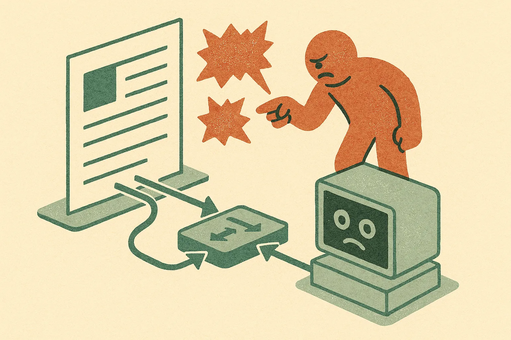

TL;DR: Stellar Colosseum shows that the interesting frontier for hard reasoning is no longer the model alone but the harness around it, a structured many-agent process that spends inference on strategy, decomposition, and falsification instead of one long chain of thought.

The paper is "Stellar Colosseum: A Many-Agent Harness for Long-Horizon Research in Mathematics and Theoretical Computer Science," posted across arXiv's cs.AI, cs.CL, and cs.LG listings. It is worth reading not because it claims a smarter model, but because it argues the opposite: the model is a component, and most of the gain comes from how you route work through it.

## What is Stellar Colosseum actually doing?

The core claim is simple. Language models can write a plausible short proof. They fall apart on long-horizon research, where you need a chain of uncertain, interdependent decisions and one bad early choice quietly poisons everything downstream.

Colosseum's answer is to break that into stages. It explores alternative strategies before it commits to building a proof. It uses what the authors call a readiness gate to decide whether a given route is mature enough to decompose into subproblems. It represents the proof plan as interdependent section-level pieces, so a fix in one section can be routed back to the parts it affects. And at each stage it generates candidates in parallel, attacks them with targeted falsification, then merges the survivors and their critiques into a single artifact through a scheme they call overlapping random-sample tree aggregation.

Strip the naming and you get a pattern any operator will recognize: divergent search, a gate, decomposition, adversarial review, and aggregation. The novelty is applying it end to end to research math and theory, where the verifier is not a unit test but a critique that has to be traced back to the right part of the argument.

## Do the benchmark numbers hold up?

Here is where you read carefully. The headline results are strong. On TCS-Bench, described as research-level theorem-proving tasks drawn from papers at FOCS, STOC, and SODA, Colosseum hits 71.0% accuracy using Gemini 3.1 Pro paired with Gemini 3.7 Flash. In a separate Codeforces evaluation with Gemini 3.1 Pro, the proof-oriented pipeline with execution feedback solves 218 of 222 problems. The authors also say they obtained several new results addressing open problems from papers at FOCS and JMLR.

Two things to sit with. First, the underlying models here, Gemini 3.1 Pro and Gemini 3.7 Flash, are ahead of what most readers have in production today, so the harness is riding on top of very capable base models. The paper's own framing is that Colosseum is model-agnostic, but every headline number uses Google's strongest available models. That does not diminish the result; it does mean you cannot assume the same lift on a weaker backbone.

Second, TCS-Bench is introduced in the same work that reports scoring 71% on it. A benchmark authored alongside the method it validates is not disqualifying, plenty of good benchmarks arrive this way, but it is not an independent yardstick either. I would want to see other groups run their own systems against TCS-Bench before treating 71.0% as a settled bar. On the Codeforces side, 218 of 222 is eye-catching, but competitive programming has a well-known contamination problem, and the sources here do not specify the problem selection or dating. Reported, not confirmed, until someone reproduces it.

The "new results on open problems from FOCS and JMLR" claim is the most exciting and the hardest to verify from an abstract. Open problems in theory get resolved through peer review and community checking, not a harness declaring victory. Treat that as a promising signal that needs the field to confirm.

## Why does the harness matter more than the model?

Because it is the part you can copy today.

The last two years of practical AI work have converged on a boring truth: for hard tasks, a single call to even a great model underperforms a structured process built around a decent one. Colosseum is a formal, aggressive version of that idea aimed at problems most people assumed needed a smarter brain, not a better workflow. The design choices generalize well beyond math. A readiness gate before you commit to a plan is just refusing to decompose a problem you do not yet understand. Targeted falsification is a reviewer whose only job is to break the current draft. Routing a verifier's finding back to the specific section it affects is dependency tracking, the thing that separates a real plan from a to-do list.

Notably, the authors say the Colosseum workflow has been integrated into Google Antigravity's Teamwork framework as the Long Proof pattern. That is the tell that this is meant as a reusable orchestration recipe, not a one-off research stunt. The name of the game is inference allocation: deciding where to spend compute, when to branch, when to prune, when to stop. Model quality sets the ceiling. The harness decides how close you get to it.

## What can a builder take from this without a theory PhD?

Most of us are not proving FOCS results. That is fine, because the transferable ideas are cheap.

Start by separating strategy from execution. Colosseum explores routes before it builds. In an agent you are shipping, that means a planning pass that proposes two or three distinct approaches and picks one on stated criteria, rather than letting the model commit to the first plausible path. Add a gate: a cheap check that asks whether the plan is concrete enough to act on, and loops back if it is not. Then add an adversary whose only job is to find the flaw in the current output, separate from the agent that produced it, because self-critique in a single context is weak. Finally, when you fan out into parallel candidates, spend real effort on how you merge them. Aggregation is where quality is won or lost, and it is the step most homegrown agent stacks skip.

The catch most readers will miss: this is expensive. Parallel candidate generation, per-section verification, and falsification passes multiply your token spend, and the paper reports results with top-tier models, which are not cheap to run at that volume. Colosseum is a demonstration that spending inference intelligently beats spending it linearly, but "intelligently" still means "a lot." Before you copy the pattern, decide whether your task actually has the long-horizon, interdependent structure that justifies it. For a customer support triage, no. For multi-step research, migrations, or anything where an early wrong turn wastes everything after it, this is the shape to build toward. And hold the 71% and the 218-of-222 loosely until someone outside the authors runs the same gauntlet.
