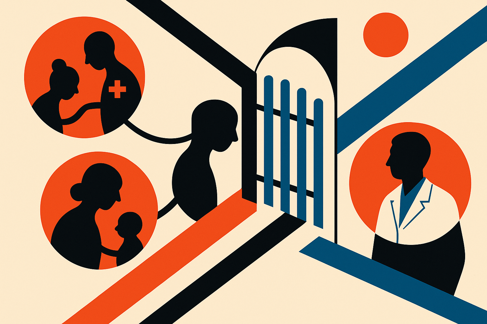

TL;DR: CareMirror’s real lesson is that caregiver-facing AI should help people reflect and communicate on their own terms, with clear consent before anything reaches clinical care.

## What problem does CareMirror actually point at?

The primary source is the arXiv cs.AI and cs.CL paper, “CareMirror: Bringing Caregiver Wellbeing into the Dementia Care Ecosystem.” It describes an envisioned caregiver wellbeing system for dementia care, tested through semi-structured interviews with 14 caregivers.

The important word is “caregiver.” Not patient. Not clinician. Caregiver.

Family caregivers for people living with dementia often become the operating system for daily care. They track behavior changes, appointments, medications, emotional shifts, sleep, safety, finances, and family coordination. Yet their own wellbeing is usually treated as background context, if it is captured at all.

CareMirror’s design probe put that caregiver experience in the foreground. The system imagined connected caregiver-facing and clinician-facing interfaces. The caregiver side supported longitudinal reflection, personalized support, and sharing selected information with clinical care. The clinician side gave visibility into caregiver wellbeing when the caregiver chose to bring it into the care relationship.

That is a practical framing. Not “AI therapist replaces clinician.” Not “ambient monitoring solves eldercare.” More like: caregivers are overloaded, their knowledge is fragmented, and the healthcare system often sees only a thin slice of what is happening at home.

The caregivers interviewed valued being seen. They liked the idea of longitudinal awareness, context-sensitive support, and clinical visibility when it could lead to meaningful follow-up. That last clause matters. Visibility is useful when someone can act on it. Otherwise it is just another dashboard.

## Where should AI help, and where should it stay out?

CareMirror is most useful because it does not pretend the hard part is model capability. The hard part is boundary design.

Caregivers wanted AI to support reflection and communication. That could mean helping someone notice patterns over time, turn scattered notes into a clearer update for a doctor, or prepare for a care visit without having to reconstruct the last three months from memory.

But the interviews also found real friction. Repeated reflection can become burdensome. It can also become emotionally difficult. If a system keeps asking someone to document stress, grief, frustration, guilt, and exhaustion, that is not neutral. It may help some people process. It may make others feel watched, judged, or asked to perform wellbeing.

Automatic clinical sharing is the bigger warning sign. Caregivers said it could inhibit candid disclosure. That makes sense. People write differently when they know a clinician, family member, insurer, or institution might read it. The most honest note may be the one that never gets sent.

So the design principle is not simply “share more data.” It is “preserve caregiver voice.” Participants expected AI to help them express what they meant, not substitute its own summary for their lived experience. They also did not want AI replacing clinician judgment.

That is a clean constraint for medical AI builders: summarize, structure, remind, translate, and prepare. Do not silently escalate, reinterpret, or speak for the person without permission.

## What should builders copy from this design?

CareMirror is not presented as a deployed clinical product. It is an envisioned ecosystem used as a design probe with 14 caregivers. That limits what we can claim. We should not read this as evidence that the system improves outcomes, lowers caregiver burden, or fits neatly into clinical workflows.

But as product research, it is strong signal.

The pattern I would copy is caregiver-controlled sharing. Let the private workspace stay private by default. Let AI help draft a clinical note, but show the draft. Let the caregiver edit it. Let them decide whether to share the full history, a summary, a single concern, or nothing.

The second pattern is longitudinal memory with friction controls. A weekly reflection may help one caregiver and drain another. The system should adapt cadence, not demand compliance. It should make skipping acceptable.

The third pattern is designing for follow-up. If a caregiver shares distress with a clinician and nothing happens, trust gets worse. Any clinical-facing feature needs a workflow behind it: who sees it, when, what counts as urgent, what response is possible, and what expectations are set.

For builders, the move is to prototype this as a consent-first workflow before touching advanced model behavior. Start with caregiver journaling, editable AI summaries, and explicit share controls. Test whether the reflection loop feels supportive or extractive. The catch most readers miss: in care settings, “more context” is not always better. The right AI product may be the one that protects silence as carefully as it structures speech.
