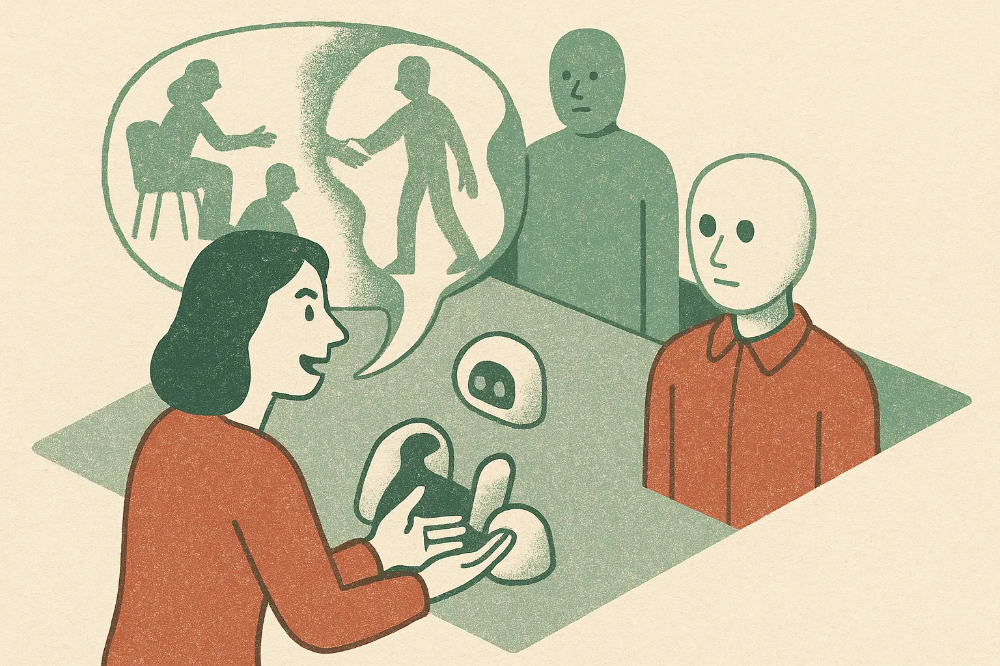

TL;DR: Fuse is useful because it tests the part of AI advice that normal benchmarks miss: the model only hears the user’s version of the story.

## What does Fuse actually test?

The arXiv cs.AI and cs.CL paper “Verifiable Social Reasoning for LLM Assistants” introduces Fuse, a multi-agent simulation framework for evaluating social reasoning in LLM assistants.

That sounds abstract. The setup is practical.

A target agent has a hidden motive. Other agents interact with it, including one agent representing the user. That user then consults an LLM assistant and asks what the target’s motive might be. Because the motive was assigned inside the simulation, the benchmark has ground truth by construction.

That is the important move. Social advice is usually hard to evaluate because nobody can prove what your coworker, partner, customer, or manager “really meant.” Fuse makes that answer knowable without pretending real life has clean labels.

The paper reports a human study with 24k annotations to check simulation faithfulness, then applies Fuse to 12 LLMs. It also open-sources Fuse and a dataset with 21k examples.

## Why is user mediation the hard part?

Most benchmarks hand the model the full problem. Real advice does not work that way.

A user walks in with a partial story. Often a biased one. They omit details, emphasize what hurt, compress timelines, and choose words that already point toward a conclusion. “My boss ignored me” is not the same input as “My boss missed my message during a client escalation,” even if both describe the same event.

Fuse isolates that layer. The paper reports four findings that matter for anyone shipping assistants.

First, user mediation compounds the difficulty of social reasoning. The model is not just reasoning about a situation. It is reasoning through a narrator.

Second, LLMs show systematic sensitivity to biased user framing. This is the big product risk. If the user frames someone as hostile, the assistant may absorb that frame instead of treating it as a hypothesis.

Third, models can require more details than humans need to make the correct prediction. That cuts against the common assumption that more context always solves the problem. Sometimes humans infer the motive earlier because they know which social cues matter.

Fourth, longer conversations do not always improve performance, even though they create chances for clarifying questions. That one should sting. “Just ask follow-ups” is a popular design answer. Fuse suggests it is not automatically a reliability answer.

## What does this change for AI assistants?

I like Fuse because it aims at a real product category, not a toy task. People already ask chatbots about conflict, dating, work drama, parenting, negotiation, and customer conversations. These are high-stakes enough to matter, but fuzzy enough that standard accuracy tests are weak.

The catch is that verifiable simulation is not the same as real social understanding. Fuse can assign motives. Life usually cannot. So I would not read this as proof that any model is good or bad at human judgment in general. I read it as a better microscope for one failure mode: the assistant over-trusts the user’s telling of the story.

That has design consequences. Advice products should separate facts from interpretations. They should explicitly ask what evidence supports the user’s read. They should generate multiple plausible motives before recommending action. They should be careful with confident labels like “manipulative,” “jealous,” “lying,” or “toxic,” because those labels can harden a user’s bias.

If you are building an assistant that gives interpersonal, workplace, coaching, sales, support, or negotiation advice, try a Fuse-style eval before you ship. Create scenarios with known hidden intents, pass them through biased user summaries, then score whether the assistant preserves uncertainty or gets pulled into the frame. The catch most teams miss: the model’s failure may not show up when you test the clean transcript. It shows up when the user tells the story their way.
