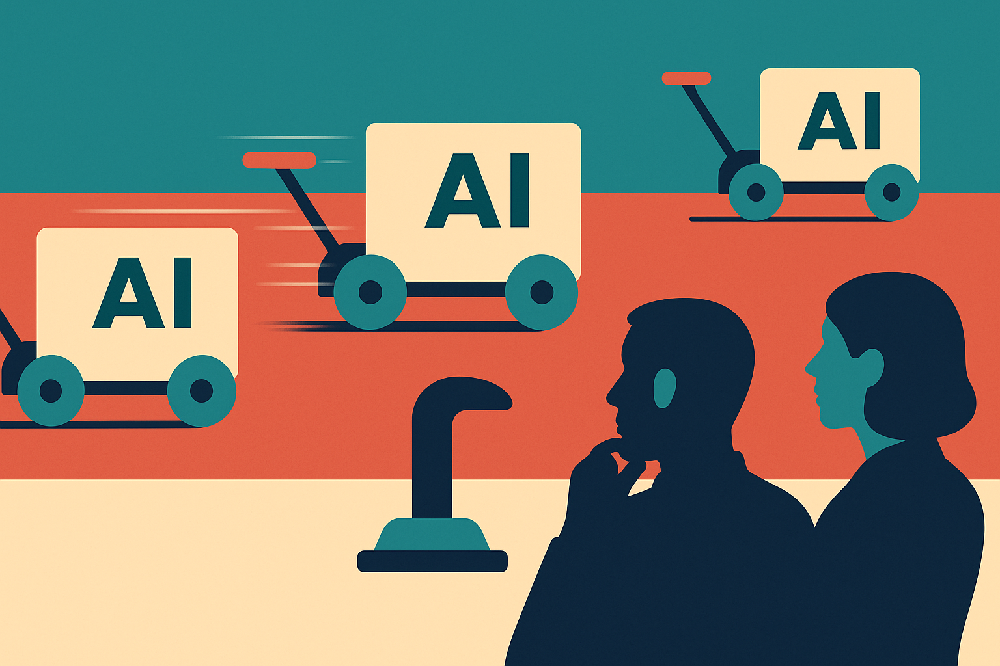

TL;DR: Zuckerberg is arguing for lab-by-lab AI safety pauses instead of a coordinated slowdown, but that only works if the pauses are specific, inspectable, and tied to release decisions.

## What is Zuckerberg actually pushing back on?

Decrypt’s “Zuckerberg Pushes Back on Coordinated AI Slowdown, Says Labs Can Act Alone” reports that Meta CEO Mark Zuckerberg rejected the idea of a coordinated AI slowdown across major labs. His argument, as reported by Decrypt, is not that safety can wait. It is that individual labs already have reasons to act carefully.

Those reasons matter. Zuckerberg cited competition and potential liability as forces that push companies toward safety. Put plainly: if a lab ships a model that causes obvious harm, users may leave, enterprise customers may hesitate, regulators may act, and lawyers may come calling. That is a real incentive structure, even if it is an incomplete one.

The interesting part is Meta’s cited example. Decrypt reported that Zuckerberg pointed to Meta’s decision to delay Muse as evidence that a lab can slow itself down without a sector-wide pact. That is the cleanest version of his case: you do not need every frontier lab to agree on a shared brake if each one has enough internal discipline to hold a model back when needed.

I buy part of that. Coordinated slowdown is messy. It raises antitrust questions, favors incumbents, and can turn into theater fast. A private club of labs deciding the industry’s pace is not automatically safer than competition. It may just be less accountable.

But the solo-slowdown argument has its own problem: trust.

## When does a self-imposed pause count?

A delay is meaningful only if people can understand what changed because of it.

If a company says, “we delayed this model for safety,” that can mean many things. It might mean the model failed an internal eval. It might mean red-teamers found a misuse pattern. It might mean product reliability was poor. It might mean the launch calendar moved because the demo was not ready. All of those are different. Only some are safety wins.

This is where Zuckerberg’s argument needs receipts. Not secret model weights or exploit details. Just enough structure to make the claim legible.

What was the class of risk? What eval or review process caught it? Was the delay days, weeks, or months? Did the lab change training, post-training, system prompts, access controls, monitoring, or product scope? Was the eventual release narrower than planned?

Without that, “we delayed it” becomes a brand-safe phrase. Useful in interviews. Less useful for policy or builders trying to learn from the decision.

There is also a timing problem. Liability often arrives after harm. Competition can punish bad launches, but only after users feel the blast radius. Internal caution is better than nothing, but it is not a full replacement for pre-release testing, external evals, incident reporting, and clear model cards.

## The real fight is over who sets the release bar

The AI slowdown debate often gets flattened into two camps: ship everything or stop everything. That is not how operators think.

The practical question is narrower: who decides when a model, agent, or product is safe enough to release, and what evidence do they owe the rest of us?

Zuckerberg’s position puts more weight on company-level governance. That can work for some risks. Labs know their systems best. They can move fast when a problem is found. They can tailor mitigations to the actual product instead of waiting for a one-size rule.

But public trust requires a second layer. Not necessarily government approval before every launch. Not a global pause button. More like a shared expectation that frontier labs publish enough about safety gates, failed eval categories, and post-release monitoring to make delays comparable across companies.

Otherwise, every lab gets to define “responsible” for itself. That is convenient. It is not a standard.

Practitioner's Take: If you are building with frontier models, copy the useful part of Meta’s reported Muse delay, not the PR wrapper. Add explicit release gates to your own workflow: eval failures that block launch, human review for high-risk outputs, staged access for new agent features, and rollback criteria before users touch it. The catch most teams miss is that a pause is only valuable if it changes the product, the permissions, or the monitoring. Otherwise it is just a calendar slip with better branding.
