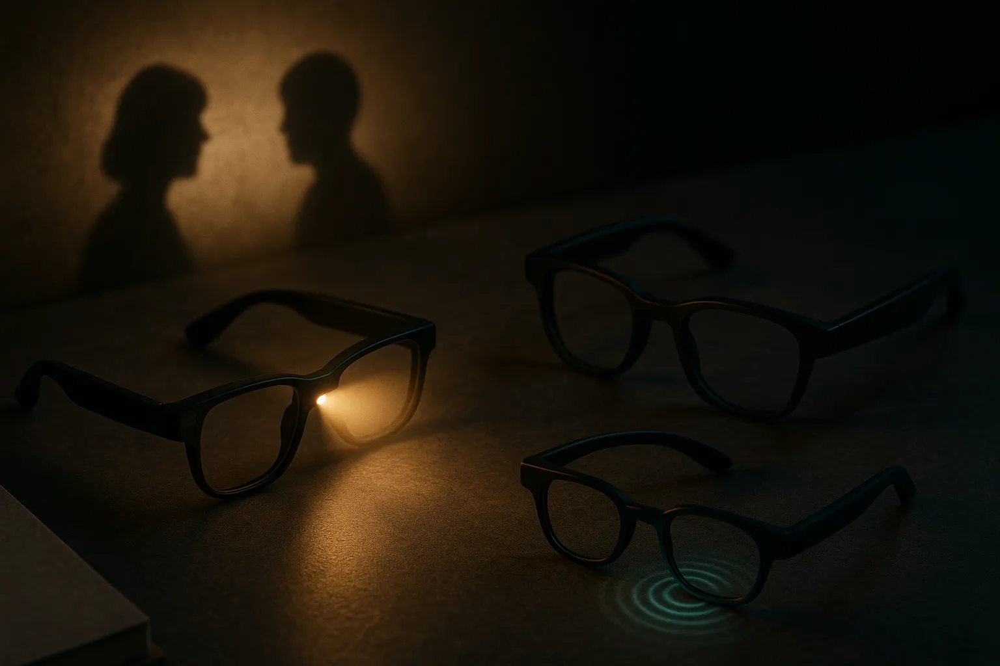

TL;DR: If Meta ships camera-free AI glasses, the bet is that wearables can become socially acceptable first, then get more capable later.

## What problem would camera-free glasses actually solve?

Decrypt reported in “Meta May Have Found a Fix for Its 'Pervert Glasses'” that Meta is reportedly developing a version of its smart glasses without a camera. Meta has not confirmed that product in the source material, so the right frame is “reportedly,” not “incoming launch.”

Still, the idea is useful because it separates two problems that usually get mashed together.

The first is the obvious social problem: people do not like being recorded by glasses. They especially do not like wondering whether they are being recorded by glasses. A phone camera is visible as an action. You pull it out, point it, hold it. A camera in eyewear is ambient. It sits at eye level and collapses the distance between “this person is looking at me” and “this person might be capturing me.”

That is why the privacy reaction to camera glasses has always been harsher than the reaction to earbuds, watches, or phones. It is not just the sensor. It is the body language.

Removing the camera would not make AI glasses “private.” Microphones still matter. Always-available voice interfaces still create bystander issues. Cloud processing still raises questions about retention, consent, and who can access what. But dropping the camera attacks the objection people understand instantly, without needing a policy page.

## Are glasses still useful if they cannot see?

This is the trade. A camera is the most exciting sensor for AI glasses because it gives the model context: what you are looking at, what object you are holding, what sign is in front of you, who just walked into the room. Without it, the product becomes less magical and more like a wearable assistant with speakers, microphones, and maybe a display.

That may be the point.

The camera version is better for demos. The camera-free version may be better for getting worn. There is a big difference between “this device can understand the world” and “I am willing to wear this into a meeting, school pickup, gym, airport lounge, or bar.”

If Meta is really exploring this branch, it suggests a more practical read of the AI wearable market. The first mass-market win may not be full multimodal perception. It may be socially tolerated assistance: voice capture, calls, messages, translation, reminders, lightweight search, navigation cues, and hands-free interaction.

Less science fiction. More Bluetooth headset, but less awkward.

That sounds boring until you remember how many products win by becoming acceptable before becoming powerful. AirPods did not start as a general-purpose computer for your ears. The Apple Watch did not start as a medical-grade health platform. Phones did not begin with LiDAR and computational photography. Form factor adoption creates the surface area for later capability.

## The privacy bar is higher than “no camera”

The catch is that camera-free does not mean controversy-free.

If an AI wearable listens well enough to be useful, it can also capture nearby speech. If it has memory, it can turn casual interactions into stored context. If it summarizes conversations, it raises consent questions. If it identifies speakers by voice, even worse. A product can remove the most visible sensor and still create a surveillance-shaped experience.

So the useful question is not “camera or no camera?” It is: what does the device sense, when does it sense it, where does the data go, how obvious is capture to bystanders, and what can the wearer inspect or delete?

That is where operators should pay attention. The market does not just need better models. It needs better interaction contracts. Lights, sounds, local controls, physical switches, clear capture states, short retention defaults, and on-device processing where possible. These details sound small, but they are the difference between “cool gadget” and “please take that off.”

Practitioner's take: if you are building for AI wearables, design for the lowest-social-friction sensor stack first. Assume the camera is unavailable, disabled, or inappropriate in many real contexts. Prototype voice-first flows that are still useful without visual input, then add vision only where it clearly changes the job outcome. The catch most teams miss: privacy is not only a compliance feature. It is part of distribution. People will not adopt a wearable that makes everyone around them uncomfortable.
