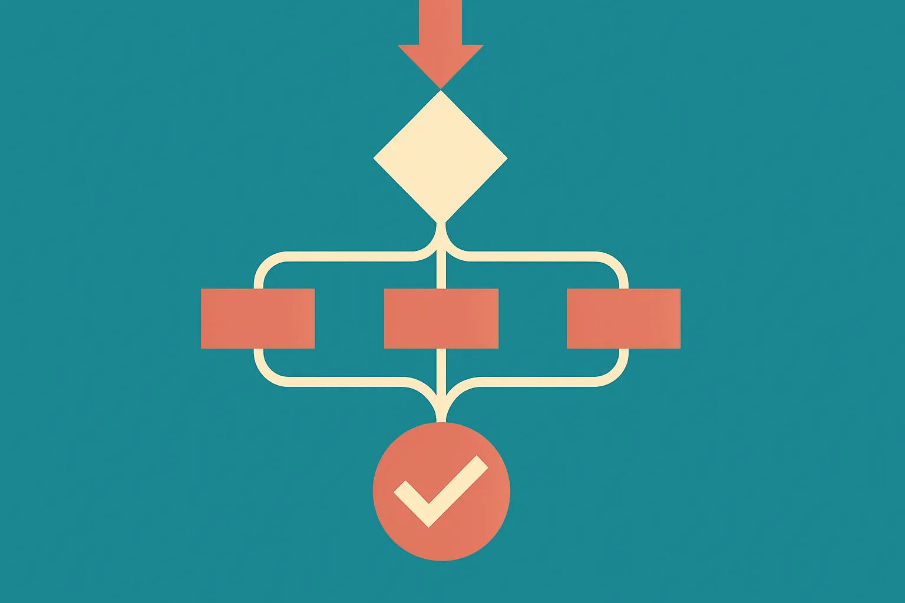

TL;DR: LangChain’s new `langchain-typesafe` alpha is not a big launch yet, but it signals a practical shift toward typed decisions, safer routing, and traceable agent behavior.

## What did LangChain actually release?

The primary source here is LangChain’s GitHub release `langchain-ai/langchain langchain-typesafe==0.0.1a2`, which follows `langchain-ai/langchain langchain-typesafe==0.0.1a1`. These are initial alpha releases, not a polished product announcement.

The first alpha, `0.0.1a1`, added `TypeSafeClassifier` via PR `#40542`. The second, `0.0.1a2`, repeats that classifier and adds experimental `AutoModeMiddleware` (`#40545`), experimental `ModelRouterMiddleware` (`#40543`), and a fix for trace usage metadata (`#40570`).

That is not much surface area. No launch blog. No benchmark. No pricing. No availability claim beyond the GitHub release itself. So the right read is modest: LangChain is carving out a package called `langchain-typesafe`, and the first pieces are about making classification, routing, and middleware behavior less squishy.

That matters because a lot of agent failures are not “the model is dumb.” They are boundary failures. The system asked for a category and got prose. It asked the cheap model to handle a task that needed the stronger one. It routed a request without a clean audit trail. It logged usage, but not in a way that made downstream accounting or evals easy.

Types do not fix intelligence. They fix contracts.

## Why does type safety matter for agents?

Agent stacks are full of small decisions that look harmless until they compound. Classify this ticket. Pick a model. Choose a tool. Decide whether to escalate. Store the trace. Return a structured answer.

If those decisions are plain-text conventions, every step becomes a soft promise. A type-safe classifier changes the shape of that promise. The system is no longer merely asking the model to “pick one of these.” It is trying to force the result into a known structure the application can trust, reject, retry, or inspect.

The release notes do not spell out the API, so I would not assume how `TypeSafeClassifier` works internally. But the naming is clear enough to read the intent: LangChain wants classification outputs to be treated as typed program artifacts, not vibes in a string.

`ModelRouterMiddleware` points at another real pain. Most production AI apps should not send every request to the same model. Some tasks need speed. Some need reasoning depth. Some need lower cost. Some need a model with a specific modality or tool behavior. Routing is where teams try to balance those needs.

The catch: routing logic itself becomes a reliability problem. If you cannot see why a request went to a given model, you cannot debug cost spikes, bad answers, or weird latency. That makes the trace usage metadata fix in `0.0.1a2` more interesting than it sounds. Metadata is boring until you need to explain a bill, reproduce an incident, or compare router behavior across versions.

## Is this a big LangChain move or just plumbing?

Right now, plumbing. Useful plumbing.

The release labels `AutoModeMiddleware` and `ModelRouterMiddleware` as experimental. That word should lower everyone’s temperature. Experimental means builders should test, not depend blindly. It also means the interfaces may move.

But plumbing is where agent frameworks either grow up or stay demoware. The flashy part of agents is tool use. The production part is making every handoff explicit enough that a normal engineering team can test it. Typed outputs, middleware, routers, and traces are the stuff that makes agents operable.

This also fits a broader pattern across the AI builder stack. Teams are moving from “prompt plus model call” toward policy layers around the call. Classification before generation. Routing before spend. Validation after output. Trace capture around everything. LangChain’s `langchain-typesafe` alpha looks like a small package aimed at that middle layer.

I would not rebuild a production app around `langchain-typesafe` yet. The releases are too early and too thin. But I would pay attention to the direction. The next competitive edge in AI apps is not just picking a better frontier model. It is knowing when to use which model, forcing outputs into contracts, and collecting enough trace data to improve the system without guessing.

Practitioner’s take: try this idea even if you do not use the package yet. Pick one agent decision in your app, classification, routing, escalation, or tool choice, and make the expected output explicit in code. Add retries or fallbacks when the output fails the contract. Log the decision and the model used. The catch most teams miss: type safety is not only about cleaner code, it is about creating evidence when the agent does something expensive or wrong.
