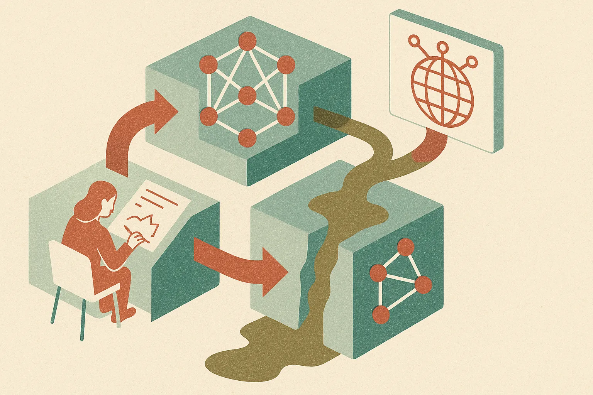

TL;DR: The AI scraping fight is not just about permission, it is about whether model builders are poisoning the labor and data supply they depend on.

## Was AI scraping “the largest theft of labor in human history”?

The primary source here is Decrypt’s report, “Microsoft Staff Asked If AI Scraping Was 'Largest Theft of Labor in Human History'.” Decrypt reported that Microsoft staff internally asked whether AI scraping amounted to “the largest theft of labor in human history,” and that internal memos warned about a “doom loop” that could threaten the quality of the models Microsoft was building with OpenAI.

That phrase is loaded. It is also useful, because it cuts through the polite abstraction around “training data.”

AI systems were not trained on vibes. They were trained on writing, code, art, forum posts, documentation, journalism, photos, product pages, books, and endless bits of structured human work. Some was licensed. Some was public. Some was scraped under legal theories that are still being fought over. Some was probably neither clean nor clearly permitted.

I do not think every use of public web data is automatically theft. Search engines, archives, quote systems, academic crawlers, spam filters, and accessibility tools have all relied on copying in some form. But foundation model training changed the scale, the product, and the economics. The output is not just an index pointing back to the creator. It can be a substitute interface.

That is why the Microsoft memo framing matters. Not because one internal phrase settles the law. It does not. But because it shows that serious people inside the machine understood the ethical and business risk before the public argument fully hardened.

## What is the “doom loop” risk?

The “doom loop” claim, as Decrypt reported it, is the more practical part.

If models absorb human work without enough credit, traffic, pay, or consent, creators have reasons to stop publishing openly. Publishers lock content down. Developers move code and discussion into private spaces. Communities block crawlers. High-quality material gets replaced by SEO sludge, AI rewrites, and synthetic filler.

Then the next model has a worse web to learn from.

This is not just a moral loop. It is a quality loop.

Model labs already spend heavily on filtering, data curation, post-training, evaluations, and synthetic data. That work gets harder if the open web becomes more polluted and more defensive. The cheap era of “just scrape the internet” was always temporary. The next phase looks more like data supply chain management: licenses, provenance, creator deals, private corpora, domain-specific feeds, and careful exclusion of junk.

There is a catch, though. Synthetic data is not a magic escape hatch. It can help in narrow tasks, especially when generated, filtered, and tested carefully. But if synthetic data becomes a replacement for fresh human observation, it risks compounding model habits instead of expanding model knowledge.

## What should builders take from this?

For builders, the lesson is not “never use AI trained on scraped data.” That is not realistic, and it is not how most software teams can operate in 2026.

The lesson is to separate legal availability from strategic reliability. A model API may be easy to call, but the provenance of its training data still affects product risk. If your product depends on current facts, expert judgment, brand safety, or community trust, you need your own clean data layer. Retrieval from approved sources. Human review where stakes are high. Logs that show what content influenced an answer. Clear attribution when your product summarizes someone else’s work.

The other move is contractual. If a vendor says its model is safe for enterprise use, ask what that means in plain terms. What indemnities exist? What data went into fine-tuning? Can your data be used for training? Can you opt out? What happens if a rights holder challenges an output? Do not accept “AI-powered” as a risk policy.

I would treat Decrypt’s Microsoft reporting as a signal, not a verdict. The courts, regulators, model labs, publishers, and creators are still negotiating the actual boundaries. But the operating reality is already clear: human-created data is not an infinite free input. Build as if high-quality data gets scarcer, more expensive, and more contractual. Try smaller workflows that pair licensed or first-party content with retrieval and evaluation. The catch most readers miss: the winner is not the team with the biggest model, it is the team that knows exactly which data it can trust.
