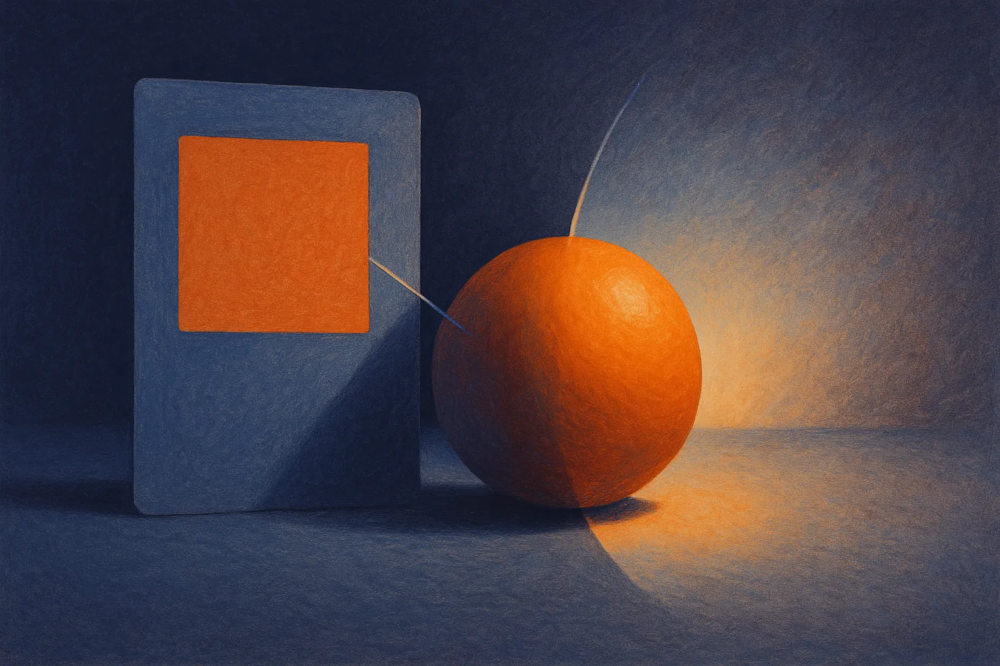

TL;DR: Paint-Anything treats exact hex color control as a training and evaluation problem, not a prompt trick, which is the right direction for design workflows that need repeatable brand colors.

## What problem is Paint-Anything actually solving?

The primary source is the arXiv cs.AI/cs.LG paper titled “Paint-Anything: Unified Any-Color Control for Image Generation and Editing.” The supplied arXiv record names the paper title but does not include an author list or arXiv ID.

The problem is narrow and useful: tell an image model to make or edit an object using any 24-bit hex value, then have it obey. Not “make the chair blue.” More like “make the chair #1E4D8C,” while keeping the chair looking like a chair, under real lighting, in a real scene.

That matters because professional design is full of exact color constraints. Brand systems. Product mockups. Packaging comps. Ecommerce imagery. UI assets. Current image models can often get close through natural language, reference images, masks, ControlNet-style conditioning, or post-editing. But “close” is not the same as color control. A model that understands “navy” may still miss the actual brand navy.

Paint-Anything’s core move is to use a shared hex-prompt interface for both text-to-image generation and editing. Same kind of instruction, two tasks. The paper argues that even compact language models can connect hex values with color semantics, so the system does not need a special color representation at inference time. That is the interesting part. The authors are trying to make exact color feel native to the prompt interface instead of bolted on after the fact.

## Why does the training recipe matter?

The paper builds Paint-500K, a dataset pipeline from real images using object grounding, perceptual color labeling, and editing-pair synthesis. That sounds straightforward until you hit the annoying physics: real images do not contain flat colors. Shadows, reflections, texture, compression, and camera response all shift pixel values.

So Paint-Anything uses two kinds of supervision. Real images teach the model how color appears on objects in natural scenes. Pure-color anchors teach exact correspondence between pixels and their paired hex values. The clever detail is timing. The paper says pure-color anchors are used only at high-noise timesteps, while low-noise training stays on natural images.

That is a nice compromise. If you train too heavily on synthetic flat patches, you risk making outputs look fake or posterized. If you train only on real images, exact hex labels are always a little dirty. Paint-Anything uses exact anchors where they can shape broad color intent, then lets real images handle the final visual realism.

The evaluation is also part of the contribution. The paper introduces Any Color Benchmark, or ACBench, split into ACBench-T2I and ACBench-Edit. The goal is object-level hex color fidelity across generation and editing. On FLUX.2-4B, Paint-Anything reports an 85.3% improvement on ACBench-T2I and a 28.3% improvement on ACBench-Edit relative to the base model. It also reports the highest average CompColor score among compared methods.

Those numbers are meaningful, but I would not overread them. Benchmarks for image editing can reward the specific shape of the task. Color fidelity is one axis. Designers also care about edges, material feel, consistency across a campaign, print conversion, accessibility contrast, and whether the model quietly changes the object. Paint-Anything measures an important piece, not the whole job.

## What would this change in actual design workflows?

If this line of work holds up, the near-term win is less time spent correcting almost-right colors. Think product photography variants, ad concepting, brand-safe illustrations, and marketplace images where one object color changes across dozens of assets.

The more important product question is whether exact color can become composable with the rest of the control stack. Hex color plus object mask. Hex color plus material preservation. Hex color plus camera angle. Hex color plus batch generation. That is where this becomes a tool instead of a demo.

The catch: hex values are not human perception. A color that is numerically correct under one lighting setup may look wrong in context. Brand teams often define colors across RGB, CMYK, Pantone, accessibility constraints, and usage rules. Paint-Anything’s approach helps the model aim at the requested value, but production design still needs review, color management, and sometimes manual cleanup.

For builders, I would test this kind of control on one constrained workflow before imagining a full creative suite. Pick a product catalog, define target hex colors, mask the target object, generate variants, then score outputs with both pixel-level checks and human review. The hidden catch most teams miss: exact color control is only useful if the model also preserves everything else the customer cares about. Color obedience that changes fabric texture, logo shape, or object identity is still a failed edit.
