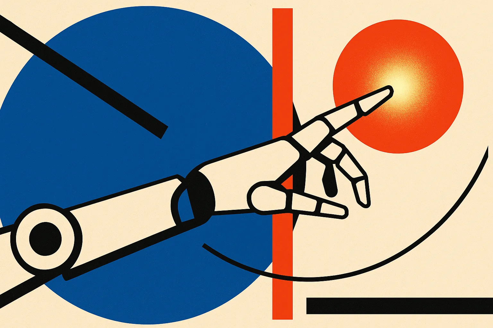
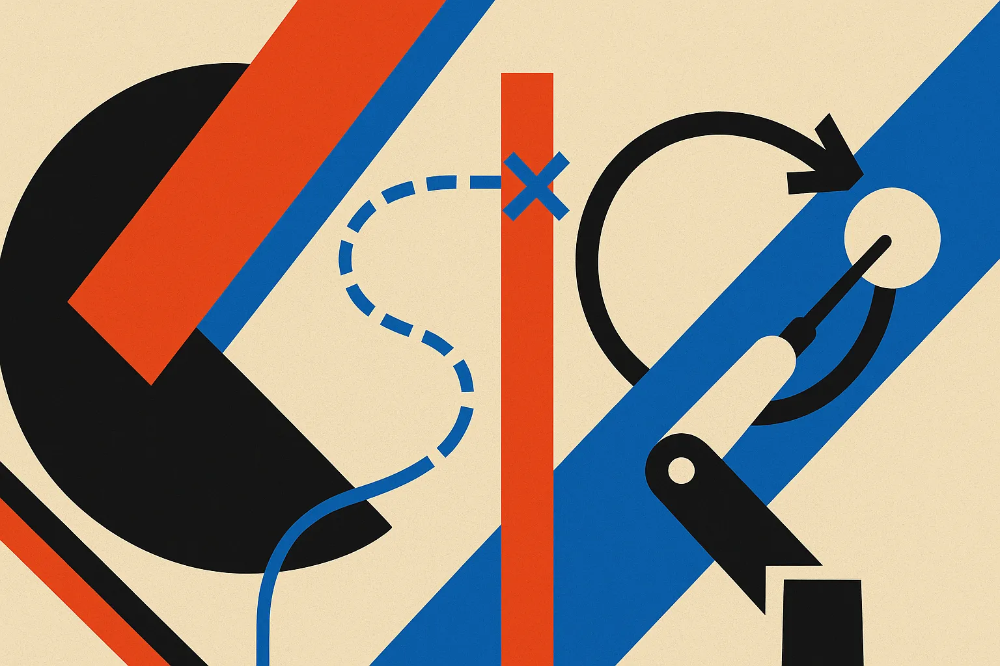
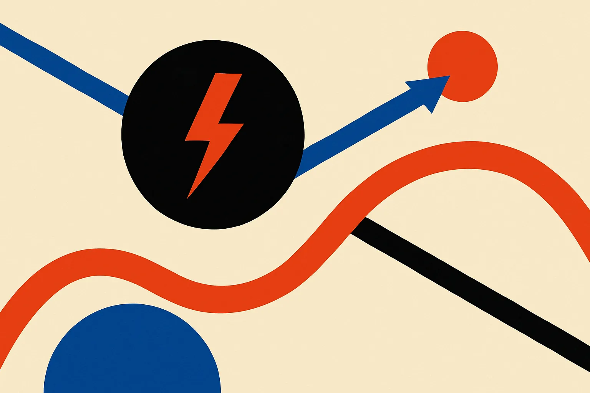

TL;DR: A coding agent asked to move a robot around an obstacle will reason about the obstacle, acknowledge it must not touch it, and then hit it anyway, because "don't collide" never becomes a priority in the plan, and the fix is structural, not more prompting.

The paper is "Coding Agents with an Obstacle-Aware Harness for Safe Robot Manipulation," posted to arXiv under both cs.AI and cs.CL. The setup is the paradigm that has gotten a lot of attention over the last year: instead of training a robot-specific policy, you hand a language model the task and let it write the controller as a program. No robot-specific training. The model reasons, emits code, the robot runs it. It works well enough that people now demo real arms driven this way.

The authors asked a question that had mostly gone unasked. Is it safe?

## What actually goes wrong when a coding agent runs a robot?

They built a benchmark where every task pairs a goal (move this, place that) with an obstacle the robot must not touch. Simple, physical, and the kind of constraint any real deployment has. Then they watched.

The agent collides with the obstacle in most cases. Not because it can't see the obstacle, and not because nobody told it. The prompt explicitly forbids touching the obstacle. And in its own reasoning traces, the model talks about the obstacle. It knows the thing is there. It knows it shouldn't hit it.

It hits it anyway.

This is the part worth sitting with. The failure isn't perception. It isn't instruction-following in the shallow "did it read the prompt" sense. The authors are direct about the location of the fault: it lives in the planning. The stated constraint never becomes a priority. The model treats task completion as the whole job and treats "don't collide" as a nice-to-have that gets steamrolled the moment it's inconvenient.

If you have shipped LLM agents, this pattern should feel familiar. The model says all the right things about the constraint in its chain of thought and then acts as if the constraint doesn't exist. Reasoning about a rule and being bound by a rule are different things. Text that mentions safety is not a safety mechanism.

## Why doesn't reasoning about the obstacle prevent the collision?

The authors decompose manipulation into two phases, and the split is the useful insight here.

The first is the route: moving the arm from A to B through space. The second is the contact-rich moment: the actual grasp, push, or placement where the robot touches something on purpose.

Along the route, the model fails for a specific reason. It has no notion of a clearing route, a path that keeps distance from the obstacle, and no mechanism to replan when a route it picked turns out to be infeasible. It commits to a straight-ish line toward the goal and drives through whatever is in the way. There's no internal loop that says "this path clips the obstacle, choose another."

At the contact, the failure is different. The model doesn't understand that the contact execution itself is bounded by the same constraint. It picks where to touch based on the goal, not on whether the touch keeps the obstacle clear. So even a robot that navigated cleanly can still knock the obstacle during the grasp.

Two phases, two distinct blind spots, one shared root: the constraint is present in language but absent from the decision procedure.

## Does the harness fix it, and how?

The proposed fix is SafeHarness, and the design tells you what the authors think the real problem is. They don't retrain the model. They don't rewrite the prompt to be sterner. They change the structure the model plans inside.

Two harnesses. The first is obstacle-aware route planning: the objects get grounded as bounding boxes, and candidate routes get drawn over them as sequences of waypoints. The agent plans a route in advance, verifies it against the obstacle, replans when the check fails, and only then executes. That's the replanning loop the base agent didn't have, made explicit and external.

The second is obstacle-aware contact execution: instead of choosing the contact point from the goal alone, the harness selects a contact position so the contact itself avoids the obstacle.

The numbers, from the paper: 71.9% task success and 87.5% collision avoidance. They report that beats the previous state of the art by 6.5% on success and 27.0% on collision avoidance, and that it's 2.3x and 1.5x the same agent running without the harnesses.

Read those together. The collision-avoidance jump is the headline. The base agent wasn't failing at the task, it was failing at the constraint, and the constraint improvement is where the harness earns its keep. Also worth being honest: 87.5% collision avoidance means roughly one in eight tasks still touches the thing it was told not to touch. Better, not solved. For a demo, fine. For a robot near a person, one in eight is a long way from a number you'd sign off on.

## What does this mean for anyone building agents, robot or not?

The robot part is vivid, but the lesson generalizes to any agent operating in a world with hard constraints. Money that must not be moved. A production database that must not be dropped. A file that must not be deleted. An email that must not go to the wrong list.

The paper is a clean demonstration that stating a constraint in the prompt and having the model acknowledge it in its reasoning does not make the constraint binding. The constraint has to enter the loop as something that gets checked and can force a replan, not as a sentence the model nods at and moves past.

That's the design pattern to steal, and it doesn't require a robot to apply.

Practitioner's take: if you run agents that touch anything you can't afford to break, stop trusting the prompt to enforce your safety constraints and stop trusting the model's reasoning trace as evidence it will comply. Build the check outside the model. Before the agent executes, run its proposed action against an explicit constraint, a bounding box, a whitelist, a dry-run, a permission gate, and reject-and-replan when it fails, exactly the loop SafeHarness bolts on. The catch most people miss is that the paper's agent already knew the rule and violated it anyway, so a monitoring setup that just re-asks the model "are you sure this is safe?" will inherit the same blind spot. The harness works because it's a separate mechanism the model has to pass through, not a reminder the model can talk past. And even then, watch the residual failure rate: 87.5% is a big improvement and still not good enough for anything with a person in the blast radius.
