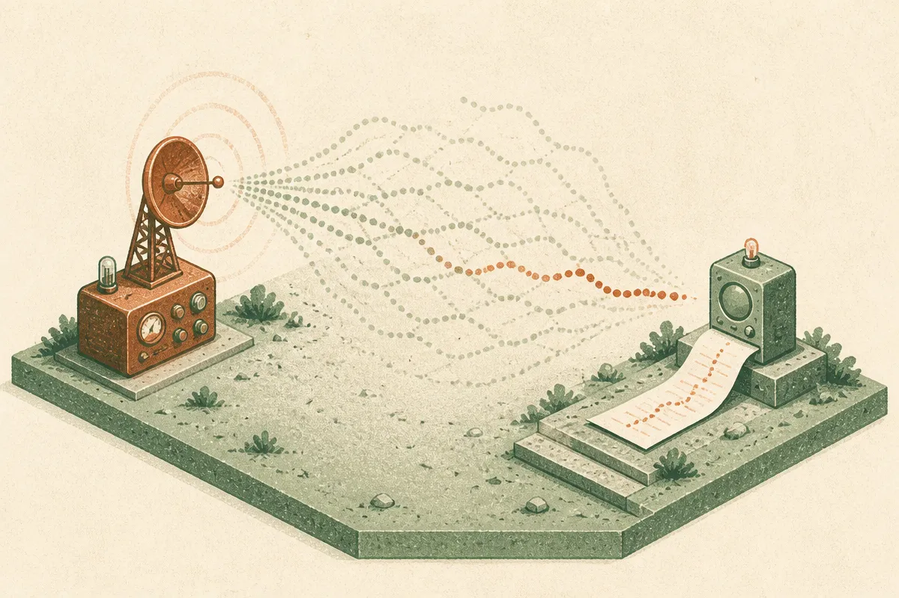

TL;DR: A model solving an old military cipher is interesting, but it only tells builders something if we can see the ciphertext, constraints, tools, transcript, and failed paths.

## What exactly was claimed?

The primary source here is the Hacker News item titled “GPT-6 Astra Solves a WWI German Radio Cipher.” That is a claim, not yet a usable technical artifact.

I do not have a first-party lab post, a reproduction package, the original cipher text, the model transcript, or a statement from the maker of GPT-6 Astra. So I would not treat this as confirmed product performance. I would treat it as a pointer to a potentially useful kind of test.

Historical cipher solving sits in a good middle zone for AI evaluation. It is not toy arithmetic. It is not a vibe check. It often requires pattern finding, hypothesis generation, language priors, careful bookkeeping, and sometimes search over many wrong paths. It can also punish overconfident guessing, because the final answer has to cohere across the whole message.

That makes it a better demo than “look, the model wrote a poem in the style of a pirate lawyer.” But it still has the usual problem: a solved puzzle is easy to overread.

Was the cipher already online? Was the plaintext in the training data? Did the model use external tools? Did a human provide hints? Were wrong attempts hidden? Did it solve from raw intercept, a cleaned transcription, or a partially annotated version? Those details decide whether this is reasoning, retrieval, tooling, luck, or a mix.

## Why are old ciphers attractive AI tests?

Because they force a model to hold multiple weak signals in mind at once.

A cipher task can involve symbol frequency, repeated groups, probable words, dates, military vocabulary, sender habits, and language constraints. A good solver has to propose a theory, test it, discard it, and keep track of what changed. That is exactly where many language models look impressive in short bursts, then drift when the search gets long.

This is why I like cipher tasks as part of an eval suite. Not as a leaderboard headline. As a traceable work sample.

The important unit is not “did it get the answer.” The important unit is the path. Did the model preserve uncertainty? Did it identify which assumptions were doing the work? Did it ask for missing evidence? Did it use tools cleanly? Did it notice when a partial plaintext contradicted the key?

A model that solves one famous cipher by memory is not doing the same thing as a model that solves an unseen cipher from first principles. A model that brute-forces with code is not doing the same thing as a model that reasons linguistically. Both may be useful. They are just different capabilities.

## What would make this claim useful?

The bar is not complicated.

Publish the ciphertext. Publish the exact prompt. Publish the model settings, tool access, and full transcript. Say whether the puzzle existed online before. Include failed runs, not just the polished one. If there was human steering, show it.

Then run variants. Change names. Swap vocabulary. Use synthetic ciphers with known ground truth. Include distractors. Test whether the model can explain its confidence without inventing certainty.

That turns a cool story into an eval.

Without that, “GPT-6 Astra solves a WWI German radio cipher” belongs in the same bucket as many AI demos: worth watching, not worth building assumptions on. The useful question is not whether the model can look brilliant once. The useful question is whether the method survives contact with fresh data, missing context, and boring repetition.

For builders, I would steal the task shape, not the headline. Take a messy internal problem with a hidden answer, strip out any memorized examples, and ask the model to reason through it with a full trace. Require it to list assumptions, test alternatives, and stop when evidence is thin. The catch most readers miss: the impressive part is not the decoded message. It is whether the process is inspectable enough that you would trust the next answer when nobody knows the plaintext yet.
