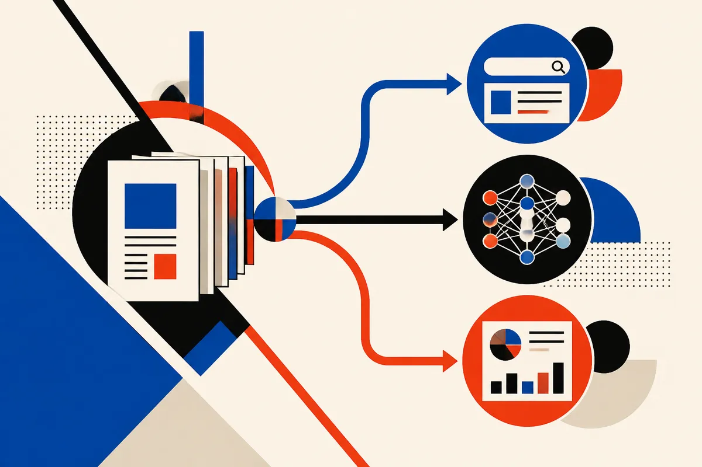

TL;DR: Treat AI search as three separate channels now: being cited in answers, being used for model training, and being measured in search reports.

## What actually changed?

The primary source here is Search Engine Journal’s “Google AI Payment Pilot, Search Profiles At 10,000 – SEO Pulse” by Matt G. Southern. The useful signal is not one single announcement. It is the pattern across three related items: Google is reportedly testing payments for content that contributes to AI answers, John Mueller says AI position data is hard to report, and Cloudflare is separating training access from search access.

That split matters.

For years, publishers treated search crawlers as one bargain. Let Google crawl, get indexed, maybe get traffic. AI search breaks that bargain into smaller pieces. A page can be useful to an answer without earning a click. A crawler can read a page for retrieval without that page being part of model training. A brand can appear in an AI answer, but not in a conventional rank position that maps cleanly to old SEO reports.

The payment pilot, as reported by Search Engine Journal, is the most visible piece because money always gets attention. But I would not build a strategy around it yet. The source does not give enough detail to know who qualifies, how payments are calculated, whether this scales, or whether it becomes a durable publisher program. Treat it as a signal that Google knows the incentive problem exists, not as proof that the incentive problem is solved.

## Why is AI search reporting so messy?

Mueller’s point, as relayed by Search Engine Journal, is the practical one: AI answer position is not the same thing as organic ranking position.

That sounds obvious until you try to report on it.

A classic blue-link result has a page, a query, a rank, an impression, and maybe a click. AI answers can compress multiple sources into one generated response. They can cite, paraphrase, omit, reorder, or answer without sending traffic. They can vary by user, query wording, location, session context, and product surface. Even if a site contributes to the answer, the measurement object is fuzzy.

So “where did we rank in AI?” may be the wrong question.

Better questions: Were we cited? Was the citation visible? Did the answer represent us correctly? Did branded demand move? Did assisted conversions change? Did our content become the canonical explanation that other systems repeat? These are less tidy than rank tracking, but closer to what is happening.

Ashe runs Lucky Domains, which works on [SEO and search visibility](https://luckydomains.io/services.html#seo), so this is not academic for me. The reporting layer affects what clients think is working, what gets funded, and what gets cut.

## What does Cloudflare’s split tell publishers?

Search Engine Journal also reported that Cloudflare is separating training from search. Again, I would be careful with second-hand specifics here. But the direction is important: access control is getting more granular.

That is healthy. Crawling for search discovery is not the same as harvesting content to train a model. Retrieval for an answer is not the same as storing the work for future model behavior. Publishers should want knobs, not one giant allow-or-block switch.

The catch is that too much blocking can also make a site invisible where users now look for answers. If AI search becomes a meaningful discovery layer, publishers will need a policy, not a reflex. Some content may be open for search retrieval. Some may be restricted from training. Some may be licensed. Some may be kept behind email, login, or product walls.

The old SEO playbook was mostly about crawlability, quality, links, and intent matching. The new one adds permissioning and provenance. Who can access the content? For what purpose? Under what terms? With what attribution? And can you measure any of it?

For builders, the move is simple but not easy: audit your best content by business value, not just traffic. Decide what should be indexable, what should be quotable, what should never train a model, and what needs stronger first-party capture because AI answers may eat the click. Then test your important queries in AI search products and record what they cite. The catch most teams miss: if your content is generic enough that an AI answer can replace it cleanly, your problem is not just attribution. It is that the page was never defensible.
