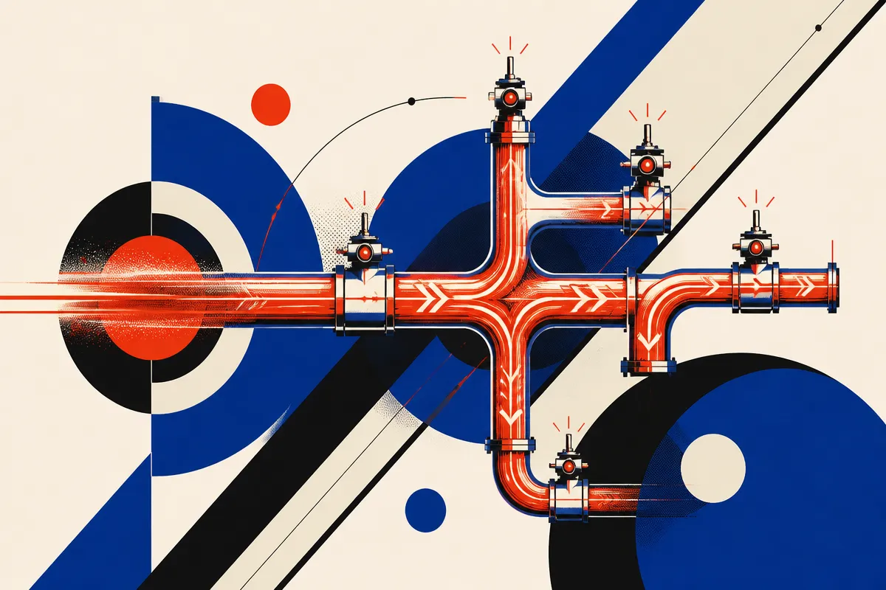

TL;DR: Treat AI-driven financial risk as an infrastructure design problem, not a reason to turn one asset class into a magic bunker.

## What did Marc van der Chijs actually warn about?

CoinDesk’s "'We have lost control': Crypto pioneer warns AI could trigger systemic banking and infrastructure shocks" reports that Marc van der Chijs, described as a crypto pioneer, sold much of his bitcoin to invest in AI, then grew concerned enough about AI risk to put some profits back into crypto.

That is the headline tension: an early crypto person chased AI upside, then started treating AI as a systemic risk.

The part I would not overread is the portfolio move. People rebalance for lots of reasons. Crypto as an AI hedge is not proven by one investor’s behavior, and it should not be treated as advice. There is no safe translation from “AI may stress institutions” to “therefore this token protects you.” That is narrative glue, not engineering.

The part worth taking seriously is the category of risk van der Chijs is pointing at: banking and infrastructure shocks. AI does not need to become sentient, omnipotent, or even especially original to cause real trouble. It only needs to be wired into enough decisions, alerts, approvals, code paths, fraud systems, and customer interactions that failures become correlated.

That is where the word “systemic” starts to matter.

## Where could AI amplify a banking or infrastructure shock?

The boring pathways are the scary ones.

A bank using models for fraud triage can block legitimate transactions at scale if the model or its surrounding rules misread a pattern. A payment processor using AI for risk scoring can create cascading merchant freezes. A cloud provider or SaaS vendor using coding agents internally can ship a bad change faster than its review culture can catch it. A customer support bot with tool access can turn prompt injection into account changes, data exposure, or operational noise.

None of this requires a sci-fi failure. It requires automation, speed, weak isolation, and shared dependencies.

The strongest version of van der Chijs’s warning is not “AI will crash the banks.” It is “AI may make many institutions fail in similar ways at similar times.” That is the real systems issue. If everyone buys the same vendor stack, routes alerts through similar models, and optimizes for fewer humans in the loop, then a model bug, adversarial attack, bad update, or data drift event can spread like a software monoculture problem.

The weaker version is treating AI as a vague monster. “We have lost control” is emotionally punchy, but control is not one thing. There is model control, deployment control, access control, vendor control, incident control, and regulatory control. The practical question is which of those failed, where, and under what load.

## What should operators take from this without buying the panic?

Start by separating exposure from drama. If an AI system can only draft an internal note, the blast radius is low. If it can approve payments, alter account status, change infrastructure, merge production code, or make decisions customers cannot appeal, the blast radius is high.

That calls for ordinary controls, applied with more discipline. Tool permissions should be narrow. High-impact actions should require deterministic checks or human confirmation. Logs should show model inputs, tool calls, outputs, and downstream effects. Vendors should be asked what happens during model rollback, outage, prompt injection, data leakage, and silent degradation. Not just uptime. Failure behavior.

There is also a policy angle. Regulators will likely care less about whether a bank “uses AI” and more about whether it can explain decisions, reverse mistakes, prove oversight, and survive a vendor failure. That is the right center of gravity.

The crypto angle is culturally interesting because bitcoin has always been sold, in part, as an exit from institutional fragility. But AI risk does not automatically validate that thesis. Crypto exchanges, wallets, bridges, custody firms, and on-chain apps also use software, vendors, automation, and human operators. They can absorb AI failure too.

For builders, the move is simple: map every AI system by authority, not intelligence. What can it touch? What can it change? Who can override it? What breaks if it acts 10,000 times in an hour? The catch most readers miss is that the dangerous system may not be the smartest model in the company. It may be a mediocre model with write access.
