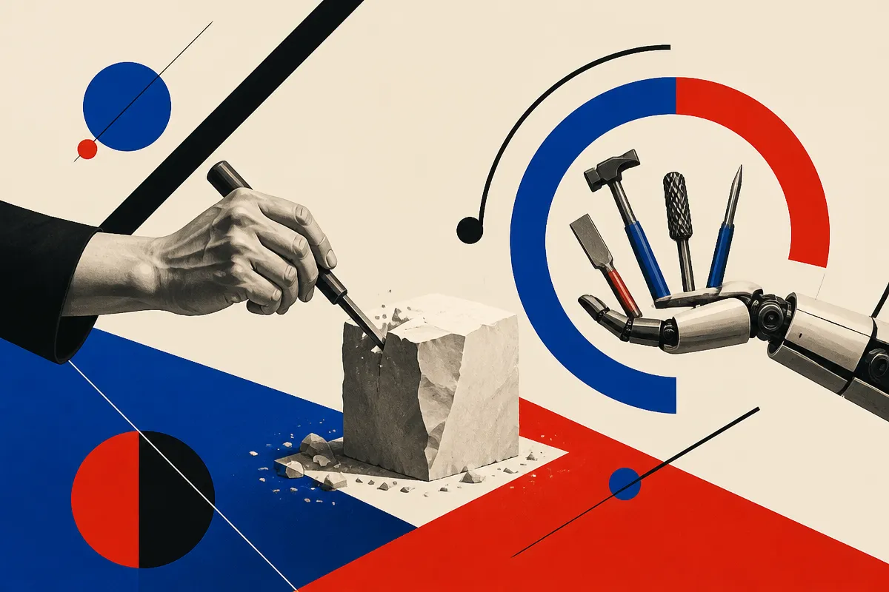

TL;DR: Use AI to pressure-test, organize, and edit writing, but do not hand it the job of forming the actual judgment your name sits on.

## What does “almost never use AI to write” get right?

The Hacker News (AI) item titled “I think you should almost never use AI to write” is blunt enough to be useful. I do not read that as “never use language models near writing.” That would be silly. I use them near writing all the time.

The better version is this: almost never use AI to produce the final thought for you.

That distinction matters. Writing is not just packaging. It is where the thinking gets forced into shape. If you let a model skip that struggle, you may get a cleaner paragraph and a weaker idea. Worse, you may not notice, because the output sounds competent.

This is the trap with AI prose. It reduces friction in the exact place where friction has value.

A model can write a fine summary of a product launch. It can turn rough notes into a readable memo. It can suggest titles, tighten sentences, find missing transitions, or ask the annoying question your draft avoids. Those are useful jobs.

But if the task is to say what you believe, decide what matters, or build trust with a reader, outsourcing the draft can flatten the signal. It replaces taste with probability. It makes the average version of your point, usually with the edges sanded off.

That is not a moral panic. It is a product constraint.

## Where should AI sit in a writing workflow?

Put the model before and after the human draft, not instead of it.

Before writing, AI is good for interrogation. Ask it what a skeptical reader would challenge. Ask for adjacent examples. Ask what terms are overloaded. Ask it to compare two frames for the same argument. The output is not the essay. It is resistance.

After writing, AI is good for cleanup. Have it flag vague claims. Have it identify repeated ideas. Have it shorten a paragraph without changing the meaning. Have it produce five possible headlines, then reject the lazy ones. This is where language models earn their keep.

The danger zone is the middle. The blank-page replacement. “Write me a post about X.” That prompt usually produces something structurally correct and intellectually generic. It has all the ingredients of an article except the reason anyone should read it.

The better prompt is not “write this.” It is “argue with this,” “find the weak claim,” “make this clearer,” or “show me what I am missing.” That keeps the author in charge of judgment.

## What changes for teams publishing at scale?

Teams have a harder version of this problem because scale rewards sameness. Once a company discovers that AI can produce 50 acceptable pages, the temptation is to ship 500. Then every page starts sounding like the same polite intern wrote it.

That may pass a quick read. It does not build authority.

For content teams, the useful question is not “Can AI write this?” Of course it can. The better question is “What part of this page requires original judgment, field experience, or a real constraint from our business?” If the answer is “none,” the page may not need to exist.

AI can help produce briefs, compare competitor coverage, extract FAQs from sales calls, draft schema, and repurpose a strong point across formats. Good. Use it. But the core asset is still the human decision about what is true, useful, and different.

Practitioner’s take: keep a simple rule in the workflow. Use AI to prepare the room and clean up after the meeting, but make the human sit through the meeting. Draft the claim yourself, even badly. Then ask the model to attack it, compress it, and clarify it. The catch most teams miss is that AI saves the most time when the writer already has a point. Without that, it mostly helps you publish faster versions of nothing.
