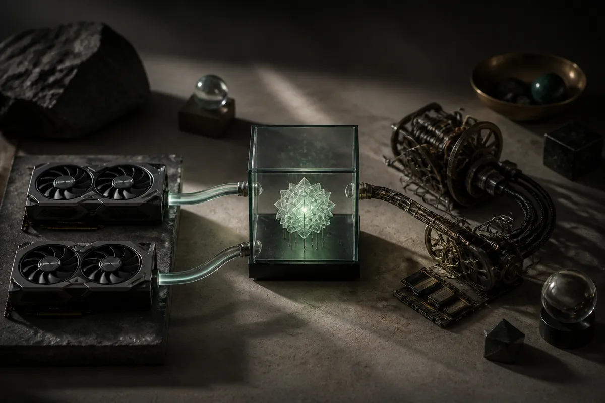

TL;DR: If AMD really has a faster consumer GPU for local AI, the deciding factor for builders will not be the benchmark headline, it will be whether the software stack makes it boring to use.

## What is actually being claimed?

GameGPU reported in “Radeon RX 10800 XT can outperform the RTX 5090 by 15-25% in 4K gaming and local AI” that AMD’s Radeon RX 10800 XT may beat Nvidia’s RTX 5090 by 15 to 25 percent in 4K gaming and local AI workloads. The claim was picked up in r/LocalLLaMA, where the short reaction was the correct one: more competition is better.

That is about as far as I would take it for now.

This is not an AMD announcement in the material provided. It is not a public benchmark suite from AMD, Nvidia, MLPerf, Hugging Face, or a known local inference project. It is a reported performance claim, and the “local AI” part is doing a lot of work. Local AI is not one workload. Running a 7B chat model at Q4 on llama.cpp is not the same thing as serving a larger model with long context, batching requests, using vision models, or doing fine-tuning experiments.

A 15 to 25 percent lead would matter if it survives real testing. But for builders, the first question is not “which card wins a headline?” It is “which card runs my actual stack with fewer surprises?”

That has been Nvidia’s moat for local AI. Not just raw silicon. CUDA, library support, tutorials, defaults, working examples, and fewer strange compatibility traps. AMD does not need to win every benchmark to become useful. It needs enough memory, enough speed, and a developer path that does not turn every install into a weekend project.

## Why does local AI care about more than GPU speed?

For local models, three practical variables usually beat abstract performance claims: VRAM, memory bandwidth, and software support.

VRAM decides what you can run without ugly compromises. A card can be fast and still be annoying if the model, context window, or batch size spills past memory. Bandwidth affects how fast tokens move through common inference paths, especially for quantized models. Software decides whether you can run the model at all without hunting through GitHub issues.

This is where AMD has the harder job. A gaming win does not automatically translate to a local AI win. The kernels matter. The quantization path matters. The backend support in tools people actually use matters. If a model runner supports Nvidia first, Apple second, and AMD only through a narrower path, the builder feels that immediately.

That said, the market badly needs AMD to be credible here. Local AI gets healthier when buyers are not locked into one vendor’s pricing and availability. If Radeon cards become a normal choice for llama.cpp-style inference, workstation experiments, and small office AI boxes, that changes purchasing decisions even without a clean performance crown.

The useful version of this story is not “AMD crushes Nvidia.” That is too neat. The useful version is “consumer GPU competition may finally reach local AI in a way builders can feel.”

## What should builders wait to see?

I would look for independent tests on specific models, not generic “AI” claims. Show tokens per second across common model sizes. Show memory use. Show long-context behavior. Show setup steps. Show failures. A benchmark that omits installation friction is only half a benchmark.

I would also separate gaming buyers from local AI buyers. Gaming benchmarks can prove the card has serious hardware. They do not prove that PyTorch, ROCm, llama.cpp, Ollama-style workflows, or agentic coding setups behave well on day one. Those are different receipts.

If the RX 10800 XT exists as reported and AMD gets the software right, it could be a very good thing for local builders. If the performance is real but the tooling remains uneven, the card may still be mostly a gaming story with an AI asterisk.

For a practitioner, the move is simple: do not preorder your workflow around a headline. Write down the exact models you run, the context sizes you need, and the tools in your stack. Then wait for independent local inference tests on those paths. The catch most people miss is that the cheapest fast GPU is not cheap if your team spends days making it behave.
