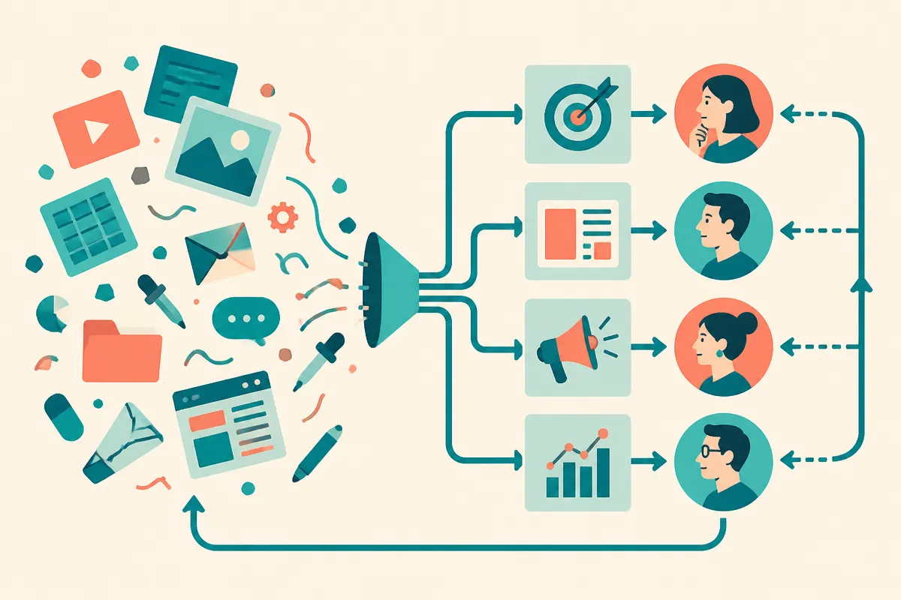

TL;DR: Giving a marketing team AI tools is not the same as changing the work, and the useful next step is redesigning the workflow around where AI actually helps.

## What changes after everyone has the tools?

Marketing AI Institute’s “Why AI Adaptation, Not Adoption, Is the Real Work Ahead” makes the right distinction: many marketing teams have rolled out AI tools, but far fewer have changed how people work with them day to day.

That sounds obvious until you look at how most teams actually use AI. A writer asks for headline ideas. A demand gen manager asks for ad variants. Someone summarizes a meeting. Useful, yes. Transformational, no.

The gap is not tool access. It is operating model.

Adoption asks, “Do people have the thing?” Adaptation asks, “Did the process change because the thing exists?” That second question is harder because it touches role design, approval paths, brand governance, analytics, legal review, and the boring systems where marketing work actually happens.

I like the adaptation frame because it avoids both lazy optimism and lazy fear. AI is not magic staff. It also is not a sidecar you can bolt onto the same old content calendar and expect step-change performance. If the work still moves through the same briefs, the same review loops, the same reporting habits, and the same last-minute scramble, the model is mostly a faster intern in a broken process.

## Where does adaptation show up in marketing work?

It shows up in the middle of the workflow, not at the shiny edge.

A content team that has adapted does not just ask AI for blog drafts. It changes the brief. The brief includes audience, search intent, proof points, internal links, examples, claims that need sourcing, and claims that cannot be made. The model helps produce options, but the human job shifts toward taste, evidence, positioning, and edit quality.

A lifecycle team that has adapted does not just ask for “10 email subject lines.” It builds reusable patterns for segments, objections, offers, compliance language, and test hypotheses. The model becomes part of the campaign planning loop, not a random copy machine.

A brand team that has adapted does not only write a voice guide. It turns that guide into examples, constraints, and review criteria. Then it checks outputs against those criteria. That is less glamorous than a viral prompt thread. It is also what makes AI usable at scale.

The important part: adaptation usually creates more process before it creates less. Teams need shared prompts, examples of good and bad output, review standards, escalation rules, and some agreement on where AI is allowed to draft, decide, recommend, or merely summarize.

That is work. It is also why “we bought seats” is such a weak milestone.

## What should teams measure instead?

The easy metric is usage. How many people logged in. How many prompts ran. How many assets were generated. Those numbers can be useful, but they do not prove much.

Better questions are closer to operations. Did cycle time drop on specific tasks? Did first drafts get better or just faster? Did reviewers spend less time fixing avoidable errors? Did campaigns ship with stronger testing plans? Did the team produce more useful variants without diluting the brand? Did AI reduce low-value work, or did it create a larger pile of mediocre work for humans to clean up?

That last one matters. AI can increase throughput and still make the business worse if the quality bar falls. More landing pages, more emails, more social posts, more reports. Not automatically better marketing.

The practical move is to pick one workflow and redesign it end to end. Not “AI for marketing.” Too broad. Try “AI-assisted webinar follow-up,” “AI-assisted product launch briefs,” or “AI-assisted SEO refreshes for existing pages.” Define the human owner, the inputs, the model tasks, the review step, the acceptance standard, and the metric that decides whether the workflow is better.

Practitioner’s take: start with one painful repeatable workflow, map it without AI first, then insert AI only where it changes speed, quality, or decision-making. The catch most teams miss is that adaptation needs artifacts, not enthusiasm: better briefs, reusable examples, review rubrics, and feedback loops. Without those, adoption becomes another software rollout people mention in meetings and avoid when the real work starts.
