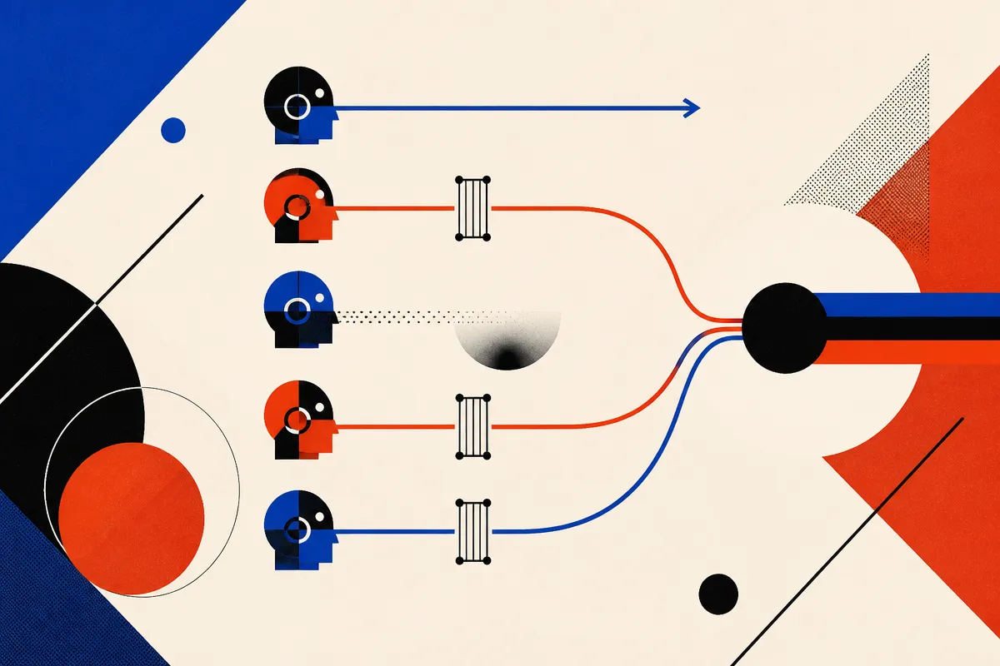

TL;DR: Gated attention may help not because it is one magic trick, but because softmax attention is missing two simple controls: the ability to say nothing, and the ability to filter noisy values.

## What is softmax attention missing?

The primary source is **“Abstention and Noise Filtering: Two Missing Primitives of Softmax Attention”**, listed on arXiv cs.CL and cs.LG. The claim is refreshingly narrow: standard softmax attention forces every attention head to put its probability mass somewhere, because attention weights sum to one. That means a head cannot naturally decide, “nothing here is useful.”

The paper calls the missing behavior **abstention**. The proposed fix is a learned per-head sink logit inside the softmax. In plain English, give the head a harmless place to put attention when it should not contribute.

The second missing behavior is **noise filtering**. Attention heads read values from the residual stream, where features can be superposed. If the value pathway carries interference, the head may pass junk forward even when its attention pattern looks reasonable. The paper tests a gate on each value so the model can suppress that interference before it contaminates the output.

That distinction matters. A lot of architecture tweaks get sold as one blob of “better attention.” This paper tries to split the gain into two mechanisms. One is about whether the head should speak at all. The other is about cleaning up what it says.

## What changes as models get bigger?

The experimental setup spans matched models from 10M to 350M parameters. That is not frontier scale, but it is large enough to show a pattern across size.

The reported result: abstention explains nearly all of the gain from gating at 10M parameters, while noise filtering explains most of the gain at 350M parameters. The best model at every tested scale includes both primitives. The paper also reports that adding these mechanisms costs negligible parameters and remains compatible with the key-value cache.

That last point is practical. Anything that breaks KV caching has a hard road, because inference speed and memory already dominate real deployment costs. A small change that keeps the cache intact is much easier to imagine in production models than a beautiful idea that makes serving worse.

The scale trend is the part I care about. Small models may waste capacity by being forced to attend when they should abstain. Bigger models may run into a different problem: richer residual streams with more interference, which makes filtering more valuable. If that holds beyond 350M parameters, it suggests some attention improvements are not interchangeable. The right primitive depends on where the model is on the scaling curve.

## Is this an architecture breakthrough or a useful patch?

I would call it a useful patch with a real conceptual point.

The paper does not claim that gated value pathways replace softmax attention. It argues that prior work saw gains from gating but did not fully separate the causes. To test that, the researchers inject controlled interference into the values a head reads, then show that the gate can remove it. They also report that different gate forms have different blind spots. That is the kind of detail that keeps this from being pure architecture vibes.

Still, there are limits. The evidence stops at 350M parameters. Validation loss gains do not automatically translate into better instruction following, tool use, long-context recall, or agent reliability. And the paper summary does not tell us how these primitives interact with the full bag of modern training choices: mixture-of-experts, grouped-query attention, post-training, distillation, or production-scale inference stacks.

But the direction is clean. Instead of making attention more expressive in a vague way, add two missing controls. Silence when nothing is worth saying. Filtering when the readout is polluted.

Practitioner’s take: if you are training small or mid-sized language models, this is a design to watch because it targets pretraining loss without a big parameter bill and without breaking KV cache behavior. I would not rewrite a production stack on one 10M to 350M result. I would test abstention and value filtering separately in your own architecture, measure validation loss and serving cost, then inspect whether gains survive post-training. The catch most readers miss: “gating helps” is too coarse. The useful question is which failure you are fixing, forced attention or noisy values.
