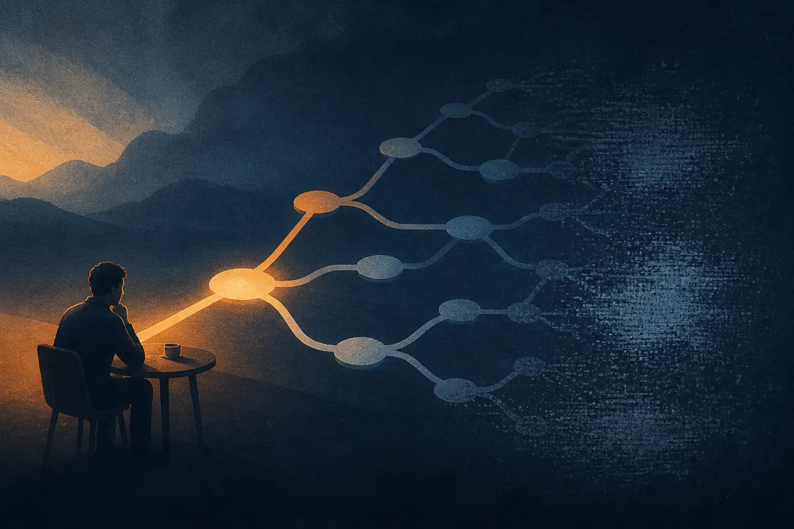

TL;DR: For multi-turn tool agents, the best training target may be one specific model call, not the whole trace.

## What problem does Critical-State RL solve?

The arXiv paper “Critical-State RL: Diagnosing Trainable States for Multi-Turn Tool Use” takes aim at a very practical agent problem: a tool-using model can fail because of one bad turn, but the final reward often cannot tell you which turn caused it.

That matters because most agent workflows are not single-shot prompts. They are sequences. The model decides whether to call a function, which arguments to include, whether to retry, whether to use memory, whether to stop, and how to recover after the environment changes. If the final task fails, the obvious move is to train on the whole interaction. But that can be wasteful, or worse, it can train the wrong behavior.

The paper’s core claim is simple: reward variation is not the same as trainability. A turn may look important because later parts of the trajectory are noisy. Or a turn may have low reward variation because the model is already boxed in by earlier mistakes. Critical-State RL tries to identify states where two things are true: the local reward actually captures the effect of the model’s action, and the model can improve over a reference policy at that point.

That is a useful distinction. A lot of agent eval work asks, “Did the run succeed?” Critical-State RL asks, “Which decision in the run is worth spending training compute on?”

## How does the diagnostic work?

The method starts with task-defined candidate calls and local rewards. Then it uses nested sampling to separate action-dependent reward variation from continuation noise. In plain English: it tries to tell whether different choices at a given turn really change the outcome, or whether the apparent signal is coming from messy stuff that happens later.

Once it finds the selected state, the paper trains the policy there using contextual-bandit training. That is narrower than full RL over the whole trace. The model is not being asked to rediscover the entire workflow. It is being trained on the decision point where the diagnostic says improvement is possible.

The Berkeley Function Calling Leaderboard, BFCL v4, is the main reported testbed. For missing-function tasks, the diagnostic selects the response after the tool becomes available. For missing-argument tasks, it selects the response before the missing argument is supplied. That tracks with intuition, but the point is that the method is trying to prove it rather than assume it.

The reported result that jumps out: training the selected responses improved performance, including about 14 percentage points on the missing-function task. Training alternative states was flat or worse. That last part is the receipt. The value is not just that training helped. It is that training the wrong turn did not.

## Why should agent builders care?

This is not a “agents are solved” result. It depends on candidate calls, task-defined local rewards, and enough structure to run the diagnostic. The paper also reports applications beyond BFCL, including logged repeat-call avoidance and memory management, but the source material does not give enough detail to treat this as a universal recipe across all agent stacks.

Still, I like the direction because it matches what operators see in production. Tool agents often do not fail everywhere. They fail at boring little seams: one retry too many, one missing argument, one stale memory lookup, one refusal to call a newly available tool. A full trajectory score turns those seams into mush.

Critical-State RL gives teams a sharper debugging loop. Instrument the workflow. Pick candidate decision points. Define local rewards that actually map to task success. Test whether the state is causal and improvable before training. Then optimize that state, not the whole agent persona.

For builders, the practical move is to stop treating every failed trace as equal training data. Start by collecting repeated failures around one tool workflow, then mark the few model calls where a different action could plausibly change the outcome. The catch most readers miss: the hard part is not the RL. It is designing local rewards and candidate states well enough that the diagnostic has something real to measure.
