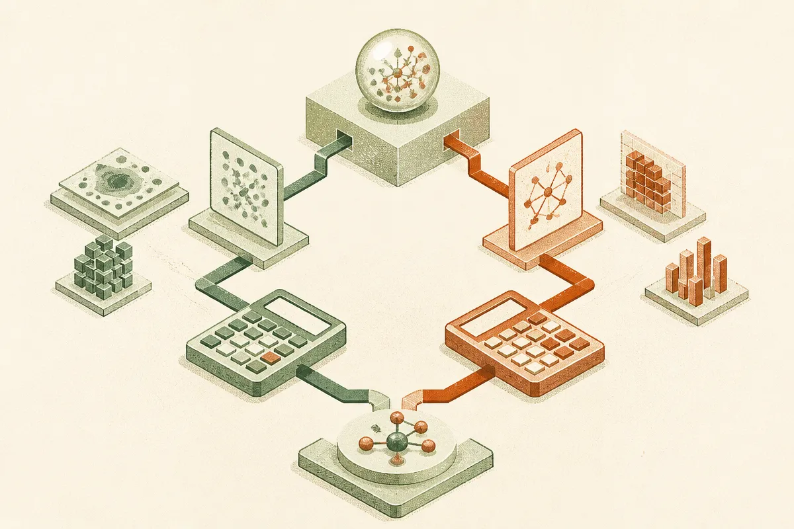

TL;DR: The useful lesson from Jev is not that one model won, it is that scientific AI workflows need evals for the semantic choices that happen before the math.

## What is Jev actually being tested on?

The primary source here is **“Jev for Scientific Decisions: Evaluating Semantic Choices and Their Consequences,”** listed on arXiv in cs.AI and cs.CL. It studies Jev as a semantic decision component inside scientific workflows.

That phrasing matters. This is not a benchmark where the model answers a trivia-style science question and gets a green check. The paper looks at a narrower and more practical pattern: before a deterministic calculation can run, the system often has to decide which relation applies.

Do two observations share the same culture? The same treatment? The same reference standard? Those are not arithmetic questions. They are meaning questions. But once the choice is made, the downstream count, comparison, or claim can change.

The setup is small but clean. The study compares twelve model configurations on twenty source-grounded Choices across ten scientific cases, with each repeated five times. Arithmetic is assigned to code, which is exactly how these systems should be built. Let the model choose among grounded semantic options. Let software do the counting.

That split is the point.

## Why can a wrong choice still produce the right final claim?

The paper reports that Jev matched five other configurations at complete semantic correctness and had the lowest observed median latency among successful responses. That is interesting, but I do not think it is the main lesson.

The sharper finding is that, across three comparison models, seven wrong selections on one culture-history question changed downstream counts while preserving the correct final label.

That is the kind of failure final-answer grading misses.

A model can pick the wrong relation, pass a count into the workflow, and still land on the same final claim because the decision boundary did not move. In a leaderboard, that looks fine. In a scientific workflow, it is debt. The next user may reuse the count. Another step may combine it with a different threshold. A later report may cite the intermediate quantity as if it came from the intended definition.

This is why “the answer was right” is too weak for applied AI in science, medicine, compliance, finance, or any workflow where intermediate values become reusable facts.

The Jev paper separates three things that are often blended together: semantic selections, downstream outputs, and final claim labels. That is a better mental model for evaluation. It tells you whether the system understood the relation, whether the computation followed from it, and whether the final statement survived.

Those are different failure modes. They deserve separate checks.

## What should builders copy from this?

The practical pattern is simple: make semantic choices explicit.

Do not ask a model to “analyze the study” and then trust the final paragraph. Force it to choose from known relations grounded in the source material. Store that choice. Attach the span or evidence that justified it. Then pass the selected relation into deterministic code for the arithmetic.

This is less glamorous than a full agent that reads papers, builds tables, writes claims, and emails the lab. It is also more likely to survive contact with real work.

The catch is that prepared decision tasks are not the same as open-ended scientific discovery. The Jev paper’s setup uses known choices and source-grounded cases. That is a strength for evaluation, not proof that the same approach handles messy literature review, ambiguous labels, or conflicting standards without more scaffolding.

For builders, I would try this on one workflow where the model currently makes invisible judgment calls. Pull out twenty recurring semantic decisions. Turn them into explicit Choices. Let code handle the math. Then grade three layers separately: the selected relation, the computed value, and the final claim. The missed catch is that your “accurate” workflow may already be carrying wrong intermediate meaning, and you will not see it until you stop grading only the last sentence.
