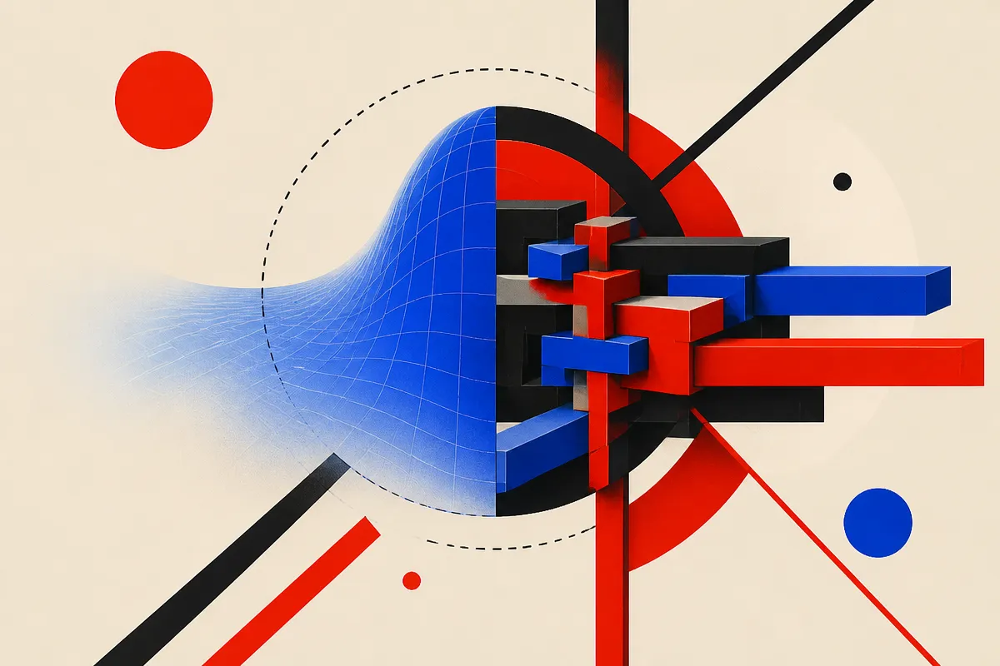

TL;DR: If a model only fits the training pattern, it can look perfect in-distribution and still fail outside it, because real extrapolation requires representing the mechanism that generated the data.

## What does “exactness at inference” mean?

“Exactness at Inference: A Representational Criterion for Out-of-Distribution Generalization,” listed on arXiv cs.AI and cs.LG, makes a hard claim: out-of-distribution generalization is not mainly about lower loss, bigger training sets, or smoother interpolation. It is about whether inference computes something structurally equivalent to the generating mechanism.

That is a useful framing because it separates “the model got the answer” from “the model has the right machinery.”

The paper’s clean example is Tensor Logic. At zero temperature, its contraction is equivalent to discrete logic. It can deduce in place. The tensors are Boolean, the embeddings are orthonormal, and only the arithmetic is continuous. That matters because the paper is not arguing that generalization requires a human-readable symbolic program to be extracted. It is arguing that the representation used at inference has to be exact in the relevant structural sense.

That distinction is easy to miss. A neural net thresholded into a hard label does not become exact just because the output is discrete. An exact marginal in $[0,1]$ can pass the criterion. Logic Tensor Networks fail under this framing, while differentiable ILP and Tensor Logic at $T=0$ pass.

So the target is not “symbols good, neural nets bad.” The target is exact representability.

## Why does this matter for agents and benchmarks?

A lot of current agent talk hides this problem under tool use. Give a model a browser, a shell, memory, and retries, then call it general. Sometimes that works. Often it just moves the fitted estimator deeper into the stack.

The paper’s propagation rule is the part I’d keep taped to the wall: in hybrid architectures, the output inherits the bounds of every fitted estimator on its path. If one step is a fitted approximation that fails off-distribution, downstream steps do not magically wash that out. They compound it.

This maps cleanly onto agent evaluation. An agent may do fine on familiar web flows, common coding tasks, or repeated business workflows, then collapse when a task changes along the wrong axis. The failure may not be “reasoning” in the abstract. It may be a missing exact representation for the thing that changed.

The paper also points at ARC-AGI’s induction/transduction split. That is the right neighborhood. Some tasks can be solved by pattern completion inside the instance. Others require inducing the rule and applying it beyond the observed cases. Those are different competencies, and treating both as generic benchmark accuracy muddies the water.

One concrete result from the paper: on a law-derived partition, an exact hypothesis class identifies the 56.3% of distant queries that are answerable. Ensembles meet those cases with false confidence, while distance metrics rank them backwards. That is a nasty finding for anyone using confidence, retrieval distance, or ensemble agreement as a proxy for “this should generalize.”

## What should builders take from this?

I would not read this as a reason to throw away neural systems. I would read it as a design warning.

If your product depends on OOD behavior, ask where exactness enters the system. A calendar agent needs exact date arithmetic. A finance workflow needs exact ledger constraints. A code agent needs exact handling of syntax, tests, dependency state, and execution traces. A medical or legal assistant needs domain constraints that are not merely vibes learned from adjacent documents.

The paper is also clear about limits. Tensor Logic without infinite recursion reaches Datalog, not Prolog. It is exact over closed domains, but needs external memory to bind a novel entity. That is a practical architecture clue: exact components still need the right state, memory, and binding machinery around them.

For a builder, the move is simple but not easy: isolate the parts of your workflow where approximation is acceptable, then cordon off the parts where exactness is required. Use models for interpretation, planning, and translation where they are strong. Use formal rules, tests, constrained decoders, typed data, executable checks, or external memory where the task has to preserve structure. The catch most teams miss is that a high eval score on the common path does not tell you which hidden fitted estimator will break first when the task leaves the training manifold.
