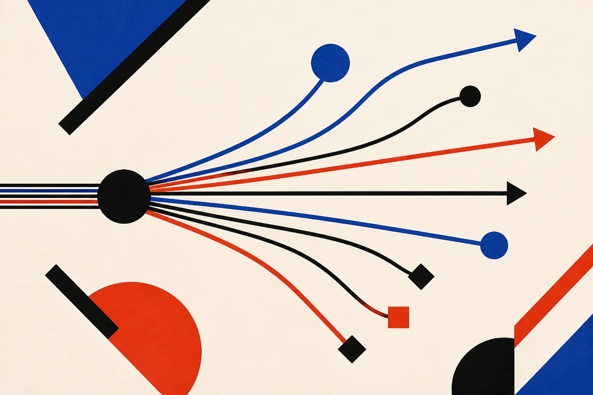
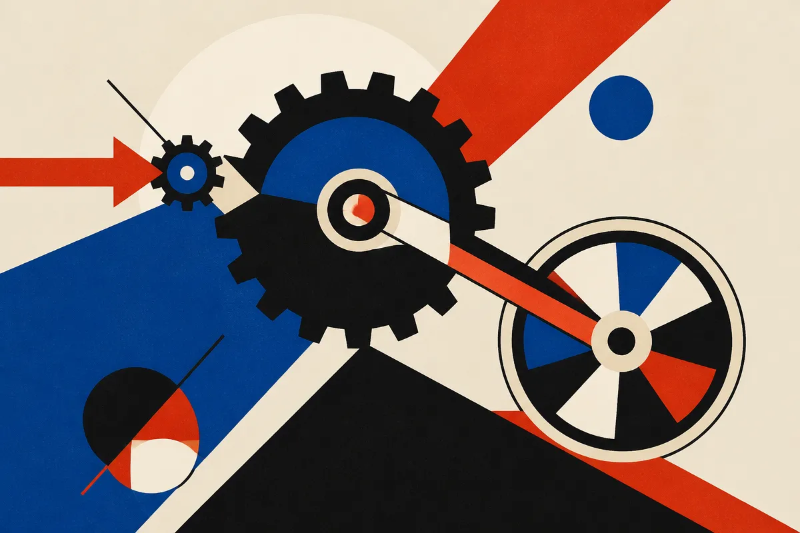

TL;DR: Instead of sampling a big model 100 times and hoping one answer lands, you can train a small model to hand it diverse strategies first, and that small model works even on bigger models it never saw during training.

The paper is "Beyond Repeated Sampling: Learning Search Policies for LLM Reasoning," posted to arXiv under both cs.AI and cs.CL. It targets a habit that has quietly become the default for hard reasoning: throw more test-time compute at a problem by drawing many independent samples and picking the winner. The authors argue that habit is lazier than it looks, and they show a cheaper, smarter alternative.

## Why is repeated sampling such a weak way to spend compute?

The standard move for a hard math problem is pass@k. You ask the model k times, you check if any of the k answers is right, and you report success if one is. Labs lean on this because it scales cleanly: more samples, higher pass@k, more compute burned.

The problem is what those k samples actually contain. When you sample the same model repeatedly, the only thing varying between attempts is local decoding noise, the small token-level randomness from temperature. So the model tends to walk the same reasoning path over and over with tiny wording changes. You get many near-duplicate attempts, not many different ideas. On easy problems that is fine, one path is enough. On genuinely hard problems, where the single most-likely approach is wrong, redrawing the same wrong approach 100 times gets you nothing.

That is the real waste. The authors frame it as an exploration failure. Repeated sampling explores at the token level when the thing you actually need to vary is the strategy.

## What does steering exploration "at a semantic level" mean?

The fix in the paper is to split the work into two steps. First, generate concepts: problem-specific hints, strategies, or angles of attack. Then condition the answer generation on those concepts. Instead of "solve this problem 100 times," it becomes "here are 100 different ways to think about it, now solve under each."

They refine this into a procedure that emits many diverse concepts in a single trajectory, which matters for cost, because you are not paying for a full solution attempt just to get a strategy. The concepts are cheap. The full answer generation, conditioned on a good concept, is where the compute goes, and now that compute is pointed at genuinely different starting points instead of the same one repeated.

This is a familiar idea dressed in new clothes. Plan-then-solve, self-consistency with diverse prompts, tree search over reasoning steps, they all try to force diversity. What is different here is where the diversity comes from and how it gets better over time.

## How do you train a small model to be a search policy for a bigger one?

Here is the part worth paying attention to. The authors make concept generation trainable. They take a small concept generator and optimize it with reinforcement learning, where the reward is the downstream success of a larger, frozen answer generator. The big model never gets touched. Its weights stay fixed. The only thing learning is the small model that feeds it strategies.

So the small model is not learning to solve math. It is learning what kinds of hints make the big model solve math. That is a different and narrower job, which is exactly why a small model can do it.

The results, on hard mathematical reasoning, are the interesting claims. The trained concept generator improves the answer generator's pass@k over naive repeated sampling at the same answer-generation budget. It beats concepts pulled from much larger untuned models, which says the training matters more than the size of the thing producing the hints. And it transfers: the concept generator helps answer generators it was never trained against, including a model from a different family.

That last claim is the one I would want independent replication on before treating it as settled. Cross-family transfer is the difference between a neat lab result and a reusable tool. The paper reports it happened on their tasks. Whether it holds across the messy range of real reasoning problems, and how much the gain shrinks off-distribution, the abstract does not say. Treat "reusable search policy for a much larger one" as the paper's claim, not a proven general property.

## What would this change for someone building with reasoning models?

If it holds up, the economics are attractive. Today, buying more reasoning reliability means either a bigger model or more samples from the one you have, both of which cost linearly in dollars. This suggests a third lever: a small, cheap, trainable component that makes your existing samples count for more. You keep the frozen big model, you add a lightweight steering model, and you get better pass@k per dollar.

It also reframes what "prompting" is. A concept generator trained with RL against a target model is prompt engineering that learns, rather than prompt engineering you hand-write and pray on. The hints are optimized for the specific behavior of the model receiving them, which is something no human prompt author can tune at scale.

The honest caveats: this is one paper, evaluated on hard math, reported through an abstract without the full numbers in front of me. Math has clean, checkable answers, which makes the RL reward easy to define. Domains where "correct" is fuzzy, code that has to pass a real test suite, agent tasks with side effects, legal or medical reasoning, do not hand you a reward signal for free. The method assumes you can score success cheaply. Where you cannot, the whole training loop gets harder.

Practitioner's take: if you are already spending on pass@k for a hard, checkable task, this is the paper to read in full before your next compute budget conversation. The move to try is not to reimplement RL on day one. It is to test the cheaper half first: before you scale samples, generate a handful of genuinely different strategies for the problem and condition separate attempts on each, by hand or with a second model. If diverse-concept sampling beats plain repeated sampling on your own eval, you have confirmed the premise on your data, and only then is training a small steering model worth the effort. The catch most readers will miss is the reward. The whole approach lives or dies on whether you can score "did the big model get it right" cheaply and reliably. Nail that first, because everything else in the paper depends on it.
