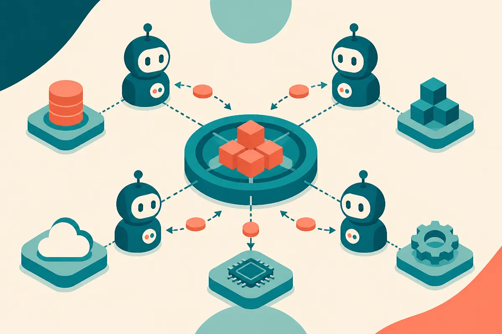

TL;DR: AI agents may create real demand for machine-native payments, but stablecoin use is most plausible first in narrow workflows where agents buy services across networks without a standing account.

## What would an AI agent actually pay for?

The core claim comes through two trade reports: CoinDesk’s “BlackRock says AI agents could drive stablecoin and crypto adoption” and Decrypt’s “BlackRock: AI Agents Could Drive Crypto's Next Demand Wave.” CoinDesk reported that BlackRock sees payments as the nearer-term opportunity, while markets for computing capacity are still early. Decrypt reported the broader version: autonomous agents buying data, paying for services, and renting computing power could become a meaningful source of crypto demand.

That idea is not crazy. It is also easy to overinflate.

Today’s AI agents mostly call APIs inside an app boundary. They search, draft, classify, scrape, schedule, code, and route work. The payment layer is usually hidden. A company pays OpenAI, Anthropic, Google, AWS, Stripe, HubSpot, or a data provider through a normal account. The agent never touches money.

The interesting shift happens when an agent needs to transact outside a pre-approved vendor graph. Think buying a one-time dataset, paying a small fee to access a specialized model, posting collateral for a task, renting a GPU for minutes, or paying another autonomous service to complete part of a workflow. Credit cards and invoicing were not designed for high-frequency software-to-software settlement across unknown counterparties.

That is where stablecoins make more sense than “crypto” as a blanket term. A dollar-denominated token can act like programmable cash if the parties care about speed, small transaction size, global reach, and automated settlement. That does not mean every agent needs a wallet. It means some agent marketplaces may need one.

## Where does the crypto case get weak?

The weak part is the jump from “agents need payments” to “crypto assets benefit broadly.” Those are different claims.

Stablecoin settlement can grow without making most tokens more useful. A marketplace can use stablecoins for payment while keeping pricing, identity, permissions, dispute handling, and user experience off-chain. Builders care about completion rates, fraud losses, compliance exposure, chargebacks, and uptime. They do not care whether a narrative sounds investable.

Compute is also harder than the headline suggests. CoinDesk’s reported distinction matters here: payments are nearer-term, compute markets are early. Cloud compute already has strong incumbents, mature billing, enterprise procurement, security controls, support contracts, and service-level expectations. A decentralized compute market has to compete on more than “agents can pay it.” It needs reliable supply, verified performance, data protection, predictable latency, and sane developer tooling.

Data markets face similar friction. Agents buying data sounds clean until you ask basic operator questions. Who verifies the data rights? Who handles bad data? Can the buyer audit provenance? Can the seller restrict redistribution? What happens when an agent buys something it was not allowed to buy?

These are product and governance problems first. The payment rail is only one piece.

## What should builders test first?

If I were building here, I would not start with a token. I would start with a controlled agent wallet in a narrow workflow.

Set a spending limit. Define approved categories. Require receipts. Log every transaction. Add human approval above a threshold. Use stablecoins only where they beat the default payment method on speed, access, cost, or automation. If they do not, skip them.

The first useful products may look boring: agents that can buy API credits, pay for gated research, rent short bursts of infrastructure, or settle usage between services. The agent should not “own money” in some sci-fi sense. It should operate inside a policy box with auditable permissions.

BlackRock’s reported argument is useful because it points to a real design pressure: autonomous software eventually needs autonomous settlement. But demand for settlement is not the same thing as a buy signal, and it is not proof that every crypto network gets pulled along. The practical question is narrower: where does programmable payment remove enough friction to justify the extra risk?

For builders, try one workflow where payment is currently the blocker: a tool call that needs a paid external resource, a usage-based service between agents, or a small cross-border payout. Then measure whether stablecoin settlement reduces manual work without increasing fraud, compliance, or support load. The catch most readers miss: the wallet is not the product. The permission system around the wallet is the product.
