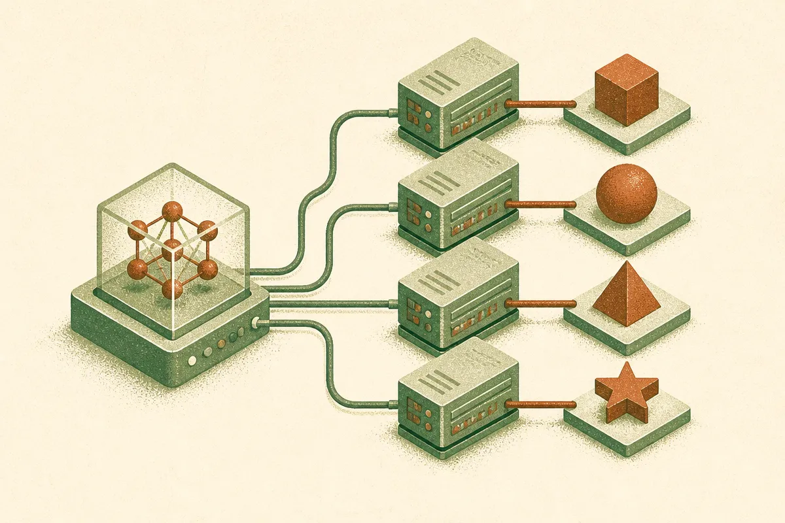

TL;DR: If you test local agents, treat the serving stack as part of the model, because it can change whether a valid tool call ever reaches your harness.

## What is actually being measured in local tool-use evals?

The arXiv paper "Measuring the Serving Stack Instead of the Model: Hidden Confounds in Local Tool-Use Evaluation" makes a simple but uncomfortable point: a coding agent does not act until it emits a valid tool call. If the serving layer blocks, rewrites, misformats, or fails to expose that call, your eval may be scoring infrastructure behavior as model behavior.

That matters because local inference is no longer a toy path. Teams are running agents through Ollama, llama.cpp, vLLM, and SGLang for privacy, cost, latency, and control. They compare models, change quantization settings, pick a runtime, then publish or trust pass rates.

The paper shows why that can go sideways. In Ollama, the default `tools=` request is gated per model by a static template flag. Some models are accepted and return calls as text. Some return native `tool_calls`. Phi-3 and Gemma-3 are rejected before inference. That is not the same as "the model refused to call a tool." In those cases, the model may never get a chance.

The nastier part is bookkeeping. The paper reports that rejection and retry exhaustion were not preserved as structured failure metadata in the harness, so downstream analysis could misclassify them as model non-calls and naively report 0% fidelity. That is the kind of quiet eval bug that can steer a model selection meeting.

## Why does the same model behave differently across stacks?

Because "tool use" is not one protocol in practice. It is a handshake between the prompt, schema, model template, server API, decoding strategy, and harness parser.

The paper’s cross-stack probes found different handling of the same request across Ollama, llama.cpp, vLLM, and SGLang. That is the real story. We often talk as if a model has a fixed tool-calling ability, then we hang a benchmark score on it. But the score is partly produced by how the stack exposes tools to the model and how the stack returns the result.

One example: adding a text tool list while keeping the native channel recovered much of the measured fidelity for accepted models. But a uniform text protocol reduced fidelity for Llama-3.2, which has native tool-call support. So there is no single magic wrapper that makes the evaluation fair for every model.

Constrained decoding looks attractive here because it can remove parse failures. The paper says it does that, but can also induce non-termination. That tradeoff matters. A tool call that is always syntactically valid but sometimes never finishes is not a clean win for an agent loop.

The measurement unit also bites. The paper reports that turn-pooled and per-instance estimates can differ by up to about 55 points. That is a huge swing. If one report says "turn-level fidelity" and another says "task-level success," they may not be arguing about the same thing.

## What should builders change in their eval harness?

I would stop treating local serving as plumbing. For agent evals, it is part of the experimental condition.

If you test a local model, log the server, version, model template, request shape, schema, decoding mode, retry policy, and raw response. Keep separate buckets for pre-inference rejection, parse failure, retry exhaustion, non-termination, valid call with wrong arguments, and valid call with bad outcome. Do not collapse those into "model did not call the tool."

Also test at least two protocol paths when possible: native tool calls and a text-described tool list. The paper’s Llama-3.2 result is the warning label. A text-only wrapper may help one model and hurt another with native support.

For published comparisons, I would want a small stack matrix, not just a model leaderboard. Same prompts, same tools, same scoring, across Ollama and one server like vLLM or SGLang if the model supports it. If the rank order changes, the claim is about model plus stack, not model alone.

My practitioner's take: before you swap models for your coding agent, run a 20 to 50 case sanity suite that includes successful calls, malformed calls, rejected requests, and long-running generations. Save raw traces. Then change only the serving stack and run it again. The catch most readers miss is that "local" does not mean simpler. It just moves the API contract into your own house, where your eval harness has to catch every failure mode itself.
