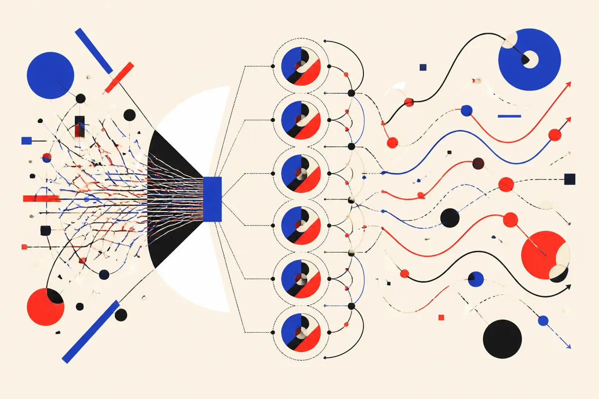

TL;DR: Marketing agents are only as useful as the audience signals underneath them, so fix the data layer before asking AI to personalize, segment, or decide who gets what.

## What breaks when agents inherit weak audience data?

Search Engine Journal’s “AI Agents Won’t Fix Bad Audience Data, They’ll Amplify It,” by Greg Jarboe, lands on the part of AI marketing that gets less oxygen than prompts and demos: the audience file.

Jarboe cites Mallory Gray of Skydeo, who argues that audience signals, not mention counts, decide who buys. That is the practical bit. Agents can draft campaigns, choose segments, trigger follow-ups, summarize accounts, and recommend offers. But if the underlying audience data is stale, inferred too loosely, or built around vanity signals, the agent does not become strategic. It becomes confidently wrong at scale.

This is the old CRM problem with a faster engine bolted on.

Bad segmentation used to mean a mediocre email list. Now it can mean an agent that keeps routing buyers into the wrong journey, suppressing the wrong accounts, or optimizing toward attention instead of intent. The risk is not that the AI “hallucinates” in the abstract. The risk is that it faithfully follows a bad map.

Mention counts are a good example. If a brand tracks who talks about a topic, but not who is likely to buy, the agent may optimize for noisy visibility. It may chase creators, students, competitors, job seekers, or casual readers because they appear active in the data. That can look like momentum in a dashboard and still miss revenue.

## What should marketers check before adding agents?

I would start with three boring questions.

First, what is the signal supposed to predict? Buying, renewal, churn, category interest, budget timing, product fit, or just awareness? If the team cannot say, the agent cannot infer it cleanly.

Second, how fresh is the data? Audience models decay. Job changes, company priorities shift, budgets move, and intent windows close. Agents make recency matter more because they can act continuously. A quarterly audience refresh feeding a daily automation loop is a mismatch.

Third, where did the signal come from? First-party behavior, declared preferences, CRM history, support tickets, sales notes, third-party attributes, content engagement, ad platform audiences. These are not interchangeable. A pricing-page visit and a broad topic mention should not carry the same weight.

The deeper issue is governance. Who can inspect the segment logic? Who can override it? Who owns a false positive? Who notices when the agent is technically performing but commercially drifting?

If the answer is “the AI team,” that is probably wrong. Audience data is a marketing, sales, product, and privacy problem before it is an AI problem.

## Where do agents actually help?

Agents can help once the audience layer has enough truth in it.

They are useful for making small decisions that humans avoid because the work is repetitive: pulling together account context, spotting missing fields, suggesting segment changes, comparing campaign performance across cohorts, or flagging audiences that behave differently from the assumptions in the brief.

They can also act as a forcing function. If a marketing team wants an agent to personalize outreach, it has to define what “personal” means. Role? Industry? company stage? prior behavior? pain point? The agent project exposes all the fuzzy internal language that teams normally hide inside slide decks.

That is the best version of this shift. Not “AI replaces marketing ops.” More like: AI makes sloppy marketing ops impossible to ignore.

Practitioner’s take: before deploying a marketing agent, pick one workflow and audit the audience inputs by hand. Trace five customers who converted and five who did not. Look at which signals were available before the action happened, not after. Then let the agent assist on enrichment, routing, or message variation only where the data is specific enough to defend. The catch most teams miss: automation does not just save time, it also removes the friction that used to reveal bad assumptions.
