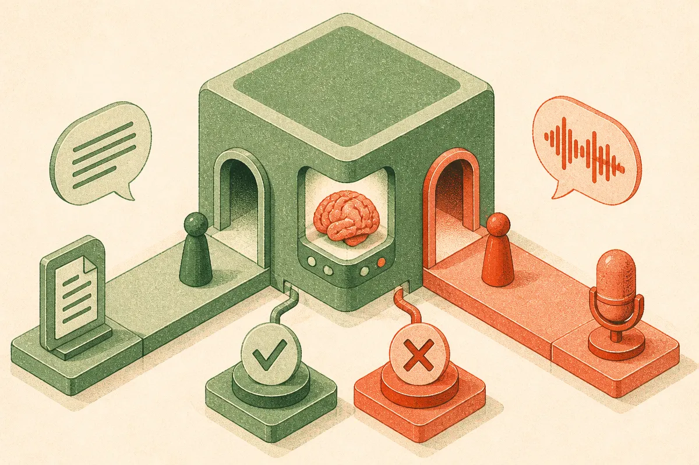

TL;DR: Audio language models can verify a written claim and then fumble the exact same claim when it's spoken, and retrieval only closes the gap when you pair it with explicit reasoning, per the VeriSpeak benchmark.

Most of the misinformation people actually encounter now arrives as sound. A clipped podcast, a stripped-down interview, a 20-second political speech snippet, a talking-head reel. Text fact-checking has years of tooling behind it. Speech does not. And the assumption baked into a lot of product roadmaps is that if a model reads well, it listens well too. The evidence says otherwise.

The primary source here is "To Trust or Not to Trust: Retrieval-Augmented Fact Checking in Speech," posted to arXiv across cs.AI, cs.CL, and cs.LG. It introduces VeriSpeak, a probe benchmark of 3,879 spoken claims with balanced true and false labels, spanning temporal, geographical, and relational facts. The dataset is on Hugging Face at huggingface.co/datasets/abhiram4572/VeriSpeak. What makes it useful is the design: it tests the same claims as text and as speech, so you can isolate what breaks when you change the modality and nothing else.

## What is the text-speech modality gap?

The core finding is blunt. Large Audio Language Models (LALMs) that verify written claims reliably often fail on the same claims when spoken. Same facts, same evidence, same labels. Change the input from characters to audio and accuracy drops.

That is more interesting than it sounds, because these are not separate systems. A LALM is supposed to be one model that handles both. If the reasoning and world knowledge live in a shared representation, you would expect verification ability to transfer cleanly across modalities. It doesn't. The paper frames this as a consistent gap, not a one-off quirk of a single model.

My read: the speech path is spending capacity on a different problem. Getting from waveform to meaning is its own task, and whatever the model has left over for actual fact verification is thinner than it is when the claim arrives as clean text. The knowledge might be in there. The bridge from audio to that knowledge is where things leak. For anyone building voice products, that is the uncomfortable part. You cannot assume the reasoning you validated on a text harness survives contact with audio input.

## Does retrieval fix it?

This is where the paper earns its title. The obvious move, when a model lacks a fact, is retrieval: pull in textual evidence and let the model compare. RAG has been the default patch for hallucination in text systems for a while now.

Here it disappoints. Retrieval alone provides limited gains, and the reason is specific and a little funny. Models frequently conflate the retrieved evidence with the spoken claim. Instead of treating the evidence as an external thing to check the claim against, the model blurs the two together. You hand it a document that says X, it hears a claim that says not-X, and somewhere in the middle those two collapse into one muddled input. The comparison step, which is the entire point of fact-checking, gets short-circuited.

That failure mode matters beyond speech. Anyone who has shipped RAG has seen a softer version of it: the model treating retrieved chunks as things to summarize rather than things to test the query against. The audio case just makes it sharper, because the spoken claim and the retrieved text are already in different modalities and the model has more work to do keeping them separate. Retrieval is not a verification strategy on its own. It is context. What you do with the context is a separate design decision.

## What actually closes the gap?

Retrieval combined with explicit reasoning. That is the combination that works. A thinking-tuned LALM reached 86.1% accuracy on the benchmark once it was doing structured reasoning over the retrieved evidence rather than just consuming it.

The pattern is: retrieval supplies the evidence, reasoning forces the model to hold the claim and the evidence apart and actually compare them. Neither piece is sufficient. Speech understanding without grounded evidence guesses. Evidence without reasoning gets conflated. You need all three legs, and the paper is clear that effective speech misinformation detection requires speech understanding, retrieved evidence, and grounded reasoning over that evidence together.

I want to be careful about the 86.1% number. It is one model on one probe benchmark of about 3,900 claims with a deliberately balanced true-false split. A balanced binary task means a coin flip scores 50%, so 86% is real signal, not noise. But probe benchmarks are built to expose a specific behavior, not to certify production readiness. Do not read this as "speech fact-checking is solved at 86%." Read it as "the combination of retrieval plus reasoning is the thing that moves the needle, and here is a clean measurement of by how much."

## What does this mean for people building voice products?

If you are building anything that ingests speech and makes factual judgments (moderation, media monitoring, meeting assistants that flag questionable claims, compliance tooling), the takeaways are concrete.

First, do not trust text evals as a proxy for audio behavior. The modality gap means your text harness can pass while the shipped voice path quietly fails on the same content. Test on spoken input directly.

Second, treat retrieval as necessary but not sufficient. If your architecture pipes retrieved docs straight into the model and hopes for a verdict, you are likely getting the conflation failure the paper describes. You want an explicit reasoning step that separates claim from evidence.

Third, one honest architectural question worth raising: transcribe-then-check versus native audio verification. The paper studies LALMs that take speech directly. A lot of production systems today just run speech-to-text and then hand the transcript to a text model. The paper does not directly benchmark that pipeline against native LALMs, so I won't claim which wins. But the existence of the modality gap suggests native audio handling has a cost that transcription might sidestep, at the price of losing everything that lives in the audio and not the words. That tradeoff is worth measuring for your own use case rather than assuming.

Practitioner's take: if you are shipping speech fact-checking or claim flagging, build your eval set on actual spoken claims with balanced true and false labels, mirror what VeriSpeak did, and measure three variants side by side: model alone, model plus retrieval, and model plus retrieval plus an explicit reasoning step. The paper's whole argument is that only the third configuration reliably closes the gap, and the cheapest way to confirm that holds for your domain is to run all three. The catch most people miss is the conflation failure. Retrieval that looks like it should help can actively hurt if the model folds the evidence into the claim, so the reasoning step is not a nice-to-have, it is the part carrying the load.
