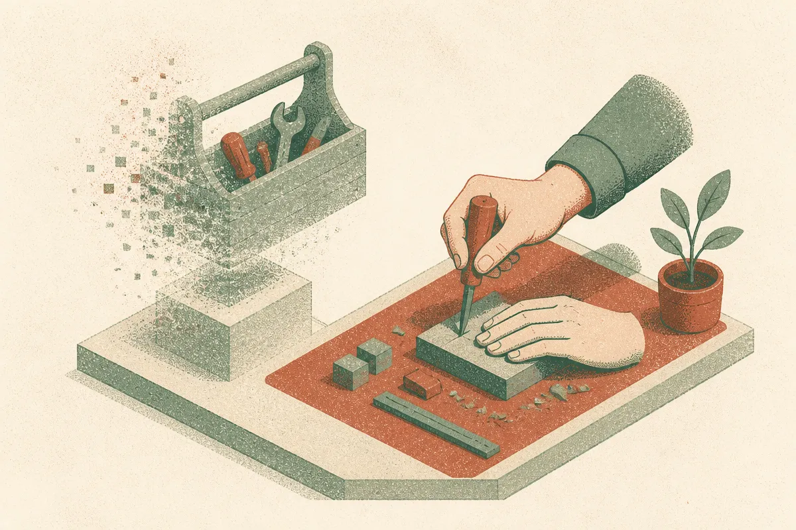

TL;DR: The value of going a month without AI is not proving you can quit, it is discovering which parts of your work you had quietly outsourced without noticing.

I want to be careful here. The primary source is a "One Month Without AI" post that surfaced on Hacker News, and the material I was given is thin: a title and a framing, not a full account of the author's setup, tools, or measured results. So I am not going to invent numbers this developer never gave or put quotes in their mouth. What I can do is treat the experiment as a prompt and think through what it actually tests, because the "I quit AI for X days" genre keeps showing up and it deserves better than the usual two camps.

Those two camps are predictable. One says AI made them slow and stupid and they feel free again. The other says they lost a week of productivity and crawled back. Both are usually true and both usually miss the point. The interesting question is not whether you can work without AI. Of course you can. Humans wrote software for decades. The question is what changes in the shape of your work when the assist is gone, and whether that change is a skill you lost or a crutch you dropped.

## What does a month without AI actually measure?

Most of these experiments conflate three different things, and separating them is where the value is.

The first is muscle memory. When you stop reaching for autocomplete and chat, the first few days feel worse because you built reflexes around them. That is not skill loss, that is habit disruption. It fades. If your productivity recovers to near baseline after a week, what you measured was habit, not dependency.

The second is genuine capability atrophy. This is the scary one people assume is happening: you can no longer write a regex, recall an API, or reason through a gnarly bug without a model holding your hand. If a month off reveals you have actually lost the ability to do the core work, that is worth knowing. But most reports I have seen, and the framing of this one fits the pattern, describe friction and slowness, not incapacity. Slower is not the same as unable.

The third is taste and judgment, which AI never really did for you in the first place. Deciding what to build, how to structure a system, when a solution is good enough, whether the abstraction is right. If your judgment felt fine during the experiment, that tells you the AI was doing execution, not thinking. Good. That is the correct division of labor.

## Is the slowness a problem or the point?

Here is where I part ways with the triumphant "I never needed it" conclusion. Going slower on purpose can be a real learning tool, the same way writing code by hand in an interview is. Friction forces you to hold more context in your head, and holding context builds intuition. A month of that is a legitimate way to check whether your intuition is still there.

But slower is not a virtue in production. If you ship for a living, choosing friction permanently is choosing to deliver less. The developer who feels clearer after a month off is experiencing something genuine: attention returning to problems they had been skating over. That clarity is worth capturing. It is not an argument for throwing away the tools that let you move fast on the boring 80 percent.

The honest read is that these experiments reveal a boundary you should have been drawing anyway. There is work where speed compounds and quality barely suffers: boilerplate, glue code, test scaffolding, translating between formats, remembering a library's surface. Hand that to the model. Then there is work where speed hides shallow understanding: system design, tricky concurrency, security-sensitive logic, anything where being wrong is expensive and subtle. Do that slow, with or without an assist, but with your own head fully engaged.

## What should an operator take from the genre, not just this post?

The pattern across every credible version of this experiment is the same. People come back not as abstainers but as more deliberate users. They stop pasting a whole file into a chat window for a one-line fix. They stop accepting the first suggestion without reading it. They notice which prompts were saving them real time and which were just avoiding a moment of thought.

That is the durable lesson, and it does not require a full month of martyrdom. You can run a smaller version of the same test. Turn off autocomplete for a day. Write one feature start to finish without a chat window open. See where you reach for the model out of genuine need versus out of reflex. The reflex reaches are the ones worth examining.

The Hacker News framing here does not give us the developer's specific findings, so I will not pretend it settles the debate. What it does is put the question back on the table at a moment when a lot of us have let the tools set the pace by default. That is the real risk, not that AI makes you dumb, but that it makes your choices for you and you stop noticing you had a choice.

## How to run this test without losing a month

If you want the insight without the productivity hit, structure it. Pick a single project or a single day, not a calendar month. Log every moment you would have reached for AI and what you would have asked. At the end, sort those moments into two piles: things that saved real time and things that saved you from a second of discomfort. The first pile is your legitimate toolset. The second pile is where dependency lives.

Then do the opposite check the following week. Use AI aggressively and log every suggestion you accepted without fully understanding it. Those are the spots where speed is quietly buying you future debt. Neither list is an argument to quit or to double down. Both are a map of where your judgment needs to stay in the loop.

The catch most people miss is that the goal was never abstinence or maximal usage. It is knowing which is which, and most of us have never actually looked. A month off is one way to find out. A structured day is a cheaper one. Either beats letting the default do the deciding, which is what almost all of us are doing right now.
