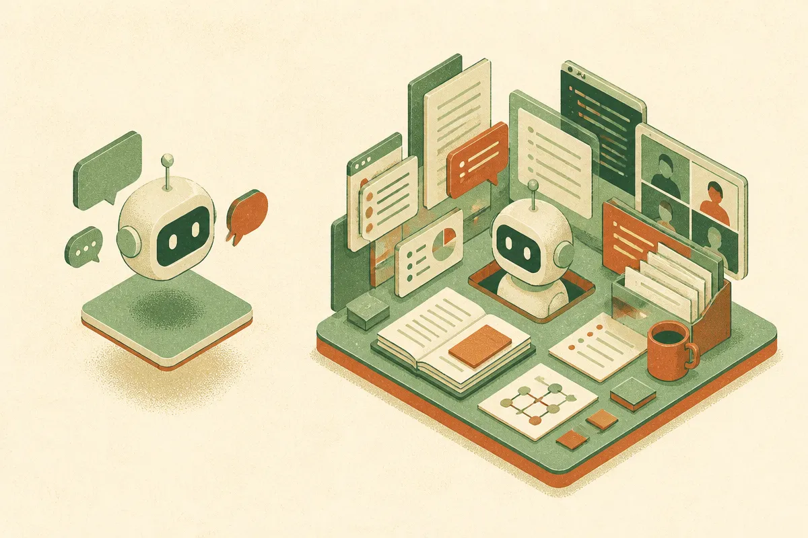

TL;DR: Microsoft’s reported Copilot reboot is a reminder that AI products win less by being “personal” in the abstract and more by being embedded where real work already happens.

## What did Microsoft actually concede?

The primary source here is the Hacker News-linked archived report titled “Microsoft abandons personal AI chatbot race with Copilot reboot.” Taken plainly, that is a big strategic signal: Microsoft no longer seems interested in fighting the consumer chatbot war on the same terms as ChatGPT, Claude, Gemini, or Meta AI.

That does not mean Microsoft is leaving AI. It means “personal AI chatbot” may have been the wrong frame for Copilot.

A generic personal assistant has a brutal product problem. It needs to be useful across everything: email, calendar, writing, coding, shopping, travel, planning, memory, search, files, messaging, and whatever random thing the user asks at 11:43 p.m. It also has to earn trust before it has enough context to be great. That is a bad loop. The product needs data to become personal, but the user needs repeated wins before giving it more data.

Microsoft’s better loop is obvious: work context. Documents, meetings, spreadsheets, code, tickets, chats, slides, identity, permissions, compliance, procurement. Boring words. Real budgets.

This is where the “abandonment” framing can mislead. Microsoft may be giving up on the consumer companion posture, but it is not giving up on assistants. It is moving away from the least bounded version of the assistant problem.

## Why is the personal chatbot market so hard?

Because “personal” is not a use case. It is a vibe.

The winners in AI products tend to have a tight wedge. GitHub Copilot had code completion. Perplexity had answer search with citations. Midjourney had image generation for taste-driven creative work. ChatGPT had the broadest wedge, but it also had the advantage of being first to mass habit. Even then, OpenAI has had to keep adding concrete surfaces: projects, memory, voice, images, file work, coding, agents.

A personal chatbot from a platform company has to compete with all of that while also explaining why it should live in your operating system, browser, taskbar, phone, inbox, or office suite. If the answer is “because AI,” users shrug. If the answer is “because this saves you 12 minutes on the thing you already had to do,” users pay attention.

That is the difference between a product and a mascot.

Microsoft also has a brand problem here. The company is strong in work software. It is less naturally trusted as the intimate layer for personal life. That matters. A user may accept Microsoft summarizing a quarterly business review before accepting it as a confidant, shopping helper, therapist-adjacent coach, or memory keeper.

## What should builders take from the Copilot reboot?

Do not copy the “assistant for everything” pitch unless you have distribution, context, and patience.

The better move is to pick one painful workflow and make the model disappear into it. Not literally disappear, but stop making the user think about the model. Draft the contract clause. Compare the vendor responses. Extract the meeting decisions. Turn the messy customer call into CRM fields. Find the bug from logs and code. Produce the landing page variants from actual product notes.

The catch is that narrower products look less exciting in demos. They do not sound like science fiction. But they have better odds of becoming daily software.

For Microsoft, the reported Copilot reset reads like a return to gravity. The company’s edge is not being the warmest chatbot. It is being near the files, accounts, workflows, and enterprise buyers who already run on Microsoft software. That is not as flashy as “your AI best friend.” It is probably more durable.

Builders should audit their own AI product the same way. If the value depends on users wanting a general companion, tighten the job. Pick the context the model needs, earn permission to use it, and measure one repeated task. The missed catch: distribution beats personality in most software markets, especially when the assistant is only as good as the system it can actually touch.
