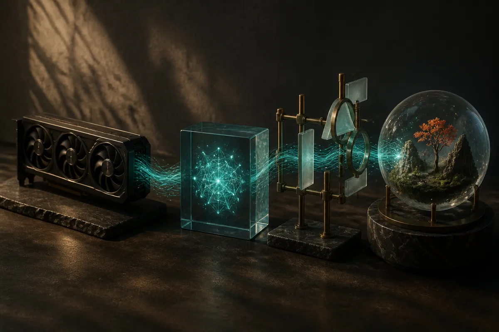

TL;DR: A Qwen 27B motion graphics demo on an RTX 4090 is not a benchmark, but it is a good signal that local models are becoming useful when the task is constrained, visual, and tool-mediated.

## What did the Qwen 27B demo actually show?

The primary source here is the r/LocalLLaMA post by /u/speedb0at titled “The Opus 5.5 posts about motion graphics are cool but Qwen 27B made this on a 4090.”

The claim is simple: after seeing people ask Opus 5.5 for motion graphics videos, the poster asked Qwen to look at those examples and make its own. The result was posted as a Reddit GIF, with a note that the lag came from Reddit’s GIF limit. /u/speedb0at also pointed to a full high-resolution version with sound on X and said it was “prompted and built in” Accuretta, linking to the GitHub repo.

That is not the same thing as saying Qwen 27B is better than Opus 5.5. It is not even enough to say it is competitive. We do not have the prompt, the number of attempts, the editing process, the exact runtime setup, or a repeatable eval.

But it is still interesting.

The useful part is not “local model beats frontier model.” The useful part is that a 27B-class model, running on a consumer 4090, appears capable of producing a polished motion-graphics artifact when the output is routed through a builder tool instead of treated like raw chat. That matters because a lot of production AI work is not open-ended intelligence. It is constrained generation, iteration, and assembly.

## Why does the tool scaffold matter so much?

Most AI demos hide the substrate. This one does the opposite, at least partially. The poster names Accuretta, which matters because motion graphics are not just “make a video.” They are timing, shapes, transitions, layout, rendering, and often code.

That is exactly where smaller local models can punch above their weight. They do not need to invent a whole medium from scratch. They need to inspect patterns, generate structured instructions, and fit within the affordances of a tool. If the tool gives the model a clean lane, the model can look much better than it would in a blank chat box.

This is the same lesson showing up across coding agents, website builders, data workflows, and design tools. The model is one component. The scaffold is the product. A weaker model in a good loop can beat a stronger model in a vague loop for a specific job.

The 4090 detail is also practical. It anchors the demo in hardware many local AI builders actually recognize. Not cheap hardware, but not a cloud cluster either. If you already have a high-end local setup, the question changes from “can local models replace frontier subscriptions?” to “which repeatable workflows should run locally because latency, privacy, cost control, or hackability matter?”

That is a better question.

## What should builders take from this?

I would not build a strategy around a Reddit GIF. I would build a test around the workflow.

Take the claimed pattern seriously, not the implied leaderboard. Pick one narrow creative artifact, motion graphic intro, product explainer animation, data visualization bumper, social clip template. Give a local model a clear reference set. Use a tool that turns model output into a real rendered object. Then measure the boring things: number of retries, edit time, rendering failures, prompt sensitivity, and whether the output survives a second request with different inputs.

That last part is where demos often fall apart. The first artifact can be hand-held. The workflow needs to repeat.

The bigger point is that local AI is moving from “can I run the model?” to “can I package the model into a useful production lane?” Qwen 27B on a 4090 making motion graphics is a nice artifact. The operator question is whether you can turn that into a template, a review loop, and a repeatable asset pipeline.

A builder should try this with one local model, one scaffold, and one output format before making any grand claims. The catch most readers miss: the model is probably not the moat here. The moat is the workflow around it, especially the constraints that make the model look good.
