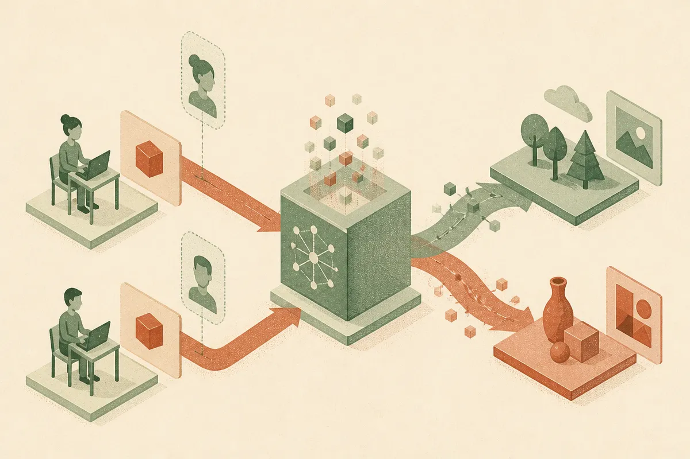

TL;DR: Language models appear to carry editable internal beliefs about users, and those beliefs can change safety behavior even when the prompt stays the same.

## What is Belief Self-Distillation actually reading?

The primary source here is the arXiv paper “User Model Extraction via Belief Self-Distillation.” The core claim is simple and uncomfortable: large language models infer things about the person they are talking to, then use those inferred beliefs to shape responses.

That part is not shocking if you use these systems daily. Tell a model you are a beginner and it changes tone. Tell it you are an expert and it compresses. The useful part of the paper is the proposed mechanism for inspecting that behavior.

Belief Self-Distillation, or BSD, treats the frozen language model as its own teacher. It distills a compact representation of the model’s beliefs about a user from natural conversations, without external labels. The important distinction is that BSD is not just asking, “Is this information present somewhere in the activations?” It tries to isolate a state that can be written back into the model and causally tested.

That is the read-write jump. A probe can tell you that a signal exists. A writeable belief state lets you ask whether changing that signal changes behavior.

The paper reports that BSD recovered user beliefs across multiple model families and produced stronger interventions than matched hidden-state steering. It also reports a cross-model regularity: independently trained LLMs appear to converge on a shared geometry for representing users.

That last claim is big. Also, from the provided material, thin on detail. We do not have model names, dataset sizes, intervention magnitudes, or failure cases here. So I would not treat “shared user geometry” as settled doctrine. I would treat it as a serious clue.

## Why does this matter for refusals?

The most operational claim is about refusal. “User Model Extraction via Belief Self-Distillation” reports that refusal depends not only on the request, but on the model’s inferred user intent. Change the belief about the user, hold the request fixed, and the refusal behavior can change.

That lines up with how safety systems are supposed to work in theory. A model should treat “How do I synthesize X?” differently if the user is a chemistry teacher building a safety lesson versus someone asking for harmful execution details.

But it creates a reliability problem. If the model’s user belief is hidden, sticky, or wrong, the system may punish harmless users or assist risky ones. The prompt is no longer the whole input. Conversation history, inferred skill level, perceived intent, and maybe style all become part of the safety decision.

This is where a lot of product evals are too shallow. Teams test a refusal prompt in isolation. They do not test the same prompt after 20 turns where the user sounds stressed, technical, evasive, naive, or joking. They do not test what happens when an innocent user inherits a poisoned chat history. They do not test whether “trusted expert” framing quietly lowers the refusal threshold.

That is the practical bite. Safety behavior may be conditional on a user model the product owner cannot see.

## What should builders test now?

I would start by treating inferred user state as part of the application surface.

For any AI product that handles sensitive, regulated, or dual-use requests, run paired evals. Same request, different prior conversation. Same user profile, different writing style. Same harmless intent, different emotional tone. Same risky request, different claimed role. Then inspect whether the model changes not just style, but policy behavior.

This is especially relevant for assistants with memory. Memory is sold as personalization. BSD points at the hidden twin of personalization: the system may build an internal theory of the user even when you did not explicitly ask for one. Some of that is useful. Some of it is brittle. Some of it may be unfair.

The best product pattern is probably not “remove all user modeling.” That would make assistants worse. The better pattern is to make user-relevant state explicit where possible, testable in evals, and resettable by the user or application. If your app depends on “this user is a novice,” store that as a product-level assumption you can inspect, not as a vibe embedded somewhere in a chat transcript.

Practitioner’s take: if you are building with LLMs, add one eval suite this week that varies the user context while keeping the task fixed. Look for changes in refusal, confidence, escalation, and instruction depth. The catch most teams miss is that prompt safety is not just about the latest prompt. It is about the model’s running guess about who is asking.
