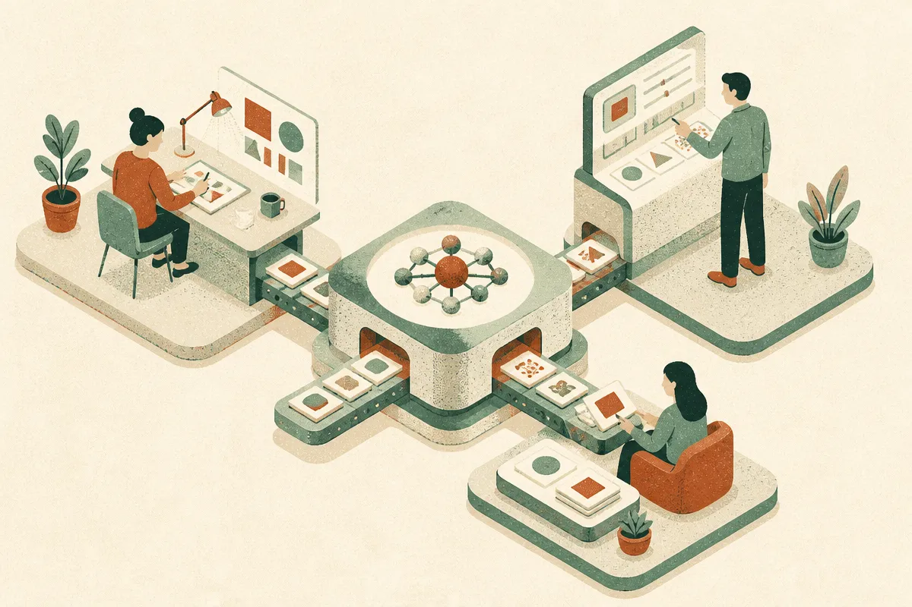

TL;DR: The useful AI org chart is not “humans vs. agents,” it is deciding who designs the system, who supervises the work, and what gets delegated to apprentice-level automation.

## What does the architect, orchestrator, apprentice split get right?

Marketing AI Institute’s announcement, “Rethinking Work in the Age of AI and Agents,” says Paul Roetzer, founder and CEO of SmarterX and Marketing AI Institute, will open MAICON 2026 with a keynote titled “The Architect, The Orchestrator and The Apprentice: Rethinking Work in the Age of AI and Agents.”

That title is doing a lot of work. More than the announcement itself, which is brief.

I like the frame because it moves the AI-at-work conversation away from job replacement theater and toward operating design. Most teams do not need another abstract debate about whether agents are “coworkers.” They need to decide which human decisions should happen before the workflow starts, which interventions should happen while it runs, and which tasks can be handed to software with clear boundaries.

The architect is the person designing the system: goals, constraints, tools, data access, approval paths, failure modes. In marketing, that might mean defining how campaign briefs turn into landing pages, emails, paid tests, and reporting. In sales ops, it might mean deciding what an agent can do with CRM data and where human review is mandatory.

The orchestrator is the operator in the loop. Not a prompt jockey. Not a passive approver. This person watches the system, redirects it, catches errors, resolves ambiguity, and decides when the work is good enough to move.

The apprentice is the AI layer doing bounded work. Drafting. Researching. Classifying. Summarizing. Producing variants. Updating records. Running repeatable checks. Sometimes using tools. Sometimes acting agentically. But still junior, because it lacks context, judgment, and accountability.

## Where does this framing break?

The danger is that “architect” and “orchestrator” become new labels for old confusion.

A lot of companies already have strategy people, ops people, channel owners, analysts, and producers. Dropping AI on top does not magically clarify who owns quality. In fact, it often makes ownership blurrier. If an agent writes the first draft, a manager edits it, a legal reviewer approves it, and a campaign tool publishes it, who is accountable when the claim is wrong?

That is the catch in agent adoption. The hard part is not getting the model to act. The hard part is deciding what counts as acceptable action.

Roetzer’s framing is useful only if teams attach it to rights and responsibilities. Who can change the workflow? Who can approve tool access? Who can override the agent? Who reviews outputs before customers see them? Who measures whether the system is saving time or just creating more review work?

Without that, “agentic work” becomes automation cosplay. Demos look impressive. Teams still spend the afternoon cleaning up malformed outputs, checking hallucinated citations, and rewriting copy that sounds like every other AI-generated campaign.

## What should teams change before they add agents?

Start with one workflow, not an org-wide AI transformation deck.

Pick something recurring and visible: weekly content repurposing, lead enrichment, competitive monitoring, support ticket triage, webinar follow-up, sales email personalization, or SEO brief generation. Then map the roles. One person owns the architecture. One person owns orchestration. The AI gets apprentice tasks with narrow permissions.

The practical test is simple: can the team explain the workflow without naming a model first? If the answer starts with “we use Claude” or “we use ChatGPT,” the design is probably backward. The model matters, but the system matters more: inputs, policies, examples, checks, approvals, logs, and fallback paths.

I would also separate “apprentice” tasks from “agent” tasks. An apprentice can draft ten subject lines. An agent may decide which contacts receive which follow-up, update the CRM, and schedule the next step. Those are different risk profiles. Treating them the same is how teams get surprised.

Practitioner’s take: take Roetzer’s MAICON 2026 frame as an org design prompt, not a prediction. Before buying another agent platform, write down one workflow and assign three owners: the architect who designs it, the orchestrator who runs it, and the apprentice tasks AI is allowed to perform. The catch most teams miss is permissions. The moment the AI can touch systems of record, send messages, or make customer-visible changes, you are no longer testing productivity. You are testing governance.
