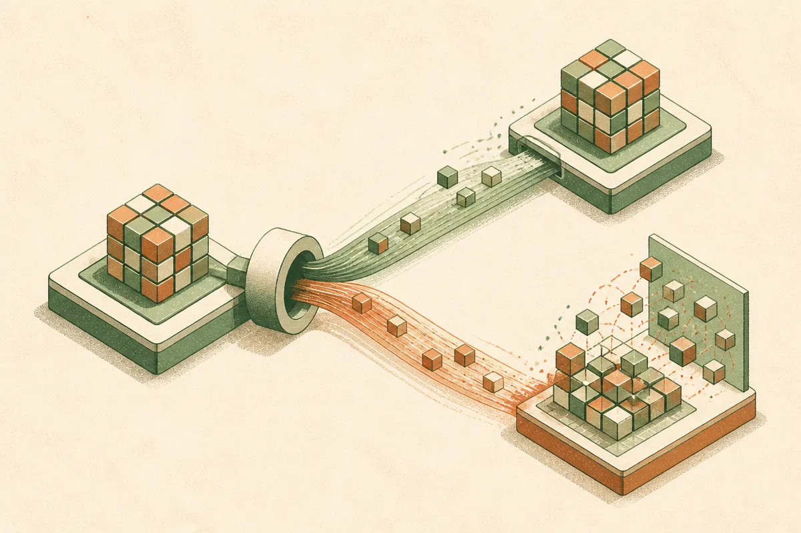

TL;DR: Linear ViTs should not blindly copy Softmax attention weights, because the useful shortcut is copying MLP representations and distilling the attention behavior.

## What actually transfers from a Softmax ViT to a Linear ViT?

The primary source here is the arXiv paper titled “Copy the Same, Distill the Difference: Initializing Linear Vision Transformers,” listed under cs.AI and cs.LG. Its core claim is simple and useful: when moving from a standard Softmax Vision Transformer to a Linear Vision Transformer, pretrained weights are not one big reusable blob.

That matters because Linear ViTs are attractive for a practical reason. They replace Softmax attention with a linear-complexity attention operator, aiming for more efficient token routing. The catch is familiar. These models often need from-scratch pre-training, and they typically trail the original Softmax versions.

The paper asks whether existing foundation ViTs, most of which are built around Softmax attention, can be recycled into Linear ViTs. Prior work on Attention Transfer suggested attention can be the transferable component between Softmax ViTs. This paper reports the opposite when crossing the Softmax-to-linear boundary.

The attention weights do not travel well. The paper says they are operator-specific, and that copying them “barely helps,” sometimes performing worse than random initialization. That is a sharp warning for anyone treating pretrained checkpoints as modular parts bins.

The MLP weights are different. The paper reports that they carry learned representation and are more operator-agnostic. Copying them directly already preserves much of the value of the pretrained Softmax model.

## Why does distillation beat copying for attention?

Attention is not just a pile of numbers. It is a routing behavior tied to the math of the operator.

Softmax attention and linear attention can both move information across tokens, but they do it through different mechanisms. So if you copy the attention weights, you may preserve the shape of the checkpoint while losing the actual behavior you wanted. Same keys on a different lock.

The paper’s answer is to distill the difference. Instead of copying attention weights directly, train the Linear ViT to recover the token routing behavior of the Softmax model using a properly designed distillation loss. In the paper’s framing, you copy what stays the same, then distill what differs.

That is a better mental model than “transfer learning works” or “attention transfers.” Transfer depends on what kind of invariance you are counting on. MLP layers seem to store useful visual representations that survive the operator swap. Attention weights seem entangled with the attention operator itself.

The paper reports that this pattern holds across multiple linear ViT variants, model sizes, and datasets. It also says that with copied MLPs and distilled attention, Linear ViTs can close the gap with Softmax models and even surpass them.

I would still read that as a research result, not a blanket production guarantee. The direction is credible, but the deployment question is narrower: does this recipe save enough training cost, preserve enough accuracy, and simplify enough infrastructure to justify replacing a known Softmax ViT in your stack?

## What should model builders take from this?

The useful lesson is not limited to vision transformers. It is a checkpoint reuse lesson.

When you change a core operator, do not assume the surrounding weights mean the same thing. Some parameters encode representations. Some encode behavior that depends on the machinery around them. The paper gives us a clean split: MLPs can be copied, attention behavior should be distilled.

That is a practical way to think about model surgery. If you are swapping architectures to reduce compute, latency, or memory, start by asking which components are functionally stable across the swap. Then test copying those. For the parts tied to the new operator, use distillation rather than pretending identical tensor shapes mean identical function.

The catch most readers miss: efficiency gains are not free if you pay for them with full retraining. This paper points at a middle path. For a builder, the experiment is straightforward: take a pretrained Softmax ViT, initialize the Linear ViT by copying the MLP weights, distill attention routing from the teacher, then compare against both random initialization and naive attention copying. If the gains survive your data and latency target, you have a real migration path, not just a cleaner architecture diagram.
