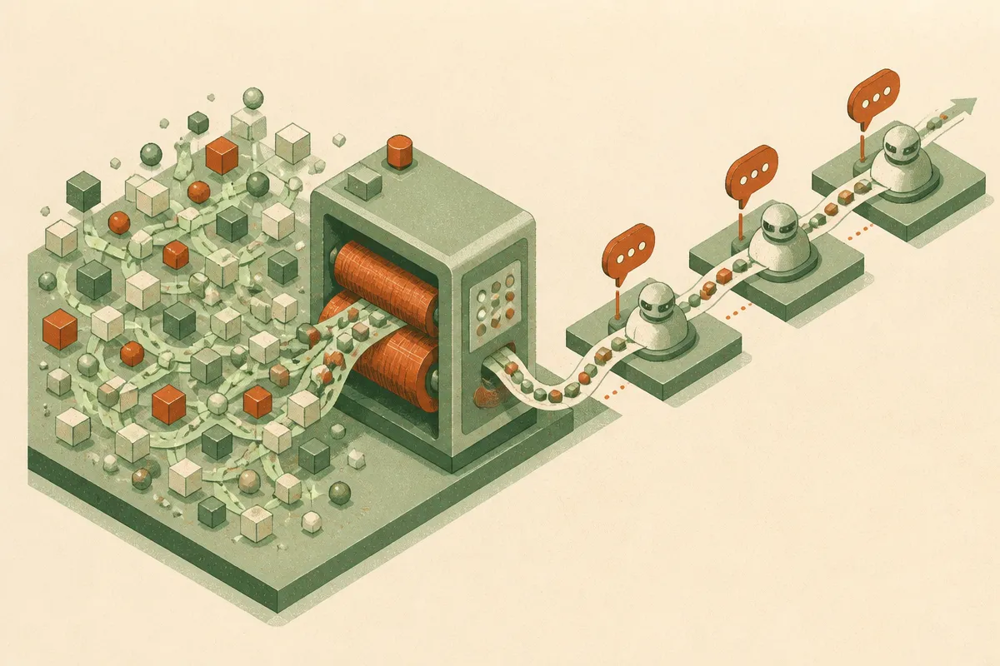

TL;DR: KV-streams target a boring but important agent bottleneck, making context compaction faster by carrying the KV cache forward instead of repeatedly rebuilding it.

## What problem does KV-streams actually solve?

The arXiv paper “KV-streams for Efficient Compaction in Agentic Reinforcement Learning” is about a training bottleneck that shows up once agents run for more than a short interaction loop.

Agent traces get long. The model calls tools, reads observations, revises plans, makes mistakes, recovers, and keeps going. If you keep the full trace in context, GPU memory becomes the wall. If you compact the trace, you can hold memory roughly constant, but most compaction methods pay a different tax: they keep prefilling the model context over and over.

That prefill cost matters. In reinforcement learning for agents, you are not just running one clean prompt. You are generating many trajectories, scoring them, and updating behavior. Every extra rebuild of context hits training throughput.

KV-streams changes the plumbing. Instead of flushing the key-value cache after each compaction and rebuilding it, KV-streams streams the KV cache forward. The paper describes it as a plug-in strategy that can work with any compaction method. Across three compaction strategies, the paper reports a 2.6x to 5x wall-clock training speedup, with no evidence of hurting performance.

That is the kind of result I pay attention to. Not because it makes agents “smarter” in the usual demo sense. Because it removes a cost center that limits iteration.

## Why does the recurrent-state claim matter?

The more interesting claim is not just speed. It is memory behavior.

The paper reports that the streamed KV cache can act like a recurrent state, carrying information forward after that information has disappeared from the visible context. In a controlled setting, “KV-streams for Efficient Compaction in Agentic Reinforcement Learning” finds that reinforcement learning alone was enough for this behavior to emerge, contrary to prior work.

That is a big claim, but it should be read carefully. The paper says this happened in a controlled setting. It does not mean today’s production agents suddenly get reliable long-term memory for free. It does not mean a model will remember the right thing, ignore stale facts, or expose what it is carrying internally in a debuggable way.

Still, the direction matters. A lot of long-context work treats memory as something visible: bigger windows, summaries, retrieval chunks, scratchpads. KV-streams points to a different layer, where the state lives in the cache path rather than the token path. For agent training, that could be useful. It also makes evaluation harder, because important state may not be inspectable from the prompt alone.

This is where the hype risk sits. If a system carries hidden state across compactions, builders need tests that catch both benefits and failures. Did it retain the task goal? Did it retain an obsolete instruction? Did it preserve a tool result after the visible context forgot it? Did it drag forward a bad assumption from 200 steps ago?

## Where does this fit in the agent stack?

I would place KV-streams in the training infrastructure bucket, not the product feature bucket.

It is not a replacement for retrieval. It is not a memory UI. It is not a reason to stop writing good compaction logic. It is a way to make compaction cheaper during post-training, and maybe to let RL shape a useful internal state over longer horizons.

That matters most for labs and teams training agents on long tasks: coding runs, browser tasks, research workflows, multi-step tool use, simulated environments. If your current bottleneck is prompt design, KV-streams is probably not your next move. If your bottleneck is that long-horizon RL runs are too slow or too memory-hungry to iterate on, this is directly relevant.

The paper is also a reminder that “context length” is not one problem. There is runtime memory, training throughput, visible recall, hidden state, compaction quality, and evaluation. Bigger windows help one part. Better summaries help another. Streaming KV cache attacks a lower-level cost that most end users never see, but every serious agent training pipeline eventually feels.

Practitioner’s take: if you are building long-running agents today, do not wait for hidden recurrent state to save you. Keep your external memory, retrieval, summaries, and evals boring and explicit. But if you are training or fine-tuning agent policies with long traces, KV-streams is worth testing as an infrastructure change: compare wall-clock time, task success, retention of old facts, and failure modes after compaction. The catch most readers will miss is that faster compaction can also make hidden-state bugs cheaper to create at scale.
