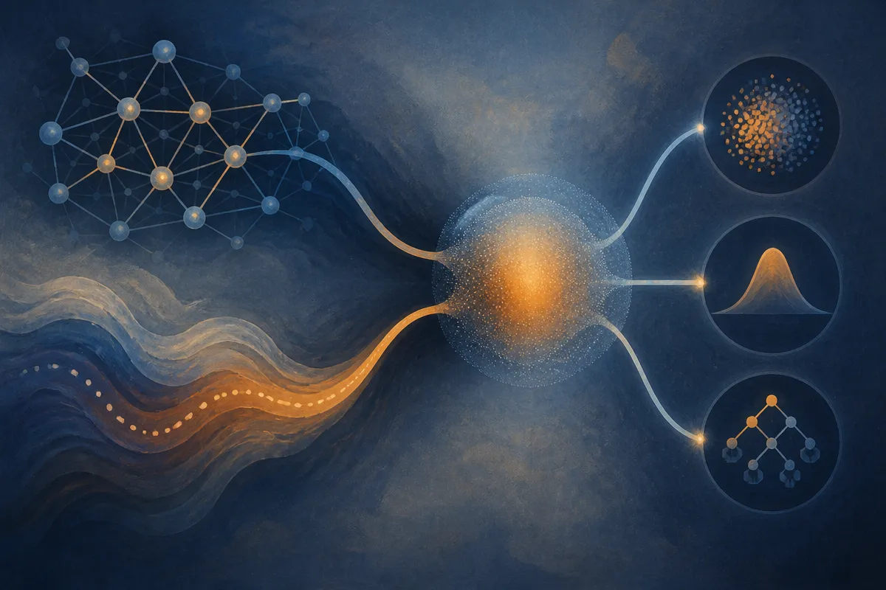

TL;DR: DSS-GNN is a graph neural network uncertainty method worth watching because it uses one representation for calibration, OOD detection, and distribution shift, instead of treating those as separate afterthoughts.

## What problem is DSS-GNN trying to collapse?

The primary source is the arXiv paper titled “A Unified Uncertainty Representation for Graph Neural Networks via Doubly-Spectral Stochastic Expansion.” The pitch is narrow, but useful: graph neural networks often need three reliability behaviors at once. They need calibrated probabilities, they need to flag out-of-distribution inputs, and they need to hold up when the data distribution shifts.

In practice, those usually become separate systems. A model for prediction. A calibration layer or post-hoc correction. Another score for OOD. Maybe a different training recipe for shift. That is operationally annoying, and it creates a real evaluation problem: improving one reliability metric can make another worse.

DSS-GNN tries to make those tasks share one uncertainty representation. It models uncertain node embeddings as random graph signals. Graph Fourier filters capture structural variation across the graph. A scalar orthogonal-polynomial chaos coordinate captures latent stochastic variation. That gives the method its “doubly-spectral stochastic” name.

The important part is not the name. It is the split of responsibilities. The mean coefficient is used as class evidence for an energy-based OOD score. Higher-order coefficients represent structured logit variation. Quadrature averaging over the chaos coordinate produces the predictive distribution used for normal prediction and calibration.

That is the clean idea: one representation, different readouts.

## Do the benchmark claims match the reliability pitch?

The paper reports two deployment modes. Standalone DSS-GNN replaces the usual graph model with the uncertainty-aware version. DSS-Hybrid runs DSS as a residual branch beside a deterministic encoder.

That distinction matters. The standalone version is the calibration story. The paper reports that standalone DSS-GNN gets the lowest Brier score among the compared uncertainty-aware baselines on all 14 node classification benchmarks, without post-hoc correction. Brier score is not exotic. It measures whether predicted probabilities behave like probabilities. For deployed systems, that is often more useful than another tiny accuracy gain.

DSS-Hybrid is the OOD and shift story. The paper reports best AUROC on most node-OOD settings, competitive cross-graph OOD detection, and the strongest shifted accuracy on all 7 GOOD concept-shift benchmarks under standard empirical risk minimization.

I like that the paper cross-evaluates both modes across all three tasks, rather than letting each variant stay in its favorite lane. The claim is not that one mode wins everything. It is that both remain useful outside their primary target, with documented exceptions. That is more credible than a clean sweep.

The theoretical claim is also scoped. The paper gives a capacity theorem showing that, under a full-rank feature assumption, a restricted subfamily can match the chaos coefficients of any Gaussian-latent random graph signal, with exponentially decaying truncation error under a growth condition. Translation: there is a formal reason this representation can express a useful class of uncertainty. The task-level claims still come from experiments.

That is the right separation. Theory explains why the structure is plausible. Benchmarks carry the practical claim.

## Where would this actually matter?

This is not a general-purpose LLM reliability trick. It is for graph settings: citation networks, molecules, fraud graphs, recommendation graphs, infrastructure graphs, social graphs, supply chains, and other systems where the relationships are part of the input.

The operator question is simple: do you need the model to say “I do not know” in a way that maps to graph structure? If yes, calibration and OOD should not be glued on after training as a separate dashboard metric. They should be part of the model design.

The catch is complexity. DSS-GNN adds math and implementation surface area. Graph Fourier filters, chaos coordinates, quadrature averaging, and variant-specific deployment choices are not free. If your current GNN is used for offline ranking and humans review the edge cases, the extra machinery may not pay for itself. If the model drives automated decisions under shifting graph conditions, it gets more interesting.

Practitioner’s take: I would not rip out a working graph model for DSS-GNN based on the abstract alone. I would test it as a reliability layer on one high-risk graph workflow where probability quality and OOD flags already matter. Compare Brier score, AUROC, shifted accuracy, and operational cost against your current model plus calibration. The catch most teams miss: reliability is not one metric, and a method that gives you one shared uncertainty representation may be easier to govern than three separate patches.
