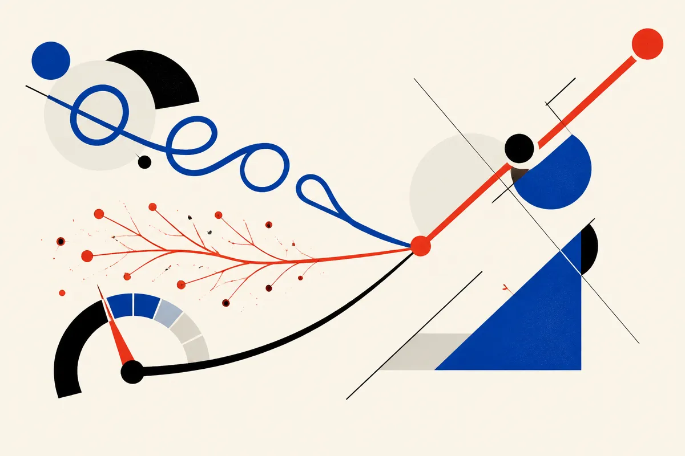
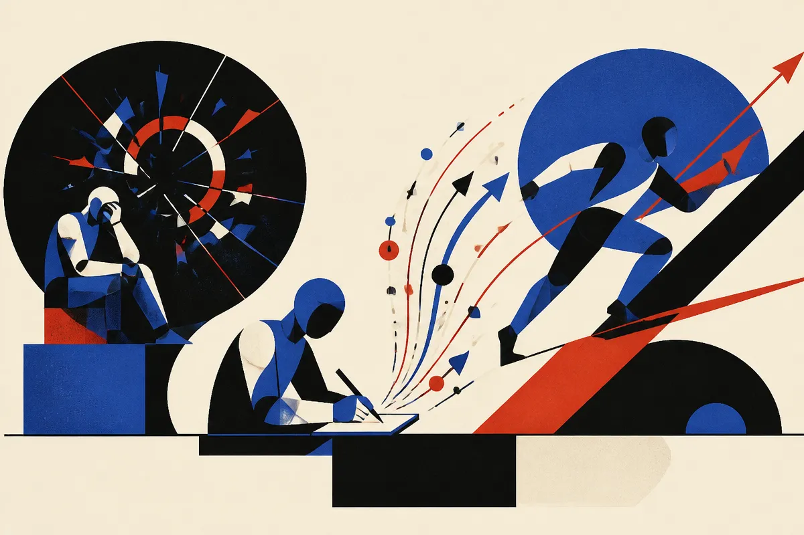
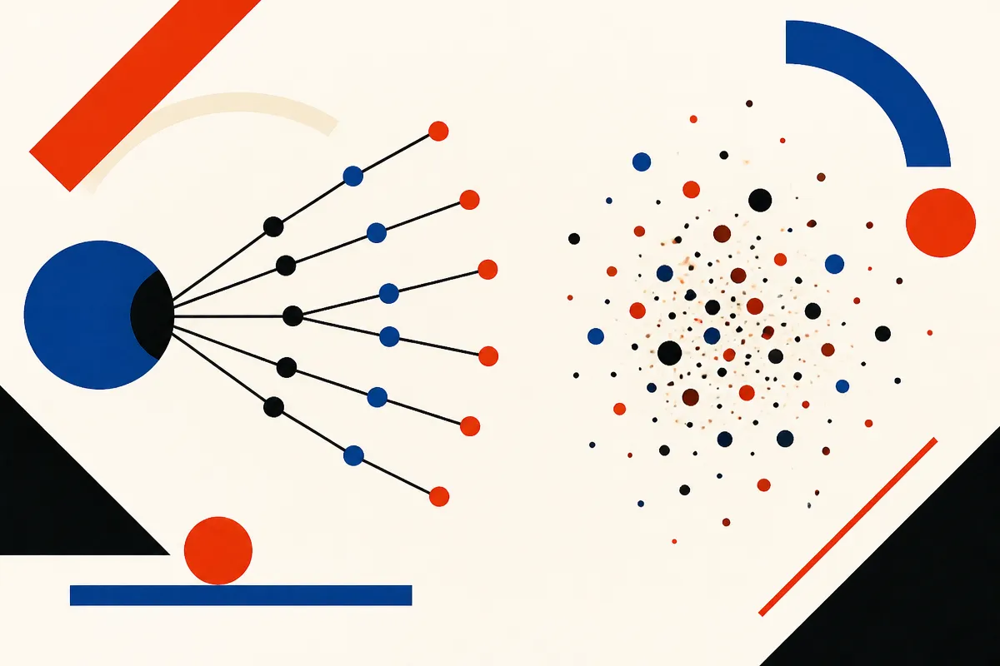

TL;DR: The frontier of "agents that improve themselves" is quietly shifting away from full reinforcement learning toward cheaper post-training and inference-time tricks, and the three most useful recent papers show it works in narrow settings while leaving the hard question, does it generalize, mostly open.

For a year the story on self-improving agents was reinforcement learning. Give the agent a verifier, let it grind through GRPO or PPO, watch the solve rate climb. That story is still true, but it is no longer the only one. A cluster of recent arXiv work is asking a sharper question: how much improvement can you get without the reward loop, without the verifier, without the compute bill that comes with policy optimization?

Three papers from this stretch make the case from three angles. One trains an agent on explanations of its own experience and matches GRPO with half the updates. One teaches creativity as a shapeable skill rather than a temperature knob. One stops trying to make the agent better and instead makes it cheaper by forecasting token spend while the run is still going. Read together they map where "agent self-improvement" actually stands right now, and where the claims outrun the evidence.

## What does "self-improving agent" even mean in 2026?

The phrase covers at least four different things, and conflating them is how you get hype.

There is training-time improvement, where the model's weights change: RL, supervised fine-tuning, distillation. There is inference-time improvement, where the weights are frozen but the agent does more work per task: sampling more, reflecting, planning. There is memory-based improvement, where the agent keeps notes across tasks and reads them back. And there is what I would call efficiency improvement, where the agent gets no smarter but gets cheaper or faster at the same quality.

These are not the same claim, and the evidence bar for each is different. I have written before about how easy it is to fool yourself here: [the self-improving agent demo that falls apart when you shuffle the tasks](/blog/2026-08-19-the-self-improving-agent-demo-that-falls-apart-when-you-shuffle-the-tasks/) was a case where the "improvement" was really the agent overfitting to task ordering. And [self-improvement audits need a measured null](/blog/2026-08-21-self-improvement-audits-need-a-measured-null/) made the point that most self-improvement papers do not compare against the obvious baseline of just spending the same compute a dumber way.

Keep those two in your head as you read the rest. The papers below are more careful than the average, but the same traps apply.

## Can an agent get better by explaining itself instead of being rewarded?

This is the most surprising result of the three. The paper is "Shockingly Simple Self-retrospection Improves Agentic Models Without RL," on arXiv cs.AI. It introduces Retrospection-Only Fine-Tuning, or ROFT.

The procedure is almost aggressively minimal. The agent attempts a task. It observes whatever feedback is available. It writes a retrospective explanation of what happened. Then it is fine-tuned with a plain next-token prediction loss on the explanation tokens alone. No external teacher. No reward-based policy update. No verifier. You are just training the model to predict its own explanations of its own experience.

The numbers, on Qwen3.5-4B, are the reason this is worth taking seriously. Trained on software-engineering problems with a mix of successful and failed base-model attempts, ROFT reaches 49.2% on held-out SWE-bench Verified and 26.8% on SWE-bench Pro after 20 updates. The paper reports GRPO hitting 48.0% and 25.3% after 40 updates in the same evaluated runs. So ROFT matches or slightly beats a real RL baseline with half the updates and no verifier.

The detail that made me sit up: ROFT learns to solve individual tasks on which all 64 sampled base-model attempts failed. That is the interesting part, because the usual objection to any non-RL method is that it can only reinforce things the model already does. If every one of 64 attempts failed, there is no successful trajectory to imitate. Yet training on explanations of those failures moved the needle. The authors' behavioral analysis argues that retrospection indirectly assigns credit: the explanations encourage good actions and discourage incorrect ones, which is functionally what a reward signal does, just delivered through language instead of gradients on a return.

There is a bonus finding worth flagging for anyone fighting token bloat. When the retrospections are prompted to emphasize more direct solutions, subsequent attempts get shorter, with no explicit length penalty. Steer the explanation, steer the behavior. That connects to the broader theme I keep coming back to, that [teaching a reasoning model to know when it's sure cuts its token bill](/blog/2026-09-28-teaching-a-reasoning-model-to-know-when-its-sure-cuts-its-token-bill/): controlling the model's self-narration is turning out to be a cheap lever on both quality and cost.

The honest caveats. This is one model family, Qwen3.5-4B, at 4B scale, on software engineering. SWE-bench is a domain where "feedback" is unusually clean: tests pass or fail. Whether ROFT holds at larger scale, in domains with muddy feedback, or against a fully-tuned GRPO run with more than 40 updates, the paper does not tell us. And "matches GRPO after 20 vs 40 updates" is an early-progress claim, not a ceiling claim. RL might still win if you let it run. But as a cheap first move before you stand up a full RL pipeline, ROFT looks like a real option, and the mechanism is clean enough to reason about.

## Is retrospection just a nicer name for self-reflection that we already know underperforms?

Fair question, and the distinction matters. I have been skeptical of inference-time reflection, because [when you count the tokens, self-reflection loses to just sampling more](/blog/2026-07-31-when-you-count-the-tokens-self-reflection-loses-to-just-sampling-more/). Ask a model to critique its own answer at inference time and, budget-for-budget, you often do better just drawing more samples and voting.

ROFT is a different animal. The reflection is not the product. The reflection is the training signal. You are not asking the model to reflect its way to a better answer in one session; you are changing the weights so future first attempts are better. That sidesteps the token-accounting critique, because the reflection cost is amortized across every subsequent task. It is closer in spirit to [SPADE making the training environment a thing the model learns to build](/blog/2026-08-20-spade-makes-the-training-environment-a-thing-the-model-learns-to-build/) than to any prompt-time reflection trick: the learning happens in the training loop, not the inference loop.

That framing is also why the "solves tasks where all 64 attempts failed" result is credible rather than magical. The model is not reasoning better in the moment. It has been fine-tuned on a description of the failure mode, and that description shifts the distribution of its next attempts.

## Can you train a model to be creative on purpose?

The second paper takes on a problem most agent work ignores: LLMs are boring by default. "Reinforcing Agentic Creativity in Scientific Ideation with Night Science," on arXiv cs.AI, argues that the low-entropy bias that makes models reliable on verifiable tasks makes them homogeneous and predictable on open-ended ones, which is exactly the wrong property for scientific ideation.

The framing borrows the "day science versus night science" distinction: structured, verifiable work versus loosely structured, serendipitous exploration. The authors, in a framework they call AI Night-Scientist, model creativity along three axes. Action, meaning what to do and how creatively. Process, meaning when to explore versus exploit. And outcome, meaning the novelty and usefulness of the resulting idea. They train with GRPO, deliberately exposing the model to varying degrees and forms of creativity through training.

The reported gains: research directions expanded by 27.8%, contribution types by 14.9%, predicted citation impact up by as much as 32.0 percentage points, and originality up 66.2 points over the base model.

Now the caveat that carries the most weight, and to the paper's credit it is one they raise themselves: these gains cannot be reproduced by simply cranking decoding temperature. That is the obvious null hypothesis, that "creativity" is just entropy, and if higher temperature reproduced the effect the whole framework would be theater. The paper says it does not. What mattered instead was semantic guidance, specifying what kind of creativity to pursue rather than just adding randomness. That is a meaningful distinction: directed novelty versus noise.

Where I hold back is the outcome metrics. "Predicted citation impact" and "originality" scores are model-judged or heuristic proxies, not actual citations from actual papers that got written and reviewed. The honest reading is that AI Night-Scientist produces ideas that score higher on novelty-and-usefulness proxies, which is not the same as producing better science. That is a hard thing to measure and I do not fault them for using proxies, but a reader should not translate "32.0 percentage point citation impact gain" into "this makes discoveries." It makes more diverse candidate ideas, measured by graders whose reliability is itself an open question, in the same way [the reconstruction test grades vibes, not facts](/blog/2026-07-23-the-reconstruction-test-grades-vibes-not-facts-reading-the-recap-paper-on/) when the grader is another model judging quality.

For an operator, the transferable insight is not "use this to do research." It is that diversity is a trainable target with a semantic handle, and that temperature is a crude substitute. If you run ideation or brainstorming agents, the lesson is to specify the kind of divergence you want rather than turning up randomness and hoping.

## How do you keep agents cheap while they run?

The third paper is the least glamorous and possibly the most immediately useful. "TokenCast: Forecasting Token Consumption During LLM Agent Execution," on arXiv cs.AI, tackles a problem anyone running agents in production has felt: the same task can vary in token cost by more than an order of magnitude across runs.

The reason is structural. The agent picks its next step based on tool feedback and intermediate results, so the path length is not fixed. And the growing context inflates the input size of every subsequent call, so early bloat compounds. You cannot predict total spend before execution, and any prediction has to be revised as the run unfolds.

TokenCast learns a composable cost representation for each execution segment, recording both that segment's own consumption and the context growth it introduces. Compose adjacent segments and you get a cumulative estimate that accounts for the re-read cost, the fact that context from earlier steps gets re-fed into every later call. As execution proceeds, new evidence refreshes the forecast, with no additional LLM calls and a mean cumulative prediction time the authors report at 32.8 ms per run on SWE-bench Verified.

The results that matter for a budget owner: across 4 task suites and 6 agent models, TokenCast's mean absolute error reduction against the strongest comparator averages 14.5% over 96 evaluated combinations. And in offline budget-control replay, it uses 21.3% fewer tokens on average than a fixed-budget policy at matched trace completion. Code is at github.com/DEFENSE-SEU/TokenCast.

That last number is the one to sit with. A fixed budget is blunt: you either cut runs off too early and fail tasks, or you set the ceiling high and waste tokens on the runs that would have finished cheaply. A forecast lets you allocate dynamically, spending where the run needs it and stopping where it does not. 21.3% fewer tokens at the same completion rate is the kind of margin that shows up on an actual invoice.

This is the "efficiency improvement" category from earlier, and it deserves more attention than it gets. The agent is not smarter. It is the same agent, run against a cost model that lets the orchestrator make better allocation calls. It pairs naturally with memory approaches like [Recuris and memory that rewrites itself](/blog/2026-08-26-recuris-and-the-case-for-memory-that-rewrites-itself/): if you know both what an agent tends to remember and what it tends to spend, you can schedule work far more precisely.

## What do these three papers agree on, and where do they diverge?

The throughline is that the interesting gains right now are coming from around the RL loop, not from a better RL loop.

ROFT replaces the reward-based update with next-token loss on explanations and matches GRPO's early progress. Night Science keeps GRPO but redirects it at a target, creativity, that standard RL objectives actively suppress. TokenCast leaves the model entirely alone and works on the orchestration layer. Three different points of intervention: post-training signal, post-training objective, and inference-time control.

Where they diverge is on how solid the evidence is. TokenCast is the most defensible, because its claim is narrow and measurable: tokens spent, error against a comparator, completion rate held constant. You can check it. ROFT is next, because SWE-bench gives it clean pass/fail feedback and a real RL baseline to beat, though the single model family limits how far you can generalize. Night Science is the most exciting and the least verifiable, because its headline gains rest on predicted novelty and impact scores rather than realized outcomes, and the reliability of those graders is the whole ballgame.

That is a healthy spread, and it maps to a rule worth keeping: trust the efficiency claims first, the narrow-domain capability claims second, and the open-ended creativity claims last, not because the last are wrong but because they are hardest to falsify.

## What should a practitioner actually do about this right now?

Start where the evidence is strongest and the payoff is fastest. If you run agents at any real volume, a token forecaster is the lowest-risk win here. You do not need to adopt TokenCast specifically, but the idea, model your cost per segment, compose it forward, refresh as you go, and let the orchestrator kill or extend runs on that basis, is directly buildable. A 21.3% token reduction at matched completion, as the TokenCast authors report, is the sort of thing that funds itself in a week.

For capability, ROFT is worth a pilot before you commit to a full RL pipeline. The setup is cheap: run your agent, capture failures and successes, have it write retrospections, fine-tune on the explanation tokens. If it moves your held-out numbers with a fraction of the updates a GRPO run would need, you have saved real compute and a lot of pipeline complexity. The catch most readers will miss: this was demonstrated on SWE-bench, where feedback is clean. If your domain has noisy or delayed feedback, the retrospections have less to latch onto, and the credit-assignment mechanism the authors describe gets weaker. Test on your data before you believe the transfer.

For creativity, treat Night Science as a design principle, not a product. If your ideation agents feel same-y, resist the reflex to just raise temperature, which the paper shows does not reproduce the gains. Instead give the model semantic guidance about what kind of divergence you want. But hold the outcome claims loosely: more diverse candidates, yes; better results, unproven until something downstream verifies them.

The forward-looking judgment you will not get from any single paper: the center of gravity in agent self-improvement is moving from "make the model learn more" to "make the model learn cheaper and steer where the compute goes." ROFT compresses the training signal, TokenCast compresses the runtime spend, and even Night Science is really about spending the RL budget on a neglected objective instead of a saturated one. The teams that win the next year of agent work will not be the ones with the biggest RL runs. They will be the ones who figured out which improvements they could get without one. Watch for the ROFT-style result to be reproduced at larger scale and in a messy-feedback domain. That replication, or its failure, will tell us whether explanation-to-action transfer is a real principle or a clean-benchmark artifact.
