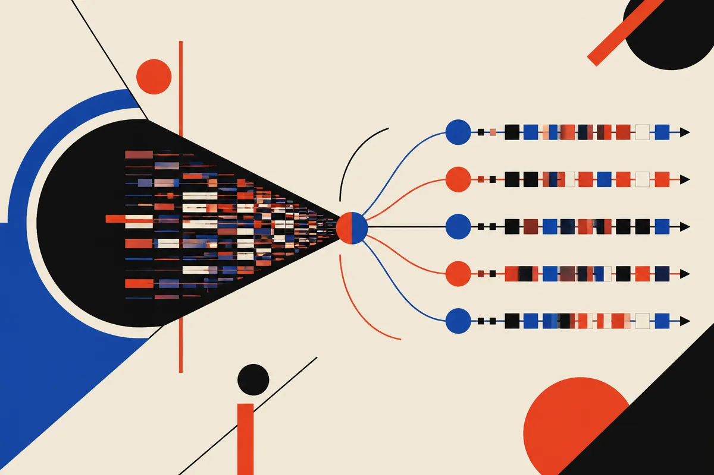

TL;DR: LeapQuant is a training-free inference trick for linear-attention models that makes recurrent state cheaper to read and update, with reported quality close to FP32 and a more modest but useful 1.47x end-to-end speedup.

## What problem is LeapQuant actually solving?

The primary source is the arXiv paper titled **"LeapQuant: Efficient Linear Attention with Accurate Recurrent State Quantization"**. It focuses on a specific bottleneck in newer hybrid language models: the recurrent state used by linear attention.

Standard attention gets expensive as context grows because tokens attend over prior tokens. Linear attention changes that tradeoff by compressing the past into a fixed-size recurrent state. The paper names Gated DeltaNet (GDN) and Kimi Delta Attention (KDA) as examples of this direction. That fixed state helps long-context processing, but it does not make inference free. The model still has to repeatedly read and update the state.

That repeated state traffic becomes the new tax.

Quantization is the obvious move. Store and operate on the recurrent state in fewer bits, spend less memory bandwidth, get faster kernels. But the paper argues that naïve quantization hurts quality for two reasons: rounding errors accumulate over time, and some rows or columns in the state behave like outliers. If those outliers get crushed into low precision, the state drifts.

This is the part I like. LeapQuant is not trying to retrain the model. It is training-free. That matters for operators because retraining a production model family is usually off the table. Serving-side changes are much easier to test, roll back, and compare.

## How does LeapQuant avoid the usual quantization damage?

LeapQuant has two main moves.

First, it uses per-window quantization. Instead of quantizing the recurrent state after every token update, it “leaps” across a window of tokens and quantizes only once at the end. Inside that window, outputs are computed using the fixed low-bit state plus high-precision buffered updates.

That is a practical compromise. You still get the cheap stored state, but you avoid repeatedly rounding every small change. Fewer quantization events means fewer chances for error to pile up.

Second, LeapQuant keeps the largest outliers in high precision as what the paper calls **Compensator Tokens**. These share the update path of real tokens. The remaining residual state is then smoothed before quantization.

This is a nice pattern that keeps showing up in inference work: do not make everything low precision just because the spreadsheet wants a smaller number. Keep the scary parts accurate. Compress the boring bulk. The win comes from knowing which is which.

## How big are the reported gains?

The paper reports experiments across Qwen, Kimi, and GLM model families. With accuracy comparable to the FP32 baseline, LeapQuant reports average kernel-level speedups of **2.05x to 3.70x** and **1.47x** for end-to-end inference on NVIDIA B200, RTX PRO 6000, and RTX 5090 GPUs.

That gap matters. Kernel benchmarks are useful, but production users feel end-to-end latency and throughput. A 3x kernel win turning into a 1.47x serving win is still worthwhile, especially at scale, but it is not magic. Other costs remain: scheduling, memory movement elsewhere, decoding overhead, batching behavior, framework overhead, and the parts of the model not touched by this technique.

The bigger signal is architectural. If more frontier and open models move toward hybrid attention, recurrent-state management becomes a first-class serving layer problem. Not just “can we run long context?” but “can we keep the state cheap, accurate, and stable over long generations?”

I would treat LeapQuant as an infrastructure idea to watch, not a plug-and-play promise for every stack. It is most relevant if you are serving or evaluating linear-attention or hybrid models, especially long-context workloads where recurrent state traffic dominates enough to matter.

For a builder, the practical move is simple: when testing long-context models, separate attention architecture from serving cost. Ask whether the model uses a recurrent state, whether that state is quantized, and whether quality was measured against an FP32 baseline over long sequences. If you operate your own inference stack, try this class of state-aware quantization on replayed production traces, not just synthetic prompts. The catch most readers miss: the headline speedup is at the kernel level. Your users only get the end-to-end number.
