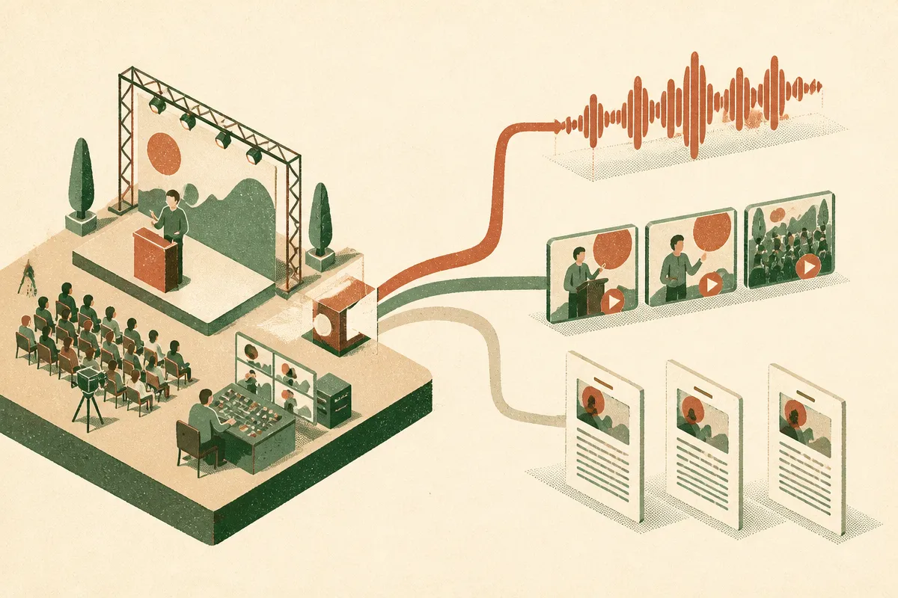

TL;DR: Marketing AI Institute’s MAICON podcast push points to a simple content operations shift: live events are becoming real-time media systems, not just rooms with recordings posted later.

## What did Marketing AI Institute actually announce?

Marketing AI Institute’s primary item here is titled “From the MAICON Stage to Your Podcast Feed.” The concrete claim is narrow: the AI conversation is coming to Cleveland, and this year people can listen to it in real time.

That is all we should treat as confirmed from the provided material. No speaker list. No schedule. No distribution mechanics. No pricing. No promise that every session becomes audio. Just the useful signal: MAICON is being framed not only as an in-person conference, but as something that can travel immediately through a podcast feed.

That matters because event content usually dies from lag.

A panel happens. Someone records it. A team waits for files. Edits pile up. Legal or brand review takes a week. The recap lands after the conversation has moved on. By then, LinkedIn has already eaten the hot takes, and the people who cared have formed their opinions from fragments.

Real-time audio changes the shape of that workflow. It says the event is not the end product. The event is the capture layer. The product is the conversation moving through channels while attention is still warm.

## Why does real-time event audio matter for AI marketers?

AI has made content production cheaper, but it has not made attention cheaper. That is the catch.

Most marketing teams now have tools that can summarize transcripts, cut clips, draft newsletters, generate social posts, and turn one long session into a dozen derivative assets. Fine. Useful. But if everyone can do that, the advantage moves upstream.

Who had the conversation first?
Who had the room?
Who had the experts?
Who shipped the clean version while the market still cared?

That is why MAICON’s real-time podcast framing is interesting. It is not “AI will make podcasts.” It is closer to: AI-related conferences now need media reflexes.

For an AI conference, this is extra important because the topic moves quickly. A model launch, policy shift, agent demo, or enterprise failure story can change what an audience wants to hear within days. A conference that waits weeks to package its best thinking risks publishing history instead of relevance.

There is a practical marketing lesson here too. Real-time does not mean sloppy. It means the workflow has to be designed before the event starts. Rights, recording quality, moderation, naming conventions, transcript handling, approvals, and publishing paths need to be set in advance. Otherwise “real time” becomes “someone on the team is panicking with a folder full of files.”

## What should teams copy from this?

Copy the operating model, not the conference.

A software company can do this with a customer advisory call. A local business can do it with a workshop. A founder can do it with a webinar. The pattern is the same: capture expert conversation once, then publish the most useful version quickly in the channel where the audience already listens.

The podcast feed is one channel. It may be the right one for MAICON because conferences are full of spoken expertise. But the deeper point is channel fit. Some audiences want a 30-minute feed. Some want a five-minute recap. Some want a search-friendly article. Some want a private Slack summary. AI helps with repackaging, but judgment decides what deserves to be packaged.

I would also avoid the fake version of this trend: publishing everything because the tools make it easy. Not every hallway quote is content. Not every transcript needs to become a post. Real-time media works when there is editorial taste behind it. The job is to reduce delay without removing standards.

Practitioner’s take: if you run events, webinars, interviews, or customer sessions, build a “publish within hours” workflow before the next one. Decide what gets recorded, who can approve it, what format ships first, and how AI will help with transcripts, summaries, and drafts. The catch most teams miss is permissions. Get consent, usage rights, and speaker expectations clear before capture, or your fastest content will sit unpublished.
