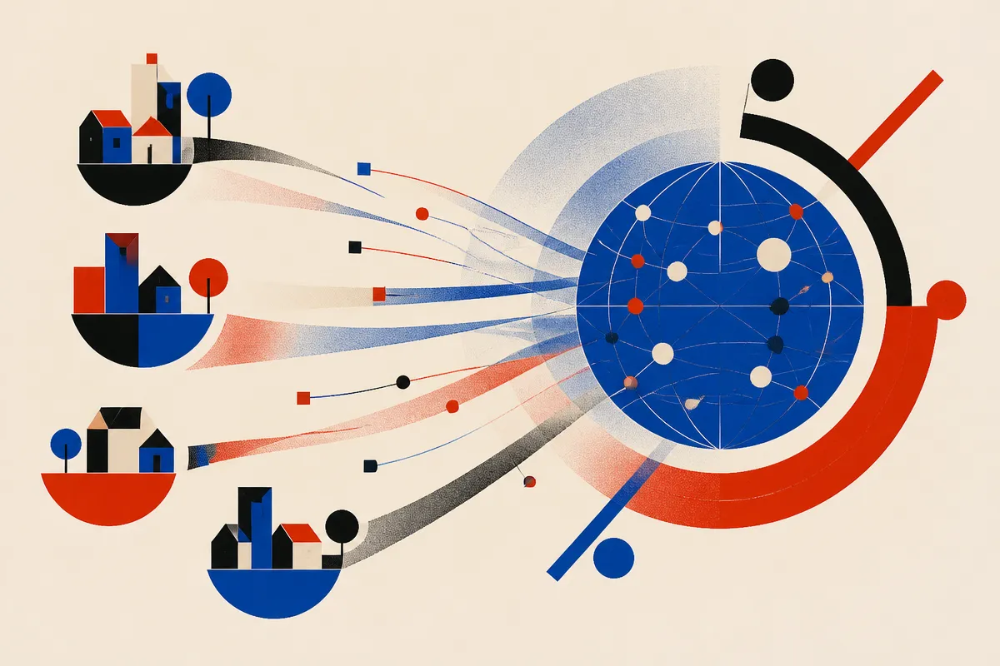

TL;DR: NoPE global attention can still learn relative position when local mixing layers write recency into the residual stream first.

## How can attention know order without position embeddings?

The primary source here is the arXiv paper "How Local Mixing Encodes Relative Position in Global NoPE Attention." Its core claim is simple but important: attention by itself does not know position, but hybrid architectures can smuggle position into the representations before global attention ever sees them.

That matters because most transformer explanations treat positional encoding as a necessary bolt-on. You add RoPE, learned embeddings, ALiBi-style biases, or something similar because vanilla attention is permutation-invariant. Without a signal for token order, "dog bites man" and "man bites dog" become too close for comfort.

The paper looks at a different pattern that has been working in scaled systems: global NoPE attention, meaning no explicit position encoding in the global attention layer, mixed with local operations like sliding window attention or gated linear attention. The question is not whether it works. The interesting question is why.

The answer offered by "How Local Mixing Encodes Relative Position in Global NoPE Attention" is recency bias. Local mixing layers create a trace in the residual stream where nearby prior tokens are represented differently from faraway prior tokens. That trace then reaches the global NoPE attention layer. The global layer does not need an explicit position code if the input vectors already carry enough relative-position structure for the attention logits to select.

That is a useful mental model. NoPE does not mean "no position information." It means "no explicit position encoding at this layer."

## Why is this interesting for long context?

The long-context angle is the real prize.

The paper contrasts hybrid NoPE systems with models that use only global NoPE attention. In the all-global case, positional information can arise from the causal mask, but that signal is thin. It is a structural constraint, not a rich representation of distance. The paper argues that local mixing layers can maintain a recency bias across long sequences, which gives global NoPE attention something more durable to use.

That points at a different way to think about context length. A model does not only need more tokens in the window. It needs stable ways to represent relationships across the window. If position encodings break, saturate, or generalize poorly outside the training range, the model may technically accept a long prompt while behaving like it has a much shorter useful memory.

This paper is not claiming every NoPE hybrid model gets indefinite extrapolation for free. The language is more careful than that. It says the findings may provide insight into position encoding that can extrapolate to longer sequence lengths indefinitely. "May provide insight" is doing real work there.

Still, the design direction is appealing. Instead of making the global layer responsible for both content matching and position awareness, use local layers to precondition the stream. The local layers bake in short-range order. The global layers then operate over content that already carries recency structure.

For model builders, that is architecture, not prompting. For model users, it is a reminder that long-context performance depends on internals you usually cannot see.

## What should builders test?

The practical test is not "does the model support 1 million tokens?" The practical test is whether it can use the right evidence at the right distance when distractors are closer, louder, or repeated.

A good eval would separate several cases: exact retrieval from nearby context, exact retrieval from far context, reasoning over events where order changes the answer, and conflict resolution where the newer statement should override the older one. If this paper’s mechanism is right, hybrid local-global models should show different failure patterns than pure global NoPE systems or models with explicit RoPE-style encodings.

I would also watch for recency bias as both feature and bug. A maintained recency signal helps language models track order. It may also make them over-prefer the latest instruction, latest fact, or latest retrieved chunk. In agent workflows and RAG systems, that can be dangerous if the newest context is not the most authoritative context.

Practitioner’s take: if you are choosing or evaluating long-context models, stop treating context length as a spec-sheet number. Build a small order-sensitive eval for your actual workflow: older policy versus newer chat message, early requirement versus late exception, nearby distractor versus distant answer. The catch most readers miss is that "NoPE" is not the same as "position-free." Position can be implicit, architecture-dependent, and very real in the behavior you see.
