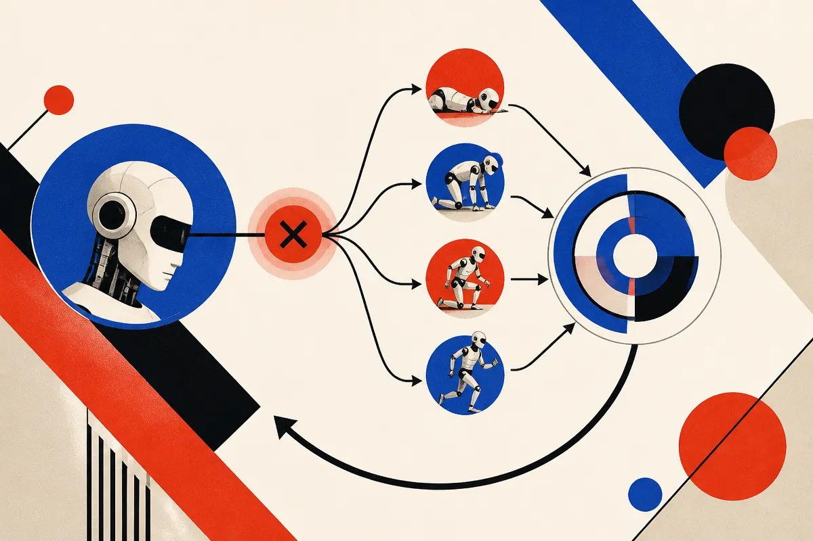

TL;DR: The useful idea in skill-space shooting is not that a foundation model can control a robot, it is that it can help generate reusable corrections when the robot fails.

## What problem is this trying to solve?

Most robot demos still hide the hard part: the second attempt.

A policy works in training, then meets a slightly different drawer, object, lighting condition, surface, or clutter pattern in the real world. It fails. The usual fix is more human data, more demonstrations, more scripted recovery cases, or another round of training. That can work, but it does not scale well if every correction needs a person to show the robot what should have happened.

The arXiv paper “Skill-Space Shooting for Autonomous Robot Policy Improvement” frames this as a missing learning loop. Agentic systems can already use foundation models to compose behaviors and finish tasks. But finishing the task is not the same as teaching the original policy to avoid the failure next time.

That distinction matters. If an AI system acts as a clever wrapper around a weak robot policy, you may get a one-off success. If the correction becomes supervision, the robot can actually improve. The paper’s core claim is that many useful corrections are short, familiar behaviors: move closer, regrasp, nudge, align, retry from another angle. These are not full tasks. They are skills.

That is a good abstraction. It is also a useful antidote to the “just add an LLM” version of robotics hype.

## What is skill-space shooting?

Skill-space shooting uses foundation model guidance to explore possible corrections through reusable skills, then converts successful trials into policy improvement.

So instead of searching directly over low-level motor commands, the robot searches over a space of short behaviors that a foundation model can reason about from the scene. That changes the search problem. “Try a slightly different sequence of torque commands” is hard to interpret and hard to transfer. “Reposition, then grasp again” is the kind of thing a model can select, combine, and reuse.

The paper reports real-world experiments showing repeated improvement in autonomous policies, and says skills can be shared to reduce the teaching needed for new tasks. That second claim is the one I care about most. If true across enough settings, it means the correction library becomes an asset. Not just a log of past mistakes, but a growing set of recovery moves that travel across tasks.

There is a catch. The provided material does not include task counts, success rates, robot platform details, or comparisons against simpler baselines. So the right read is not “robots can now self-improve.” It is narrower and more useful: this is a concrete design pattern for turning agentic recovery into training signal.

## What would make this matter outside a lab?

For deployed robots, the expensive thing is not only initial training. It is maintenance under variation.

Warehouses, homes, labs, farms, and factories are full of edge cases. A robot that needs a human demonstration for every new failure becomes a support burden. A robot that can try bounded, reusable corrections and learn from the successes starts to look more like a system you can operate.

The word “bounded” is doing work there. Physical-world exploration has costs. Failed attempts can damage objects, waste time, or create safety issues. Skill-space shooting is interesting because it narrows exploration to known skills rather than open-ended action generation. That does not remove risk, but it gives builders a better control surface.

I also like the separation of roles. Let the foundation model reason over the scene and propose skill-level corrections. Let the robot policy learn from successful physical attempts. That is a cleaner architecture than asking one model to plan, perceive, act, recover, and train itself all at once.

For builders, the practical move is to stop treating failures as only logs or tickets. Instrument them as candidates for correction. Define a small library of safe recovery skills. Use a vision-language or foundation model planner to rank plausible retries. Then feed successful corrections back into the task policy, with evaluation held out so you can see whether the policy improved or merely memorized a situation. The catch most teams miss: recovery is not improvement unless the corrected behavior updates the underlying policy and shows up again on the next run.
