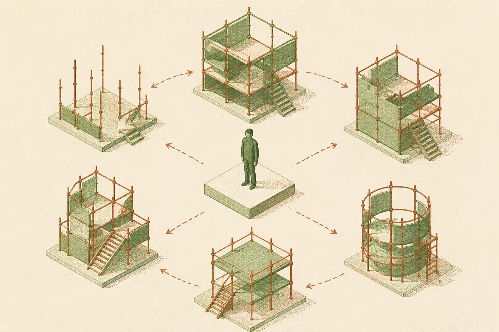
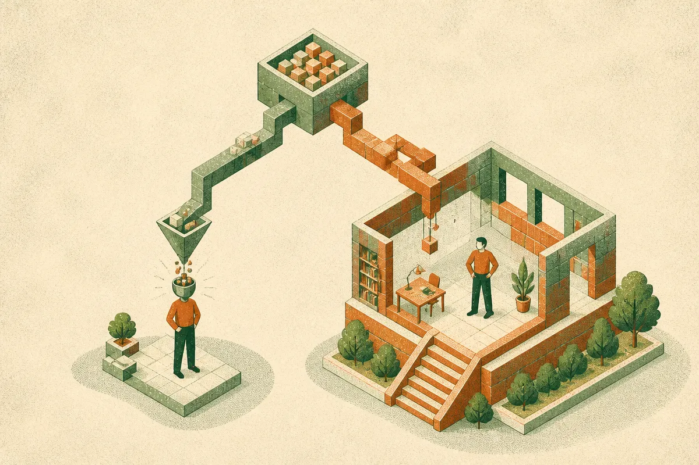

TL;DR: A paper called "Learning Meta-Skills for Agent Harness Design in Test-Time AI4AI" reports that you can lift a frozen agent's task performance by 8.95 points on average without touching its weights, just by learning reusable principles for how to build the environment it runs in, which means a lot of the agent-quality gap you are fighting is a harness problem, not a model problem.

The paper (posted to arXiv under cs.AI, cs.CL, and cs.LG) sets up a two-role framing that is worth sitting with. There is a Target, the model that actually does the task, and there is a Builder, a model that constructs the execution environment the Target works inside. Both models are frozen. Nobody fine-tunes anything. The only thing that changes is the scaffolding, tools, instructions, and resources the Builder decides to hand the Target for a given job. That is the whole experiment, and the results are more interesting than they sound.

## What is a "harness" and why does it move the numbers?

When people say "the agent," they usually mean the model plus everything wrapped around it: the system prompt, the tools it can call, the retrieved context, the retry logic, the intermediate scratchpads, the little bits of guidance that tell it when to reach for a calculator versus reason in its head. That wrapper is the harness. Same model, different harness, wildly different results. Anyone who has shipped an agent already knows this in their bones, but it usually gets treated as prompt-craft folklore rather than something you can measure and systematize.

What the authors do is treat harness construction as a learnable skill. The Builder watches how the Target performs on a development set, gets execution feedback (did the task succeed, where did it fail), and distills that into what they call Meta-Skills: principles that specify when support is needed and what resources to provide. Not a fixed prompt template. Principles. "If the task involves multi-step arithmetic, provide a code execution tool" is the flavor of thing, generalized and stored in a bank the Builder can pull from later on tasks it has never seen.

The measured lift is 8.95 percentage points macro-average over building a harness with no learned skills, tested across two benchmarks the paper names, Harness-Bench and NewtonBench. That is not a rounding-error improvement. For an operator, nine points of task success from scaffolding alone is the difference between an agent you can trust in production and one you babysit.

## Why not just hand the skills to the model directly?

Here is the finding I keep turning over. The paper compares two ways of using the same skill bank. One: the Builder uses the skills to construct a harness for the Target. Two: you deliver the same skills directly to the Target as, presumably, context or instructions. The Builder-constructs-the-harness route beats direct delivery by 12.02 points.

Read that again. The identical knowledge, given to the model doing the work, underperforms the same knowledge used to shape the environment that model runs in. That is a real result and it cuts against a common instinct, which is to stuff everything useful into the context window and let the model sort it out.

Why would that happen? The paper does not hand us a tidy mechanism, and I will not invent one, but the intuition is plausible. A model given a pile of principles has to decide, in the moment, which apply and how. That is cognitive overhead spent on meta-reasoning instead of the task. A harness that has already been shaped by those principles removes the decision. The tool is just there. The guidance is baked into the structure rather than competing for attention with the actual problem. It is the difference between telling a worker "here are twelve safety rules, apply them as relevant" and building a workspace where the unsafe action is simply not reachable.

If that holds up, it is a genuinely useful design principle: convert your accumulated knowledge about failure modes into environment structure, not into longer instructions.

## Does this actually point to self-improving systems?

The paper's most ambitious claim is the softest, and I want to flag it as such. They note that when the same model serves as both Builder and Target, you still get gains, and they read that as "a path to system level self-improvement through learning to build better environments." A model improving its own scaffolding, then running inside the scaffolding it improved.

That is a suggestive result, not a demonstrated loop. There is a difference between "one model playing both roles still shows improvement on these benchmarks" and "this compounds into open-ended self-improvement." The paper reports the former. The latter is an inference the authors gesture at, and the abstract is the only detail the sources here give me, so I am treating the self-improvement framing as a direction the results are consistent with rather than something shown. The honest version: a frozen model can meaningfully upgrade the environment it works in, and doing so helps even when it is upgrading its own environment. That is a real and interesting result on its own. It does not need the recursive-self-improvement halo to matter.

## What should a builder do with this on Monday?

The practical translation is cleaner than the paper's framing. Most teams tune the model choice and the prompt and stop there. This work says the highest-leverage surface might be the layer between them: the harness. So build a feedback loop where a second process reviews your agent's failures on a real task set and proposes structural fixes, add a tool here, remove an option there, pre-shape this context, rather than only editing the prompt. Store those fixes as reusable principles you can apply to new task types, which is the Meta-Skill idea stripped of the jargon. And test the two delivery modes yourself: does putting a guideline in the prompt beat encoding it into the tool set or the retrieval step? The paper's 12-point gap says the environment usually wins, but your workload is not their benchmark, so measure it. The catch most people will miss: this only works if you actually collect execution feedback on a development set. No feedback, no skills, no lift. The harness gets smart because it watched the agent fail first, and if you are not logging those failures in a structured way, you have nothing to learn from.
