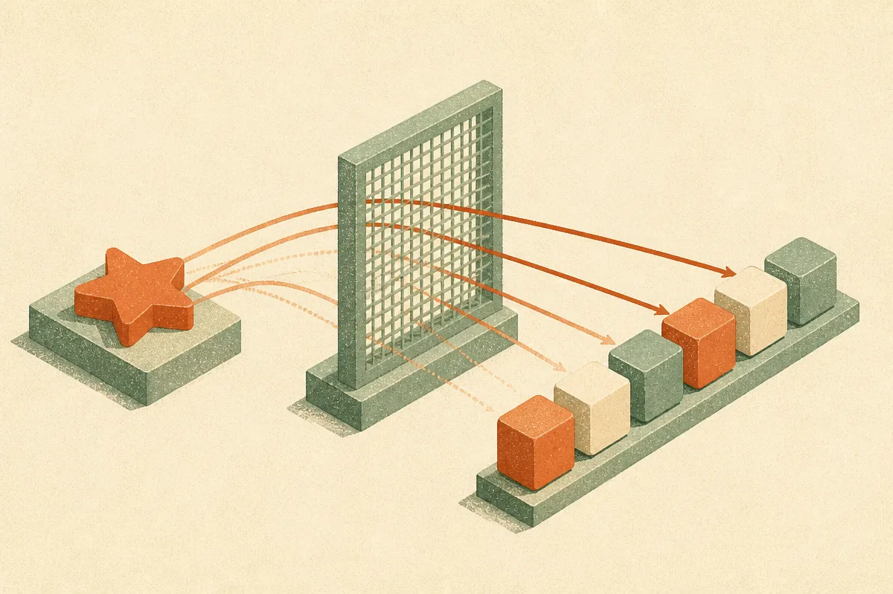
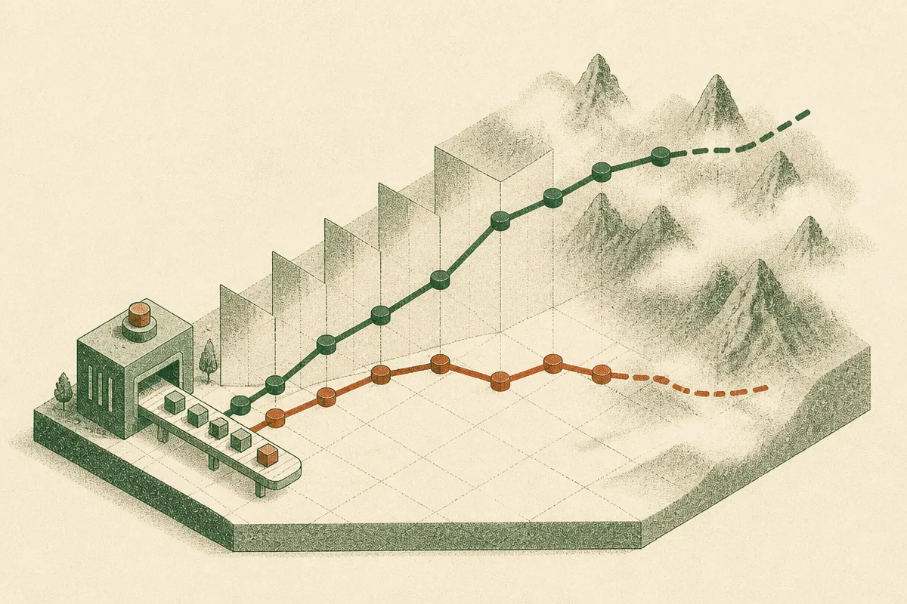

TL;DR: A reasoning model can get the right answer for the wrong reason, latching onto task-irrelevant phrasing, and SCAPO fixes some of that by giving unstable tokens less credit during RL training instead of rewarding every token in a correct answer equally.

Here is a problem most people never see because the leaderboard number looks fine. You give a reasoning model a math problem. It solves it. You rephrase the problem in a way that does not change the math or the answer at all, and the model's internal token probabilities shift noticeably. Same problem, same answer, different confidence. That drift is the model leaning on features that have nothing to do with the actual reasoning. The paper "Semifactual Credit-Augmented Policy Optimization" (arXiv, available with code at github.com/DtYXs/SCAPO) goes after that drift directly, and the fix is more interesting than the usual "we beat GRPO by X points" story.

## What is actually broken in GRPO?

Group Relative Policy Optimization is the workhorse behind a lot of recent reasoning training. The short version: generate a group of responses to a problem, score them against a verifiable reward (did the final answer check out), and compute each response's advantage relative to the group. Responses that beat the group average get their tokens reinforced. Simple, cheap, no separate value model.

The catch the SCAPO authors flag is in how that advantage gets distributed. GRPO assigns the same outcome-derived advantage to every token in a response. If the final answer is correct, every token that produced it gets the same positive credit, including the tokens that were along for the ride. So the parts of the chain that were genuinely load-bearing reasoning get rewarded, and so do the parts that happened to correlate with the phrasing of that particular prompt. You reinforce the real reasoning and the spurious dependence together, with no way to tell them apart.

That is the structural blind spot. A verifiable reward tells you the destination was right. It says nothing about which turns along the way actually mattered.

## What does "semifactual" mean here?

This is the clever part, and it is worth getting the term right because it is doing real work. A counterfactual changes something and changes the outcome. A semifactual changes something and the outcome stays the same. The authors apply semifactual prompt interventions: they rewrite the prompt in ways that preserve the underlying problem and its answer, then watch what happens to the model's token probabilities.

If a token's probability barely moves across these rephrasings, that token is stable. It is keyed to the actual problem structure. If a token's probability swings around when you change irrelevant wording, that token is unstable, and it is probably riding on surface features rather than reasoning.

The first finding stands on its own even before any training. Suppressing high-drift token candidates during decoding improved reasoning accuracy with no weight updates at all. That is a decoding-time intervention. You can get a bump just by not letting the model commit to tokens that are sensitive to phrasing noise. That alone tells you the drift is not harmless.

## How does SCAPO change the training signal?

SCAPO folds that stability measurement into GRPO's credit assignment. For a fixed response, it measures how much each token's probability drifts under semifactual interventions, normalizes those into stability scores, and then uses them to reduce advantages for relatively unstable tokens during early training.

Two design choices matter here and they show restraint, which I like. First, this is applied early in training, not throughout. The idea is to stop spurious dependencies from getting baked in before they calcify, then back off. Second, and this is the important one, stability earns no bonus. SCAPO does not hand extra credit to a token just for being stable. It only reduces credit for instability. That asymmetry is deliberate. If you rewarded stability directly, you would create a new thing for the model to game: produce boring, phrasing-invariant tokens to farm reward. By only penalizing drift, they shrink the attack surface instead of opening a new one.

So the mechanism is causally inspired rather than a hard causal claim. They are using stability under irrelevant perturbation as a proxy for "this token reflects the problem, not the packaging," and letting that proxy modulate how much each token gets reinforced.

## Do the numbers hold up?

On Qwen3-4B-Base, SCAPO improved AIME 2024-2026 accuracy over GRPO by 5.63 percentage points. On Qwen3-1.7B-Base, 4.17 points. At both scales the authors report best results on most of the math benchmarks they tested and on all of the out-of-distribution benchmarks in the comparison.

That out-of-distribution result is the one I would weight most. Beating GRPO on AIME is good, but AIME is in-domain math. The whole premise is that spurious dependence hurts generalization, so the test that actually matters is whether cutting that dependence helps on problems the model was not shaped around. The OOD sweep is the paper backing its own thesis, and it is a cleaner signal than the headline AIME delta.

The honest caveats. Two base models, both Qwen3, both small (1.7B and 4B). No frontier-scale confirmation. Measuring token drift under interventions adds compute during training, and the paper's framing does not resolve how that cost scales. And "causally inspired" is a careful phrase. This is a well-motivated heuristic that behaves like causal credit assignment, not a proof that these tokens are causally responsible for anything. It works on these benchmarks at these scales. That is what we know.

## Practitioner's Take

If you are doing RLVR post-training on small open models, two things here are usable now and one is a longer bet. The immediate win is the decoding-time trick: suppressing high-drift tokens improved accuracy with zero retraining, so if you can measure token sensitivity to prompt paraphrases on your eval set, you have a cheap inference-side lever to test before you touch weights. The training method itself is worth a pilot if you already run GRPO and have the budget to compute stability scores, especially if your real goal is generalization rather than squeezing an in-domain benchmark. The catch most readers will miss: the semifactual interventions are the whole game, and the paper leans on paraphrases that preserve the math answer. For domains without a clean notion of "same problem, different wording" (open-ended generation, code with many valid forms), building good semifactual interventions is the hard, unsolved part, and without them the method has nothing to measure. Start where you can define an irrelevant perturbation precisely. That is where this pays off.
