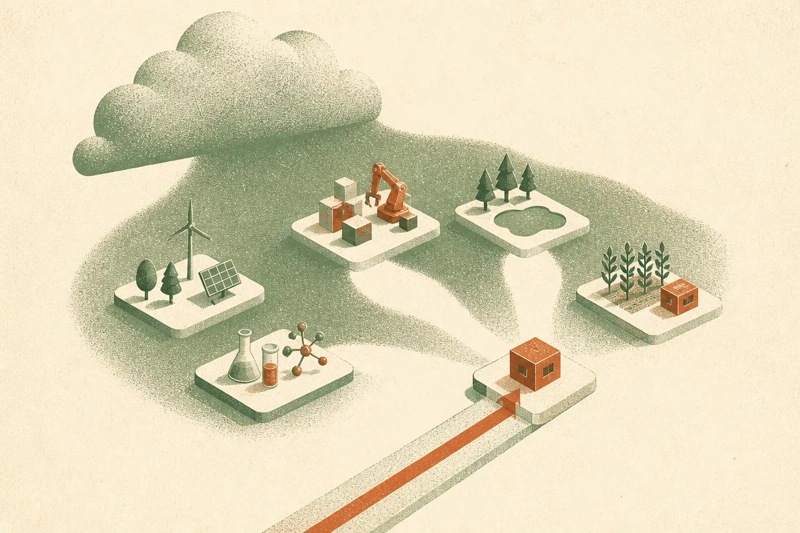

TL;DR: FERPO is interesting because it treats critic action gradients as a weak link in continuous-control RL, then replaces them with a forward-KL target-fitting step that may explore better and update faster.

## What problem is FERPO trying to avoid?

The primary source here is the arXiv paper titled “FERPO: Forward Entropy-Regularized Policy Optimization.” Its core complaint is simple: many online reinforcement learning methods for continuous control use action gradients from a learned critic to improve the policy, but the critic was usually trained to predict returns, not to provide reliable derivatives with respect to actions.

That distinction matters. A critic can be useful at ranking or estimating outcomes while still having bad local geometry. If the actor follows the critic’s slope, and that slope is noisy or misleading, the policy update can move in the wrong direction even when the value estimate looks reasonable.

FERPO sidesteps that. It performs policy improvement using critic values without differentiating the critic with respect to actions. Instead of asking, “which way does the critic’s gradient point from here,” it asks, “what action distribution would be preferred under this value model, with entropy and KL constraints keeping it sane?”

That is a practical design choice, not just a math preference. Continuous-control tasks, including robotics-style environments, often punish brittle local moves. If the learned value surface has bumps, bad curvature, or strange extrapolation artifacts, gradient-following can amplify them.

## Why does forward KL matter?

FERPO derives an optimal target action distribution from a policy-improvement objective regularized by entropy and KL divergence. Then it fits the actor to that target by minimizing a forward-KL objective. The estimate uses self-normalized importance sampling, with actions drawn from the rollout policy.

The paper’s key claim is that this forward-KL choice changes the behavior of the update. Reverse-KL objectives can favor a subset of the target distribution’s modes. In plain English, they can collapse toward one promising action cluster and ignore other good options. Forward KL encourages coverage of multiple high-value modes, which can help exploration.

The KL regularization also limits how far the target distribution can drift from the rollout policy. That matters because importance sampling gets ugly when the samples come from one distribution and the target lives somewhere else. FERPO’s constraint is not just philosophical caution. It is a way to keep the weights better behaved.

I like this framing because it attacks a familiar RL failure mode: pretending the learned model is more trustworthy than it is. FERPO still depends on critic values, so it does not escape approximation error. But it refuses to trust a derivative the critic was not trained to make accurate. That is a narrower and more believable claim.

## What do the experiments actually show?

“FERPO: Forward Entropy-Regularized Policy Optimization” reports experiments and ablations on MuJoCo Playground and ManiSkill. The paper says FERPO shows competitive performance and sample-efficiency gains. It also reports faster actor updates than Relative Entropy Pathwise Policy Optimization, or REPPO, in computational benchmarks.

That is promising, with the usual RL caveat: benchmark wins are not deployment guarantees. MuJoCo and ManiSkill are useful testbeds, but the real test is whether the method survives messier simulators, hardware gaps, reward misspecification, and long-horizon tasks where exploration is expensive.

Still, the idea is clean enough to watch. FERPO is not claiming a general intelligence breakthrough. It is making a specific engineering bet: policy improvement gets more reliable if the actor learns from a constrained target distribution rather than chasing critic action gradients.

For builders, the useful takeaway is not “switch everything to FERPO tomorrow.” It is to audit where your RL stack trusts gradients from learned critics, especially in continuous-action systems. If your runs are unstable, mode-seeking too early, or sensitive to critic artifacts, FERPO’s recipe suggests a concrete experiment: compare gradient-based actor updates against value-based target fitting with KL control and forward-KL coverage. The catch most readers miss is that better value prediction does not automatically mean better policy gradients. Those are different contracts.
