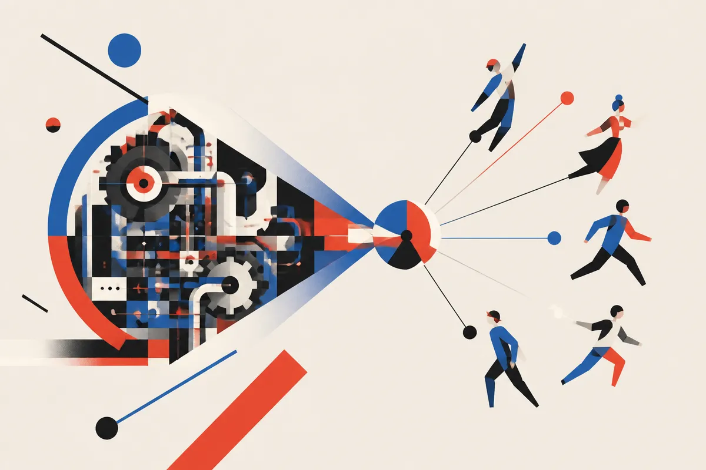

TL;DR: GALA is interesting because it treats avatar animation as a distillation problem, replacing expensive per-frame neural decoding with a compact shared basis that can run at mobile-friendly speeds.

## What did GALA actually replace?

The primary source here is the arXiv paper **“One Basis to Animate Them All: Gaussian Blendshape Distillation for Real-Time Avatars”**, which introduces **GALA**, short for **Gaussian Animation via Linear Approximation**.

The problem is specific but important. 3D Gaussian avatars can render quickly, but animating them still often requires costly neural inference every frame. That matters if the target is a phone, a headset, a browser, or any product where “real time” means more than a demo running on a workstation.

GALA’s move is to distill the animation step. Instead of asking a heavier neural decoder to produce each frame, it learns a shallow MLP that predicts coefficients. Those coefficients drive a linear blend of blendshapes. In plainer terms: keep the expensive model’s behavior, but approximate its animation with a smaller, simpler mechanism.

The paper reports that this works across three different avatar models, including facial expression animation and full-body animation with clothing dynamics. It also says the approach applies without retraining the original avatar models. That is a big practical detail. Retrofitting a speedup onto pretrained systems is usually more useful than asking every team to rebuild its whole avatar stack.

## Why does a shared linear basis matter?

The most interesting claim is not just “we made it faster.” It is that learned avatar representations appear to share enough linear structure that one identity-independent basis can approximate animation across held-out identities.

That is the part worth paying attention to.

A lot of AI graphics work chases bigger models, richer decoders, and more compute. GALA points in the other direction: maybe the animated variation inside these systems has a lower-dimensional structure that can be extracted, budgeted, and reused.

The paper uses **block-local PCA** under a **rendering-aware metric** and a memory budget to construct the basis. That detail matters because a naive compression target would optimize the wrong thing. In avatar systems, the user does not care whether an internal tensor is reconstructed perfectly. They care whether the face, body, cloth, expression, and motion look right when rendered.

GALA’s reported numbers are strong, with CPU animation cost reduced by up to three orders of magnitude while preserving most rendering quality. The paper also reports frame rates reaching up to 60fps on mobile devices. Those are paper claims, not product guarantees. Still, they point to a useful direction: spend the big model once, then ship a cheaper approximation for runtime.

## Where does this show up for builders?

This is not only an avatar paper. It is another example of a broader pattern in applied AI: train or use the expensive thing to discover structure, then distill that structure into something small enough to ship.

For builders, the lesson is to look for repeated runtime work that can be turned into coefficients, cached bases, lookup tables, or smaller predictors. If your system is doing expensive inference on every frame, request, scene, or user interaction, ask whether the variation is actually as complex as the model makes it look.

GALA is especially relevant for virtual humans, telepresence, games, AR filters, creator tools, and mobile character systems. The catch is fidelity. “Most rendering quality” is not the same as indistinguishable, and the hard cases are usually where products get judged: extreme expressions, hair and cloth interactions, unusual body shapes, identity-specific motion, and bad lighting.

I would treat GALA as a design pattern to test, not a drop-in miracle. Take a trained high-quality model, profile the runtime bottleneck, build a compact basis around what changes most, and evaluate on rendered output rather than internal loss. The missed catch: the win comes from respecting the product constraint first. Real-time avatars are not won by the prettiest model in isolation. They are won by the best compromise that still moves at frame rate on the device people actually use.
