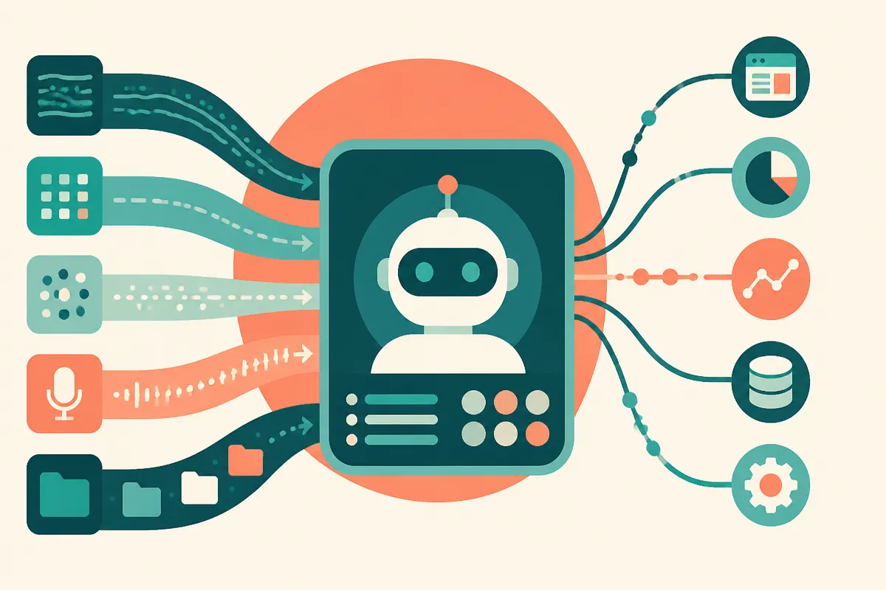

TL;DR: OpenAI’s latest Python SDK releases suggest the agent layer is moving from demo glue toward application plumbing: typed streams, artifacts, traces, session events, and voice hooks.

## What changed in `openai-python`?

The primary sources here are OpenAI’s own GitHub releases, `openai/openai-python v3.23.0` from October 1 and `openai/openai-python v3.24.0` from October 2. Read together, they are not a flashy model launch. They are more useful than that for builders.

OpenAI reported that `v3.23.0` adds typed answers from session streams, file staging, downloadable turn artifacts, session traces, Realtime translations, typed application actions exposed as agent tools, and collection of final output from beta Agents streams. A day later, OpenAI’s `v3.24.0` adds SDK support for custom voice creation and agent session events, plus fixes around routing fields.

That sounds like release-note oatmeal until you map it to an actual app.

An agent session needs to stream partial work, call tools, accept files, produce artifacts, expose traces, recover from reconnects, and tell the surrounding application what happened. That is the difference between “I called a model and got text back” and “I have a workflow that a user can trust enough to keep open while it works.”

The bug fixes point the same direction. OpenAI fixed WebSocket path and query parameter retention, send queue behavior during reconnect, uncertain typed sends replaying on reconnect, file processing timeout behavior, and an eval run cancellation endpoint. These are not headline features. They are the boring places where real apps break.

## Why do typed streams and artifacts matter?

Typed streams matter because agents are not just chat UIs anymore. A useful agent might return a draft, a decision, a structured object, a file, a trace, and a status event. If every one of those is “some JSON-ish thing in a text stream,” the application becomes brittle fast.

OpenAI’s `v3.23.0` phrase, “return typed answers from session streams,” is small but important. It means the SDK surface is acknowledging that developers need predictable shapes while work is still happening, not only after the final answer lands.

Artifacts matter for the same reason. If an agent edits a spreadsheet, creates a report, generates a support summary, or processes an uploaded file, the file is part of the output, not an afterthought. OpenAI’s release notes say `v3.23.0` can stage files and download turn artifacts. That is plumbing for agents that leave evidence behind.

Session traces are the other half. If a user asks “why did it do that?” or an operator asks “where did this workflow fail?”, you need the path, not just the final message. Traces are also where evaluation and debugging start to meet product support.

## Is this an agent product launch or infrastructure work?

I read this as infrastructure work. Useful infrastructure, but still infrastructure.

The release notes do not give pricing, broad availability promises, or product positioning. They say what changed in the Python SDK. That distinction matters. A GitHub release can show where the platform is being prepared without proving that every piece is production-ready for every team.

The pattern is clear though. Agents need sessions. Sessions need events. Events need types. Files need lifecycle support. Realtime work needs transports that survive reconnects. Voice needs custom creation hooks if voice agents are going to feel less generic. OpenAI is adding pieces around the model call, which is where most agent products either become real software or fall apart.

I would not rebuild a business process around a beta agent API just because a release note looks promising. I would, however, start testing the shape of the SDK against one narrow workflow. Pick something with files, a clear final output, and enough intermediate state that tracing actually matters.

Practitioner’s take: build a tiny internal agent that stages an input file, streams typed progress, produces one downloadable artifact, and stores the trace for review. Do not start with autonomy. Start with observability. The catch most readers miss is that agent reliability is not only model quality. It is event handling, reconnect behavior, artifact custody, and knowing exactly what happened when the user says, “that result looks wrong.”
