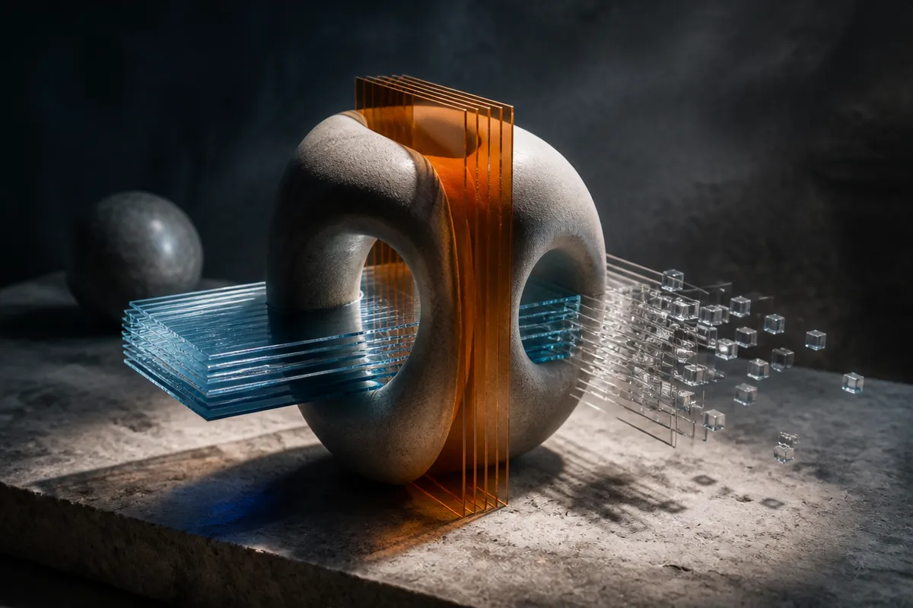

TL;DR: SILSA is a 3D generation method that keeps shape connectivity in view while cutting token count, memory, and inference cost, which is exactly the kind of boring efficiency work that makes high-res 3D generation more usable.

## What problem is SILSA trying to solve?

The primary source here is the arXiv paper titled “SILSA: Sliding-Window Slice Latents for Topology-Preserving High-Resolution 3D Generation,” listed under cs.AI and cs.LG. It targets a real weakness in high-resolution 3D generation: most systems still pay a lot to represent shapes as voxel-like latent tokens, then patch the object together through multi-stage pipelines.

That works, but it is clumsy. Continuous surfaces get broken into many local chunks. Thin parts and repeated structures can fall apart. Long-range connectivity is hard to maintain. If you have ever seen a generated chair with almost-correct legs, a mechanical part with broken holes, or an organic mesh where loops do not quite close, that is the flavor of failure this paper is going after.

SILSA’s bet is simple: represent the 3D object through overlapping slices instead of huge sets of voxel tokens. The system uses a fixed set of sliding-window slice latents along the three canonical axes. Each token summarizes a local depth window, so the model sees cross-sectional continuity rather than only tiny isolated blocks.

That is the important move. The paper is not just saying “make the tokenizer smaller.” It is saying the tokenization should match the structure of the object better.

## Why do slice latents matter?

Voxel tokens are intuitive because 3D space feels like a grid. But grids get expensive fast. Double the resolution and the volume cost can explode. Sparse and hierarchical tokenizers help, but SILSA argues they still fragment the surface and create too many pieces for the generator to coordinate.

SILSA uses a Slice VAE to encode oriented surface samples into multi-axis slice latents. A sparse volumetric decoder reconstructs the shape. A Volumetric Anchor Lattice coordinates the directional slice streams through a shared 3D workspace.

The phrase “Volumetric Anchor Lattice” sounds like paper-language, but the idea is practical: if different slice directions are each describing the same object, they need a common place to agree. Otherwise, one axis can imply a connection that another axis fails to preserve.

The topology piece is also central. SILSA adds slice-level topology supervision using persistence diagrams and Betti transitions across neighboring slices. In plain terms, it tries to preserve structural features like connected components, loops, and cavities as the slices move through the object. This matters for shapes where “looks close” is not enough. A broken loop in a generated bracket, pipe, lattice, or anatomical structure may be a functional error, not a cosmetic one.

## How strong are the reported gains?

The numbers are the hook, but I would read them as research signals, not deployment guarantees.

“SILSA: Sliding-Window Slice Latents for Topology-Preserving High-Resolution 3D Generation” reports an 8.7% PSNR improvement, a 5.96 absolute point gain in coverage, and a 9.2% reduction in Betti error over the strongest baseline. It also reports using 70.0% fewer tokens than the next-most compact baseline and more than 98% fewer tokens than sparse or hierarchical tokenizers. The claimed system-level savings are a 40.4% reduction in training memory and a 58.5% reduction in inference time.

Those are meaningful if they hold outside the benchmark setup. Token reduction is not a vanity metric here. In generative systems, fewer tokens often means lower memory pressure, faster sampling, and more room for resolution or conditioning. For 3D, that can be the difference between a demo and something a designer can iterate with.

The catch is that the supplied material does not include dataset details, code availability, license, failure cases, or comparisons against product-grade 3D asset pipelines. So I would not read SILSA as “solved 3D generation.” I would read it as a strong architectural direction: topology-aware compression beats brute-force volumetric tokenization when shape structure matters.

For a builder, the lesson is to inspect representation before chasing a bigger generator. If your 3D workflow breaks thin structures, holes, or repeated connected parts, look at whether your latent space is destroying topology before generation even starts. Try slice-based or multi-view intermediate representations, add explicit topology checks to evals, and measure token count alongside visual quality. The catch most teams miss: faster inference only helps if the generated mesh is structurally usable.
