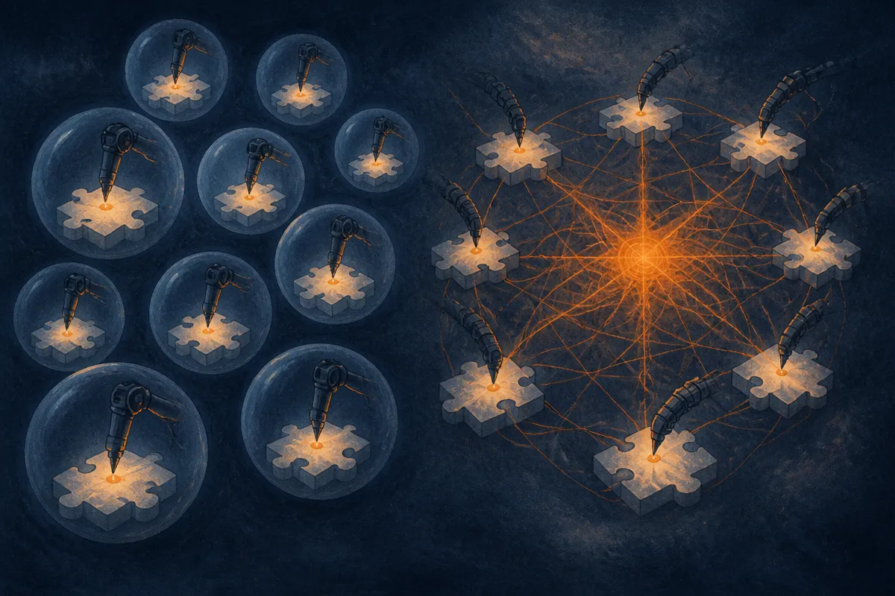

TL;DR: HC-DLM makes a continuous latent the single source of truth for a diffusion language model, reading tokens out of it at every denoising step so parallel decoding stops producing tokens that ignore each other.

If you have been watching diffusion language models from the sidelines, this is a paper worth reading closely. Not because it ships a product. Because it names a specific failure mode that has been quietly limiting the whole approach, and it proposes a clean fix.

The paper is "Hierarchical Continuous Diffusion Language Models" (HC-DLM), posted to arXiv across cs.AI, cs.CL, and cs.LG, with a project page at hc-dlm.github.io. I am going to treat it as research, not a release: no benchmarks against frontier autoregressive models here, no scaled-up runs, just a mechanism and some targeted evidence that the mechanism works.

## Why do diffusion language models decode tokens that ignore each other?

Start with the problem the paper is actually solving.

Most language models you use today are autoregressive. They write one token, then the next, each conditioned on everything before it. Slow but coherent, because every token sees its predecessors.

Diffusion language models want to break that bottleneck by decoding many tokens in parallel. Fill in a whole blank region at once, refine it over a few steps. The appeal is bidirectional reasoning: a token in the middle can be shaped by tokens on both sides, which matters for anything with global constraints. Think of a Sudoku grid where every cell constrains every other, or a planning problem where the ending has to agree with the beginning.

Here is the catch the authors put their finger on. Discrete diffusion models, when they decode in parallel, sample each token independently from its own marginal distribution. In plain terms: the model decides each blank on its own, without knowing what the other blanks decided in the same step. The statistical dependencies between those jointly-decoded tokens get severed. You can get an answer where each token is individually plausible but the combination is nonsense. That is exactly the wrong property for constraint satisfaction.

Continuous diffusion models try another route. Instead of discrete tokens, they denoise a shared continuous state, so in principle the state carries the dependencies. But the paper points out a second gap: the denoiser only ever sees that continuous state. Nothing anchors it to a valid arrangement of actual tokens until the very end, when you finally decode. So the model can drift through continuous space without any running check that it still corresponds to real, coherent text.

Two approaches, two different ways of losing the thread.

## What does HC-DLM actually change?

The move is structural, and it is the part worth remembering.

HC-DLM makes the continuous latent the only persistent generative state. Not a side channel, not extra context bolted onto a discrete chain. The latent is the thing that lives across the whole denoising process.

Then at every step, the model reads tokens out of that latent, and those tokens feed back in as a scaffold for the next latent update. So you get a loop: continuous state produces a concrete token configuration, that configuration informs the next revision of the state, and around again. The continuous trajectory keeps the dependencies, and the per-step token readout keeps it honest about whether it still maps to valid text.

The authors contrast this directly with recent methods that attach continuous context to a "self-contained discrete chain." Their argument is that if the discrete chain is doing the real generative work and the continuous part is just advisory, you have not fixed the independence problem, you have only decorated it. In HC-DLM the hierarchy runs the other way: continuous is primary, discrete is the readout.

The training objective is derived from a variational bound on the token likelihood, which is the respectable way to say the loss is principled rather than a stack of heuristics that happens to work. That matters for whether this generalizes beyond the toy tasks, though a bound on paper is not the same as scaled results.

## Does the evidence hold up?

This is where I want to be honest about what the paper shows and what it does not.

The evaluation is three tasks: Sudoku for structured reasoning, Countdown for mathematical planning, and LM1B for language modeling. On Sudoku and Countdown they report puzzle accuracy gains; on LM1B they report better generative perplexity. All of this at matched model size against discrete and continuous diffusion baselines.

That is a clean comparison and it supports the core claim: given the same parameter budget, coupling the latent and the token readout beats keeping them separate. Good.

But notice what is not here. No comparison to strong autoregressive models at the same scale. No large models. LM1B is a language modeling benchmark, not a downstream reasoning or instruction-following test you would recognize from a frontier model card. Sudoku and Countdown are exactly the kind of constraint-heavy, bidirectional tasks where diffusion is supposed to shine, so winning there confirms the mechanism does what it was designed to do without telling you how it behaves on open-ended generation.

So read this as a mechanism paper. It isolates a real bottleneck, proposes a specific architecture to close it, and shows the architecture wins on the tasks that stress that bottleneck. That is a legitimate and useful result. It is not evidence that diffusion is ready to displace autoregressive generation for general text, and the paper does not claim that.

The thing I find genuinely interesting: the independence problem in parallel decoding is the single biggest reason diffusion language models have felt like a research curiosity rather than a practical tool. If the continuous-primary, token-readout loop holds up at scale, it changes the calculus for any workload where you want to generate a whole structured object at once and have its parts agree. Code with cross-references. Schemas. Plans. Anything where the pieces constrain each other.

## Practitioner's take

You are not deploying HC-DLM next week. There is no model to download, no API, and the results live on Sudoku, Countdown, and LM1B. Treat this as a signal about where diffusion text generation is headed, not a tool.

What is worth doing now: if you have a workload that is really constraint satisfaction wearing a text costume, generating a config where fields must be mutually consistent, filling a structured template, planning where the end has to match the start, keep a file on diffusion approaches and this paper specifically. Autoregressive models handle those tasks today by brute coherence and a lot of tokens, and they still produce outputs where part A quietly contradicts part D. The whole premise of HC-DLM is that joint, dependency-aware decoding fixes exactly that class of error.

The catch most readers will miss: the interesting metric is not perplexity, it is whether jointly-decoded tokens stay consistent, and that only shows up on tasks with hard global constraints. When you evaluate any diffusion text model, test it on something with a right answer that depends on all the parts at once, not on fluent prose. Fluency hides the independence bug. Constraints expose it. That is the test that tells you whether a given approach actually solved the problem this paper is about, or just dressed it up.
