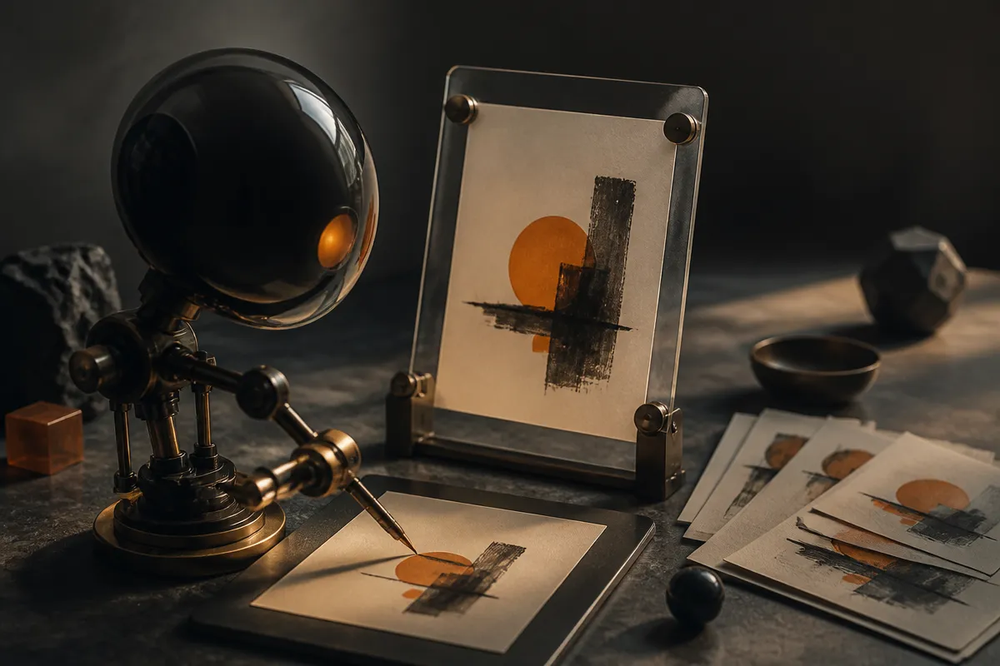

TL;DR: Simulated canvases are useful because they turn image creation from a prompt-only guess into an action loop a model can inspect, revise, and recover from.

## What does “giving Opus 5.5 a simulated paint canvas” really imply?

The primary source here is the Hacker News Show HN post titled “Show HN: Giving Opus 5.5 a simulated paint canvas.” That is a thin source, so I am not going to pretend we know the implementation, model access path, pricing, benchmark score, or UX details. We do not.

But the phrase itself is enough to point at a real design pattern.

A normal image model takes a prompt and returns an artifact. Maybe you iterate with more prompts. Maybe you inpaint. Maybe you open Photoshop. The model is still mostly outside the work surface.

A simulated canvas changes that relationship. The model gets a workspace with state. It can place marks, inspect the result, make another move, and repeat. That starts to look less like “generate an image” and more like “operate a tool.” The difference matters.

When a model uses a canvas, its output is not just pixels. Its output is a sequence of decisions. A brush stroke here. A color change there. A correction after seeing the intermediate result. That gives builders more hooks for control, logging, replay, undo, constraints, and evaluation.

This is the same reason coding agents got more useful when they moved from chat boxes into repos, terminals, tests, diffs, and issue trackers. The model did not become magic. The environment gave it handles.

## Why is the canvas a better agent environment than open-ended chat?

Chat is a weak interface for visual work. You can describe what you want, but the model has to compress intent, geometry, style, and correction into language. That is lossy.

A canvas gives the model a tighter feedback loop. It can see what changed. It can compare the current state to the goal. It can make small edits rather than regenerate the whole thing. It can fail locally.

That last point is underrated. One-shot generation often fails globally. The hands are wrong, the layout is off, the brand mark is warped, the spacing is weird, and now you are arguing with a text prompt. In a canvas environment, the model can be asked to fix one region, test one move, or preserve everything except a target area.

The catch: simulation quality becomes part of model quality. If the tool only exposes fake brushes, crude geometry, or poor visual feedback, the agent will inherit those limits. If the model cannot reliably perceive its own intermediate state, the loop becomes theater. It looks agentic, but it is just guessing with extra steps.

That is why I would not judge this pattern by whether a demo produces gallery-grade art. I would judge it by whether the model can follow constraints across multiple steps. Keep a shape unchanged. Move an object without changing the background. Apply a style only to one region. Recover after a bad stroke. Explain what it tried and why it changed course.

## Where would this be useful first?

The near-term use is probably not “replace artists.” That framing is tired and usually wrong.

The more practical use is visual operations: thumbnails, ad variants, icon roughs, storyboard panels, product mockups, educational diagrams, game assets, UI explorations, and internal creative tooling. Places where the goal is not a single perfect image, but a controlled path from rough intent to usable draft.

A simulated canvas could also be good for evaluation. Give the model the same starting canvas and task. Watch whether it completes the job in fewer steps, preserves constraints, or makes reversible edits. That is more informative than asking people to rank final images with vibes.

There is a policy angle too. Tool-mediated creation can leave a trace. Not just “this was AI-generated,” but what actions produced it. If provenance matters, action logs are more useful than a naked PNG.

The bigger pattern is this: multimodal models need environments, not just prompts. Text agents got files and shells. Browser agents got pages and clicks. Visual agents need canvases, timelines, layers, masks, palettes, cameras, and simulators.

For a builder, I would try this in a narrow workflow before chasing a general creative agent. Pick one task with visible state and clear constraints, such as resizing product imagery into layout-safe variants or generating diagram drafts from a written brief. Give the model a small set of actions, log every move, and evaluate the process, not just the final image. The catch most readers miss: the canvas is not the product. The loop is.
